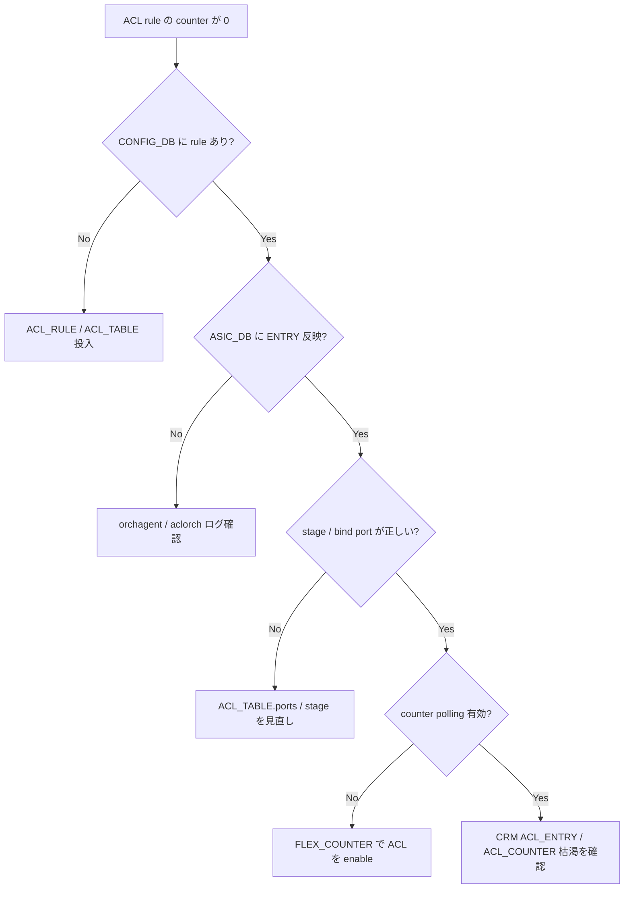

# Runbook: ACL ルールが効かない / counter が増えない

!!! danger "実行前提"
    ACL の追加 / 削除は data plane の hot path を書き換えるため、誤った deny ルールで管理 SSH が落ちる事故が起こりやすい。事前に `sudo cp /etc/sonic/config_db.json /etc/sonic/config_db.json.bak.$(date +%s)` を必ず取り、可能なら management interface に対する `permit ip any any` を最後に並べる構成にしておく。最悪 console から `config reload -y -f` で backup を戻す。

## 症状

- `aclshow` で hit counter が常に 0
- 想定通り deny されない / されすぎる
- [ACL](../../reference/glossary.md#term-acl) bind 後に `show acl rule` には出るが [ASIC_DB](../../reference/glossary.md#term-asic_db) に書かれない

## 想定原因（優先度順）

1. **stage / type の不一致**: `INGRESS` [ACL](../../reference/glossary.md#term-acl) を outbound に bind 等
2. **bind 先 interface 誤り**: PORT ではなく PORTCHANNEL に bind すべき場面
3. **rule priority の競合**: 上位 priority に permit があり、対象が先に抜ける
4. **`PACKET_ACTION` の typo**: `FORWARD` / `DROP` の大小区別
5. **[TCAM](../../reference/glossary.md#term-tcam) 不足**: [ASIC](../../reference/glossary.md#term-asic) リソース不足で program 失敗 → [sai-table-full.md](sai-table-full.md)

## 切り分け手順




## 確認コマンド

### 1. CONFIG_DB の table / rule

```bash
sonic-db-cli CONFIG_DB keys "ACL_TABLE|*"
sonic-db-cli CONFIG_DB keys "ACL_RULE|*"
sonic-db-cli CONFIG_DB hgetall "ACL_TABLE|<table>"
```

- 期待: `stage=ingress` / `type=L3` / `ports=Ethernet0,...`

### 2. ASIC_DB への反映

```bash
sonic-db-cli ASIC_DB keys "ASIC_STATE:SAI_OBJECT_TYPE_ACL_ENTRY:*" | wc -l
```

### 3. counter

```bash
aclshow -a
```

### 4. orchagent ログ

```bash
docker logs swss 2>&1 | grep -iE "aclorch" | tail -50
```

### 5. CRM

```bash
crm show resources acl-table acl-group
```

## 対処方法

- table 再作成: `sudo config acl remove table <name> && sudo config acl add table <name> L3 -p Ethernet0,Ethernet1 -s ingress`
- rule JSON で適用: `sudo acl-loader update full rules.json`
- [TCAM](../../reference/glossary.md#term-tcam) 不足の場合 priority を整理し低優先 deny を集約

## 確認

対処後の正常化を以下で裏取りする。

- **症状解消**: 「症状」節で挙げた事象 (counter / log / state) が回復していること
- **再発監視**: 数分〜数十分の間隔で同コマンドを再実行し、値がフラップしていないこと
- **副作用なし**: 関連サブシステム ([syslog](../../reference/glossary.md#term-syslog) / `show interfaces counters errors` / `show ip bgp summary` 等) に新規 error が出ていないこと
- **永続化**: `sudo config save -y` 済みで `config_db.json` に変更が反映されていること (恒久対処の場合)

短時間で再発する場合は「想定原因」リストの次候補に進む。

## 関連ページ

- [sai-table-full.md](sai-table-full.md)
- [rif-acl-counter-zero.md](rif-acl-counter-zero.md)
- [../config-db/acl-table.md](../config-db/acl-table.md)

## 引用元

本ページの根拠は引用元 [^1][^2] を参照。

[^1]: sonic-net/[sonic-swss](../../reference/glossary.md#term-sonic-swss) @ 4305596 — [orchagent](../../reference/glossary.md#term-orchagent)/aclorch.cpp
[^2]: sonic-net/[sonic-utilities](../../reference/glossary.md#term-sonic-utilities) @ 39732bceb — acl_loader

<!-- glossary-links-injected: c006405759d8 -->
