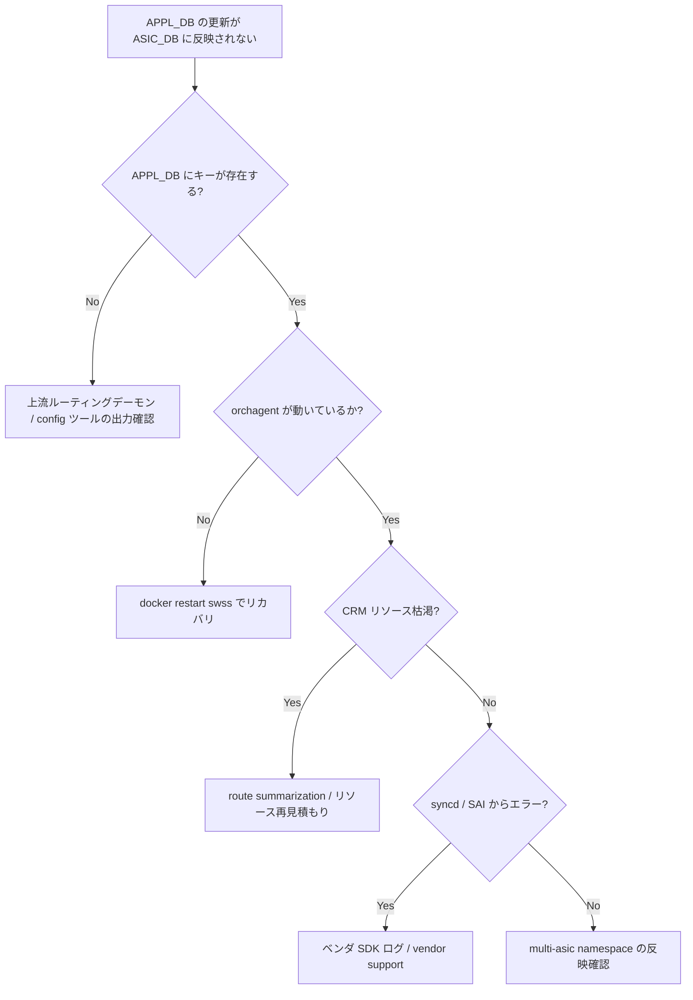

# Runbook: APPL_DB の更新が ASIC_DB（syncd）に反映されない

!!! danger "実行前提"
    `docker restart swss` / `docker restart syncd` は全 datapath programming を一度途切れさせ、ASIC 内 table の再構築中に瞬断〜数十秒のトラフィック影響が出る。実行前に **`sonic-db-cli APPL_DB / ASIC_DB` のキー数・主要 table を退避**し、ロールバック手順として `config_db.json` を控えておくこと。warm-restart 設定が有効でない場合、再起動は cold start 相当の影響になる。

## 症状

- [BGP](../../reference/glossary.md#term-bgp) で受信した route が `show ip route` に出るが、[ASIC](../../reference/glossary.md#term-asic) 側 forwarding に反映されない
- `sonic-db-cli APPL_DB hgetall ROUTE_TABLE:...` に値があるのに、対応する `ASIC_STATE:SAI_OBJECT_TYPE_ROUTE_ENTRY:*` が存在しない
- `swss` / `syncd` の CPU が継続的に高い

## 想定原因（優先度順）

1. **[orchagent](../../reference/glossary.md#term-orchagent) が特定 task で詰まる**: [ACL](../../reference/glossary.md#term-acl) / Nexthop group 再計算で長時間ロック
2. **[syncd](../../reference/glossary.md#term-syncd) ↔ [SAI](../../reference/glossary.md#term-sai) 呼び出しでベンダ SDK がブロック**
3. **[CRM](../../reference/glossary.md#term-crm) 枯渇による [SAI](../../reference/glossary.md#term-sai) 書込失敗**: `SAI_STATUS_TABLE_FULL` で retry ループ
4. **redis broken pipe / slow consumer**: PUB/SUB チャネルで詰まり
5. **multi-asic namespace の reflection 遅延**

## 切り分け手順



## 確認コマンド

### 1. DB 規模・差分

```bash
sonic-db-cli APPL_DB dbsize
sonic-db-cli ASIC_DB dbsize
sonic-db-cli APPL_DB keys "ROUTE_TABLE:*" | wc -l
sonic-db-cli ASIC_DB keys "ASIC_STATE:SAI_OBJECT_TYPE_ROUTE_ENTRY:*" | wc -l
```

- 期待: 大きな乖離なし

### 2. orchagent / syncd 負荷

```bash
docker stats swss syncd --no-stream
docker exec swss top -bn1 -p $(pgrep orchagent)
docker exec syncd top -bn1 -p $(pgrep syncd)
```

### 3. ログ

```bash
docker logs swss 2>&1 | grep -iE "error|stuck|table_full|sai_status" | tail -200
docker logs syncd 2>&1 | grep -iE "error|sai_status" | tail -200
```

### 4. CRM 確認（[crm-threshold-exceeded.md](crm-threshold-exceeded.md)）

```bash
crm show resources all
```

### 5. m-pipe / pub-sub

```bash
sonic-db-cli APPL_DB info clients | head
```

## 対処方法

- [CRM](../../reference/glossary.md#term-crm) 枯渇: 容量再見積もり / route summarization
- [orchagent](../../reference/glossary.md#term-orchagent) ハング: まずは原因 task を log から特定。restart は最後の手段（**ロールバック**: `config_db.json` 退避済みなら `config reload`）
- ベンダ SDK ブロック: vendor support と stack を共有
- multi-asic: 該当 namespace で `sudo ip netns exec asic0 docker logs swss`

## 確認

対処後の正常化を以下で裏取りする。

- **症状解消**: 「症状」節で挙げた事象 (counter / log / state) が回復していること
- **再発監視**: 数分〜数十分の間隔で同コマンドを再実行し、値がフラップしていないこと
- **副作用なし**: 関連サブシステム (syslog / `show interfaces counters errors` / `show ip bgp summary` 等) に新規 error が出ていないこと
- **永続化**: `sudo config save -y` 済みで `config_db.json` に変更が反映されていること (恒久対処の場合)

短時間で再発する場合は「想定原因」リストの次候補に進む。

## 関連ページ

- [./crm-threshold-exceeded.md](./crm-threshold-exceeded.md)
- [./sai-failure.md](./sai-failure.md)
- [./flex-counter-stuck.md](./flex-counter-stuck.md)

## 引用元

本ページの根拠は引用元 [^1][^2] を参照。

[^1]: sonic-net/[sonic-swss](../../reference/glossary.md#term-sonic-swss) @ master — orchdaemon.cpp
[^2]: sonic-net/[sonic-sairedis](../../reference/glossary.md#term-sonic-sairedis) @ master — Syncd.cpp

<!-- glossary-links-injected: c006405759d8 -->
