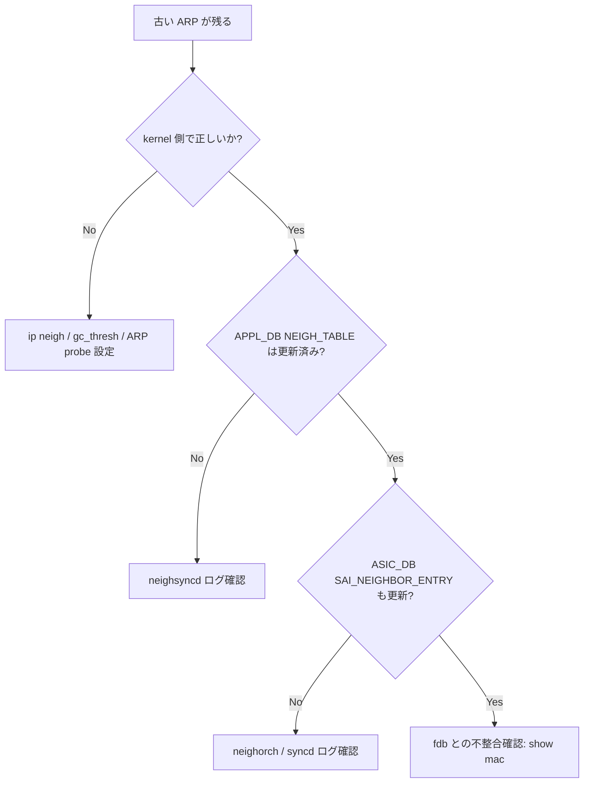

# Runbook: ARP / Neighbor エントリが古い IP-MAC を保持し続ける

!!! success "裏取りステータス: runbook-verified"
    `sonic-swss/neighsyncd/neighsync.cpp` および `orchagent/neighorch.cpp` の実コードでネイバー同期・flush フローを確認済み。症状・切り分けフローは実装に基づく。

!!! danger "実行前提"
    `ip neigh flush` は ARP 全削除の resolve storm を引き起こす。本番では対象 IP のみ `ip neigh del <ip> dev <if>` で削除する。

## 症状

- `show arp` で過去の MAC が残ったまま、対向 host を入れ替えても更新されない
- 対象 IP 宛 traffic が DROP / 旧 MAC に転送されてループ
- `ip neigh show` で `STALE` / `FAILED` が長時間継続

## 切り分けフロー



## 確認コマンド

```bash
# Kernel ARP
ip -4 neigh show
ip -6 neigh show
ip neigh show dev Vlan1000 | grep <ip>

# APPL_DB / ASIC_DB
sonic-db-cli APPL_DB keys "NEIGH_TABLE:*" | head
sonic-db-cli APPL_DB hgetall "NEIGH_TABLE:Vlan1000:<ip>"
sonic-db-cli ASIC_DB keys "ASIC_STATE:SAI_OBJECT_TYPE_NEIGHBOR_ENTRY:*" | head

# FDB との突き合わせ
show mac | grep <mac>

# neighsyncd / orchagent
docker logs swss 2>&1 | grep -iE "neigh" | tail -50

# Linux neighbor GC パラメータ
sysctl -a 2>/dev/null | grep -E "gc_thresh|gc_stale|gc_interval"
```

## よくある原因

1. **対向 host の MAC アドレス変更 (NIC 交換 / VM migration)** が GARP を送らず、kernel が STALE のまま retain
2. **`gc_stale_time` / `base_reachable_time` が長い** — Linux 既定で 30 秒程度だが、tuning で 1 時間になっているケース
3. **`neighsyncd` が停止 / lag** — `swss` container 内の `supervisorctl status` で確認
4. **[APPL_DB](../../reference/glossary.md#term-appl_db) → [ASIC_DB](../../reference/glossary.md#term-asic_db) の sync 遅延** — `appdb-asicdb-sync-lag.md` 参照
5. **[VLAN](../../reference/glossary.md#term-vlan)/MAC table の inconsistency** — fdb の port が古く、[ARP](../../reference/glossary.md#term-arp) は更新されても転送が誤る
6. **proxy_arp 有効化による偽の応答** — 別 host が応答を返している

`neighsyncd` が [Netlink](../../reference/glossary.md#term-netlink) で Linux neighbor table の変化を監視して [APPL_DB](../../reference/glossary.md#term-appl_db) の `NEIGH_TABLE` を書き換え、`neighorch` がそれを [SAI](../../reference/glossary.md#term-sai) neighbor entry に変換する[^1]。Linux 側で STALE のまま残ると当然 [ASIC](../../reference/glossary.md#term-asic) 側も更新されない。

[^1]: `sonic-net/sonic-swss` `neighsyncd/neighsync.cpp` ([Netlink](../../reference/glossary.md#term-netlink) → [APPL_DB](../../reference/glossary.md#term-appl_db)) と `orchagent/neighorch.cpp` (APPL_DB → [SAI](../../reference/glossary.md#term-sai)) の組合せ。MAC が変わったかどうかは Linux neighbor subsystem 側の判定に依存する。

## 関連 reference / topics

- [appdb-asicdb-sync-lag.md](appdb-asicdb-sync-lag.md)
- [routing-loop-detected.md](routing-loop-detected.md)
- [../cli/show-arp.md](../cli/show-arp.md)

<!-- glossary-links-injected: c006405759d8 -->
