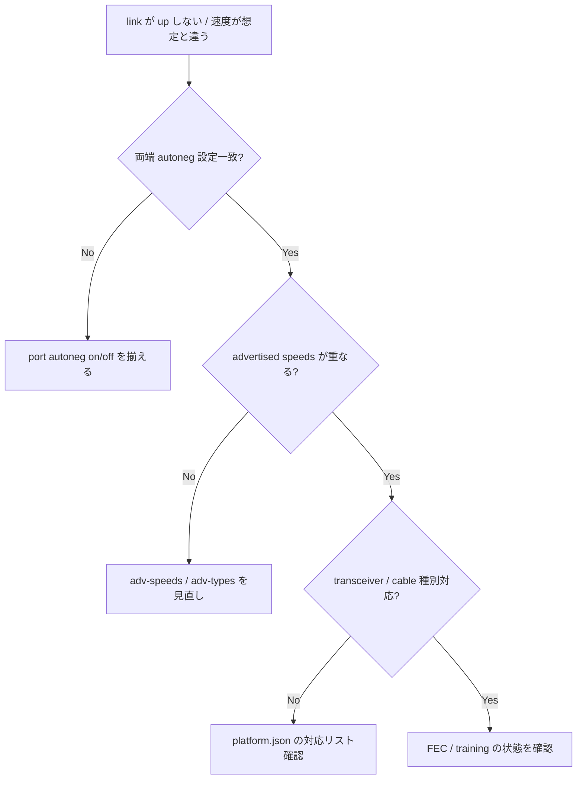

# Runbook: ASIC port が UP しない (autoneg / speed / FEC 不整合)

!!! danger "実行前提"
    `config interface speed` / `config interface fec` / `config interface autoneg` の変更は対象ポートを一旦 down させて再 up する。本番トラフィックの通る port では事前に対向側と合意し、メンテ枠で実行すること。**ロールバック**は変更前の値を控えておき、同コマンドで戻すか `config reload` で `config_db.json` から再構築する。

## 症状

- `show interface status Ethernet0` で `oper down` のまま
- カウンタが上がらない、`SFP present` だが `link` が下がる
- 片側だけ UP、対向はずっと `Idle`

## 想定原因（優先度順）

1. **speed / lane 設定不一致**: 100G(4x25) vs 100G(2x50 PAM4) など lane モード差
2. **FEC mode 不一致**: `rs` / `fc` / `none` が対向と一致していない
3. **autoneg 設定の食い違い**: 片側 on / 片側 off
4. **transceiver 互換性 / DOM 異常**: 光出力低下 / temperature alarm
5. **Breakout 設定の port mapping 不整合**: `port_config.ini` と [CONFIG_DB](../../reference/glossary.md#term-config_db) の不一致

## 切り分け手順




## 確認コマンド

### 1. interface 状態

```bash
show interface status Ethernet0
show interface counters Ethernet0
sonic-db-cli APPL_DB hgetall "PORT_TABLE:Ethernet0"
sonic-db-cli STATE_DB hgetall "PORT_TABLE|Ethernet0"
```

### 2. transceiver 情報

```bash
show interface transceiver eeprom Ethernet0
show interface transceiver presence
sudo sfputil show eeprom -p Ethernet0
sudo sfputil show error-status -p Ethernet0
```

### 3. FEC / autoneg

```bash
sonic-db-cli CONFIG_DB hgetall "PORT|Ethernet0" | grep -iE "fec|autoneg|speed|lanes"
show interface fec Ethernet0
```

### 4. ASIC ログ

```bash
docker logs swss 2>&1 | grep -iE "ethernet0|portsyncd" | tail -100
sudo dmesg | grep -iE "phy|link" | tail -50
```

### 5. 対向との突合

- 両側で `speed` / `fec` / `autoneg` を一致させる（公式互換性表に従う）

## 対処方法

- speed 修正: `config interface speed Ethernet0 100000`（**ロールバック**: 変更前の speed に同コマンドで戻す）
- FEC: `config interface fec Ethernet0 rs`（**ロールバック**: 元 FEC mode に戻す）
- autoneg: `config interface autoneg Ethernet0 enabled`（**ロールバック**: 同コマンドで disabled に）
- breakout: `config interface breakout Ethernet0 "4x25G"` （多大なポート再構成あり、メンテ枠必須）
- transceiver 異常: 別 SFP に差し替え、ベンダ互換性表を確認

## 確認

対処後の正常化を以下で裏取りする。

- **症状解消**: 「症状」節で挙げた事象 (counter / log / state) が回復していること
- **再発監視**: 数分〜数十分の間隔で同コマンドを再実行し、値がフラップしていないこと
- **副作用なし**: 関連サブシステム ([syslog](../../reference/glossary.md#term-syslog) / `show interfaces counters errors` / `show ip bgp summary` 等) に新規 error が出ていないこと
- **永続化**: `sudo config save -y` 済みで `config_db.json` に変更が反映されていること (恒久対処の場合)

短時間で再発する場合は「想定原因」リストの次候補に進む。

## 関連ページ

- [./fec-errors.md](./fec-errors.md)
- [../config-db/port.md](../config-db/port.md)

## 引用元

本ページの根拠は引用元 [^1][^2] を参照。

[^1]: sonic-net/[sonic-swss](../../reference/glossary.md#term-sonic-swss) @ master — portsorch.cpp
[^2]: sonic-net/sonic-platform-daemons @ master — xcvrd.py

<!-- glossary-links-injected: 6d49ad6a28cc -->
