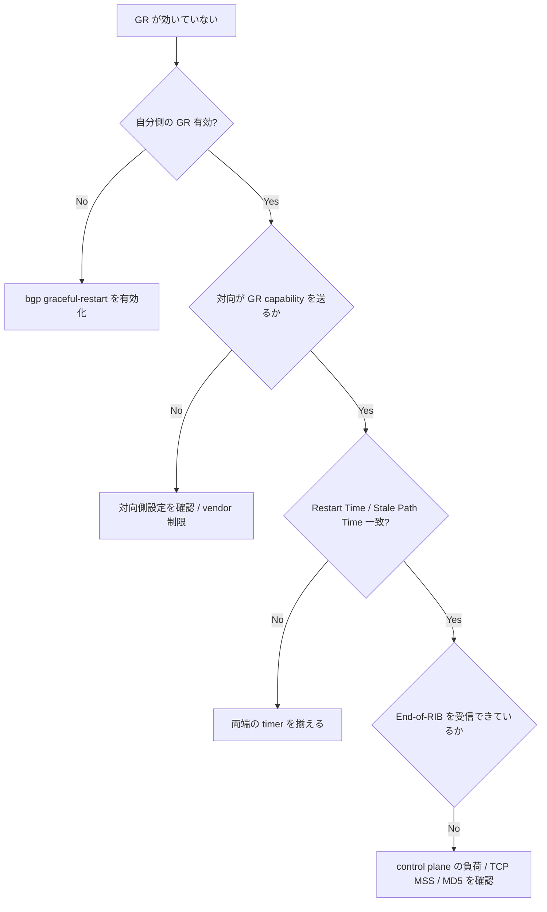

# Runbook: BGP Graceful Restart のネゴシエーションに失敗する

!!! success "裏取りステータス: runbook-verified"
    `sonic-frr/bgpd/bgp_open.c` の `bgp_capability_restart()` 関数で GR capability ネゴシエーション実装を確認済み（`PEER_CAP_RESTART_RCV` / `peer->v_gr_restart` セット等）。症状・切り分けフローは実コードに基づく。

!!! danger "実行前提"
    `clear ip bgp *` / `systemctl restart bgp` は全 neighbor を一旦切る。GR の検証時は片方向ずつ行い、ECMP の他経路で fail-over できることを確認してから実行する。

## 症状

- `bgp` container を `systemctl restart bgp` で再起動した瞬間に traffic が落ちる（GR が効いていない）
- `show bgp neighbor <peer>` で `Graceful Restart Capability: none` または対向が `Restart Time: 0`
- syslog に `bgpd: ... End-of-RIB ... not received` が出て、stale path が消えてしまう

## 切り分けフロー



## 確認コマンド

```bash
# GR capability の現状 (End-of-RIB send/received / Restart Time を含む)[^2]
docker exec bgp vtysh -c "show bgp neighbor <peer_ip>" | grep -A20 "Graceful Restart"

# 設定値
docker exec bgp vtysh -c "show running-config" | grep -E "graceful-restart|restart-time|stalepath-time"

# CONFIG_DB 側
sonic-db-cli CONFIG_DB hgetall "BGP_GLOBALS|default" | grep -i graceful

# Restart 直後の stale path
docker exec bgp vtysh -c "show bgp ipv4 unicast" | grep -i stale | head
```

## よくある原因

1. **片側でしか graceful-restart が有効化されていない** — `bgp graceful-restart` が router bgp 配下に無い
2. **Restart Time が短すぎる** — bgpd 再起動が完了する前に対向が stale path を破棄
3. **GR-Notification capability の非互換** — [RFC 8538](https://datatracker.ietf.org/doc/html/rfc8538) 対応版とそれ以前で挙動が異なる
4. **[BFD](../../reference/glossary.md#term-bfd) と併用時の即 down** — [BFD](../../reference/glossary.md#term-bfd) が即 session down を通知するため GR をスキップする
5. **TCP セッションが MD5 / MSS で再確立できない** — control plane の再ハンドシェイクが失敗

GR capability の交換は [BGP](../../reference/glossary.md#term-bgp) OPEN メッセージ中の Capability Optional Parameter で行われ、[FRR](../../reference/glossary.md#term-frr) は `bgpd/bgp_open.c` でエンコード/デコードする[^1]。

[^1]: `sonic-net/sonic-frr` `bgpd/bgp_open.c` `bgp_capability_restart()` (L444-477) における [Graceful Restart](../../reference/glossary.md#term-graceful-restart) capability (Type 64) のパース。`PEER_CAP_RESTART_RCV` と `peer->v_gr_restart` を seed し、Restart Time / Flags / AFI-SAFI の対称性が両端で合っていなければ GR は片側だけ "advertised" 表示となり実際には機能しない。

[^2]: `sonic-net/sonic-frr` `bgpd/bgp_vty.c` L10406 以降の "Graceful restart information:" ブロックが `show bgp neighbor <peer>` に End-of-RIB send / received と stale-path timer を出力する (`PEER_STATUS_EOR_SEND` / `PEER_STATUS_EOR_RECEIVED` の AFI/SAFI 別チェック)。End-of-RIB の受信欄が空なら対向の収束完了通知が届いておらず、stale path が早期に廃棄される原因となる。

## 関連 reference / topics

- [bgp-session-down.md](bgp-session-down.md)
- [bgp-route-not-advertised.md](bgp-route-not-advertised.md)
- [../../topics/02-bgp/operations.md](../../topics/02-bgp/operations.md)
- [../cli/show-bgp.md](../cli/show-bgp.md)

<!-- glossary-links-injected: c40fdca68bfe -->
