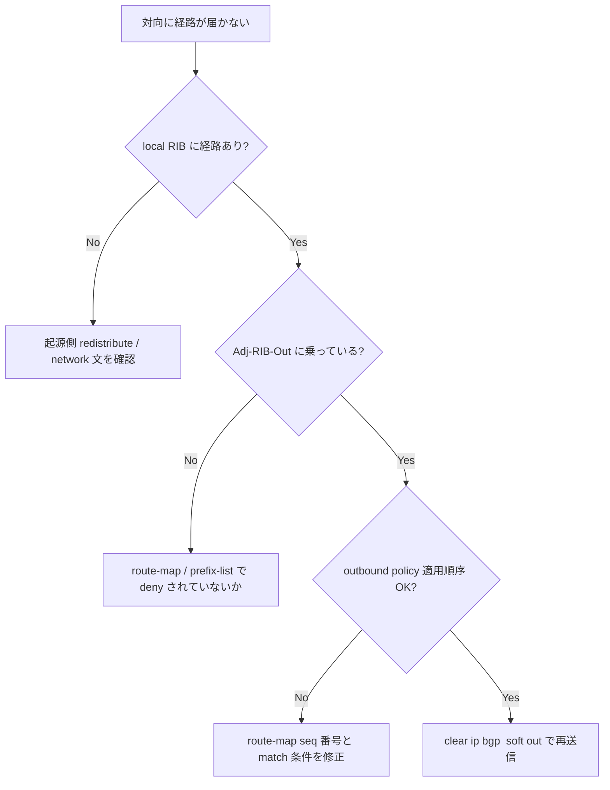

# Runbook: BGP route が広告されない

!!! danger "実行前提"
    `clear ip bgp <peer> soft out` は対向への full advertise を再送する。peer の inbound 処理に瞬間負荷がかかる。`clear ip bgp *` 全 reset は経路断を伴うので避ける。修正前に `vtysh -c "show running-config bgpd" > /tmp/frr.bak` を取得し、悪化時は `vtysh -f /tmp/frr.bak` で書き戻す。

## 症状

- `show ip route` には経路があるが、`show ip bgp neighbors <peer> advertised-routes` に出てこない
- 対向側で受信されない
- 自分の loopback prefix が外に出ない

## 想定原因（優先度順）

1. **`network` / redistribute 文の不足**: [FRR](../../reference/glossary.md#term-frr) で `network 1.1.1.0/24` または `redistribute connected` が無い
2. **outbound route-map で deny**: `route-map RM_OUT permit` の match で外れる
3. **prefix-list で除外**: `ip prefix-list PL_OUT` の sequence で deny
4. **next-hop self / community 設定不適**: iBGP で next-hop が peer から到達不能
5. **best-path にならない**: 同 prefix で他の経路（IGP / static）に負けて Adj-RIB-Out に乗らない

## 切り分け手順




## 確認コマンド

### 1. local RIB と Adj-RIB-Out

```bash
docker exec bgp vtysh -c "show ip bgp 1.1.1.0/24"
docker exec bgp vtysh -c "show ip bgp neighbors <peer> advertised-routes"
docker exec bgp vtysh -c "show ip bgp neighbors <peer> received-routes" # 対向側用
```

- 期待: 該当 prefix が `*>` (best, valid) で、advertised-routes に出る
- 異常: best ではない → 他の同 prefix エントリと比較

### 2. route-map の適用

```bash
docker exec bgp vtysh -c "show running-config bgpd" | grep -A20 "neighbor <peer>"
docker exec bgp vtysh -c "show route-map"
```

### 3. prefix-list の確認

```bash
docker exec bgp vtysh -c "show ip prefix-list"
```

### 4. soft clear で再評価

```bash
docker exec bgp vtysh -c "clear ip bgp <peer> soft out"
```

### 5. CONFIG_DB の ROUTE_MAP

```bash
sonic-db-cli CONFIG_DB keys "ROUTE_MAP|*"
sonic-db-cli CONFIG_DB keys "PREFIX_LIST|*"
```

## 対処方法

- `network` 文追加: `vtysh -c "conf t" -c "router bgp <ASN>" -c "network 1.1.1.0/24"` → [CONFIG_DB](../../reference/glossary.md#term-config_db) 側にも反映
- route-map 修正: `route-map RM_OUT permit 100` を追加、または既存の deny を緩める
- iBGP 経路で next-hop 問題: `neighbor <peer> next-hop-self`

## 確認

対処後の正常化を以下で裏取りする。

- **症状解消**: 「症状」節で挙げた事象 (counter / log / state) が回復していること
- **再発監視**: 数分〜数十分の間隔で同コマンドを再実行し、値がフラップしていないこと
- **副作用なし**: 関連サブシステム (syslog / `show interfaces counters errors` / `show ip bgp summary` 等) に新規 error が出ていないこと
- **永続化**: `sudo config save -y` 済みで `config_db.json` に変更が反映されていること (恒久対処の場合)

短時間で再発する場合は「想定原因」リストの次候補に進む。

## 関連ページ

- [bgp-session-down.md](bgp-session-down.md)
- [../../topics/02-bgp/operations.md](../../topics/02-bgp/operations.md)
- [../config-db/route-map.md](../config-db/route-map.md)

## 引用元

本ページの根拠は引用元 [^1][^2][^3] を参照。Adj-RIB-Out への投入判定は [FRR](../../reference/glossary.md#term-frr) の `subgroup_announce_check()` を経由し、選定経路の APP_DB 反映は [fpmsyncd](../../reference/glossary.md#term-fpmsyncd) の `RouteSync::onRouteMsg()` 経路で `ROUTE_TABLE` [ProducerStateTable](../../reference/glossary.md#term-producerstatetable) に書き込まれる。

[^1]: sonic-net/sonic-frr @ 799f47f — `bgpd/bgp_route.c` L1420 `subgroup_announce_check()` および L2161-2164 で outbound policy 判定後に `bgp_adj_out_set_subgroup()` で Adj-RIB-Out へ投入。
[^2]: sonic-net/[sonic-swss](../../reference/glossary.md#term-sonic-swss) @ 4305596 — `fpmsyncd/routesync.cpp` L153-162 [`RouteSync`](../../reference/glossary.md#term-fpmsyncd) constructor が `APP_ROUTE_TABLE_NAME` (`ROUTE_TABLE`) の [ProducerStateTable](../../reference/glossary.md#term-producerstatetable) を生成、L2111 `onRouteMsg()` で [zebra](../../reference/glossary.md#term-zebra) → APP_DB へ反映。
[^3]: sonic-net/[sonic-swss](../../reference/glossary.md#term-sonic-swss) @ 4305596 — `fpmsyncd/fpmlink.cpp` は [FPM](../../reference/glossary.md#term-fpm) ソケット受信のみを担当し、netlink → APP_DB 変換は `routesync.cpp` 側で行われる。

<!-- glossary-links-injected: d1439329b8c6 -->
