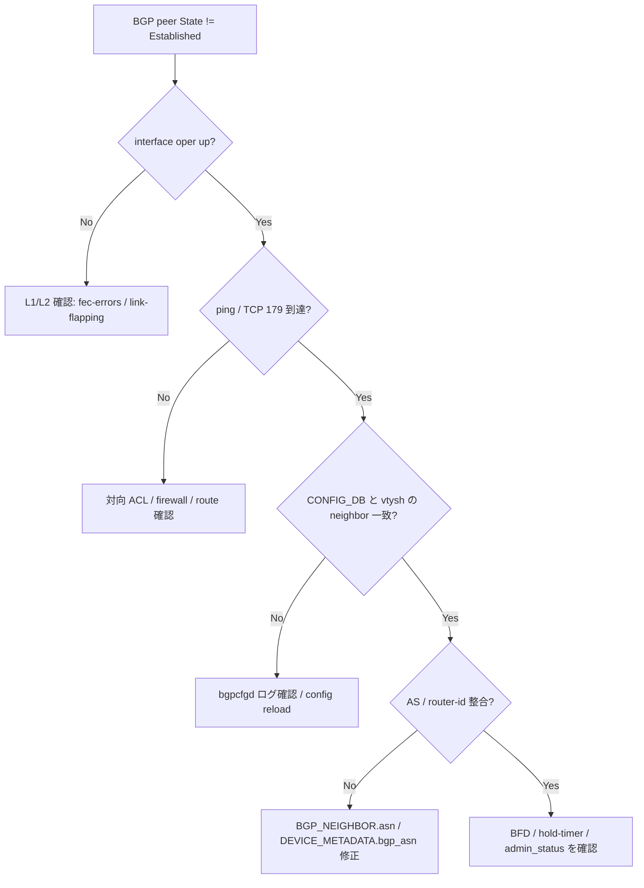

# Runbook: BGP セッションが UP しない

!!! danger "実行前提"
    `systemctl restart bgp` / `config reload -y` は FRR の全 neighbor を一旦切り、再収束まで数十秒～数分の経路断が発生する。実行前に `sudo cp /etc/sonic/config_db.json /etc/sonic/config_db.json.bak.$(date +%s)` でロールバック用 backup を取り、ECMP メンバーがいる場合は本機を `config bgp shutdown all` で graceful drain してから対処すること。問題が悪化した場合は backup を `cp` で戻して `config reload -y` で復旧する。

## 症状

- `show ip bgp summary` で対向の State が `Active` / `Connect` / `Idle (Admin)` のままになる
- Peer の確立後すぐ flap する (`Established` → `Idle`)
- Container `bgp` 内では [FRR](../../reference/glossary.md#term-frr) (bgpd) が動作しているが、[SONiC](../../reference/glossary.md#term-sonic) 側 `show` で peer が表示されない

## 確認コマンド

最初に状態を 1 枚で確認するためのワンライナー集 (詳細手順は後述「切り分け手順」)。

```bash
# Peer State / AS / Uptime の一覧
show ip bgp summary

# 特定 peer の詳細 (Active / OpenSent / Established 等)
docker exec bgp vtysh -c "show bgp neighbor <peer_ip>"

# CONFIG_DB と FRR の整合
sonic-db-cli CONFIG_DB hgetall "BGP_NEIGHBOR|<peer_ip>"
docker exec bgp vtysh -c "show running-config" | grep -A5 "router bgp"

# notification 抽出 (直近のエラー)
docker exec bgp tail -n 200 /var/log/frr/bgpd.log | grep -iE "notification|fsm"
```

## 想定原因（優先度順）

1. **L1 / L2 / L3 の事前条件が満たされていない**: interface oper down、IP 未設定、MTU 不一致、対向側 [ACL](../../reference/glossary.md#term-acl) でブロック
2. **[CONFIG_DB](../../reference/glossary.md#term-config_db) と [FRR](../../reference/glossary.md#term-frr) の同期失敗**: `bgpcfgd` (= [FRR](../../reference/glossary.md#term-frr) config generator) がテンプレ生成エラーで停止し、`vtysh -c "show run"` に neighbor が出ない
3. **AS 番号 / router-id の設定誤り**: ローカル AS が `DEVICE_METADATA|localhost` の `bgp_asn` と一致しない
4. **管理上 disable されている**: `BGP_NEIGHBOR|<ip>` の `admin_status` = `down`
5. **[BFD](../../reference/glossary.md#term-bfd) セッション断**: `bfdd` が UP しないと [BGP](../../reference/glossary.md#term-bgp) が即 down する構成（bfd hold-down）

## 切り分け手順




### 1. リンク・IP の確認

```bash
show interface status Ethernet0
show ip interface
```

- 期待: `oper` が `up`、対向 peer の IP がローカル subnet にある
- 異常: `oper down` → ケーブル / SFP / FEC の確認（[fec-errors.md](fec-errors.md) を参照）

### 2. ICMP / TCP/179 到達確認

```bash
ping <peer_ip> -c 3
sudo tcpdump -i any -nn host <peer_ip> and port 179
```

- 期待: ping 応答あり、TCP SYN / SYN-ACK が双方向に流れる
- 異常: TCP SYN は出るが SYN-ACK 戻らない → 対向 [ACL](../../reference/glossary.md#term-acl) / firewall を確認

### 3. CONFIG_DB と FRR の整合

```bash
sonic-db-cli CONFIG_DB hgetall "BGP_NEIGHBOR|<peer_ip>"
sonic-db-cli CONFIG_DB hgetall "DEVICE_METADATA|localhost" | grep -E "bgp_asn|hostname"
docker exec bgp vtysh -c "show running-config" | grep -A5 "router bgp"
```

- 期待: `BGP_NEIGHBOR` の `asn` / `local_addr` / `holdtime` が FRR 側 `neighbor` 設定と一致
- 異常: [CONFIG_DB](../../reference/glossary.md#term-config_db) に存在するが FRR に出ない → `docker logs bgp 2>&1 | grep bgpcfgd` で template エラー確認

### 4. BGP セッション状態の詳細

```bash
docker exec bgp vtysh -c "show bgp neighbor <peer_ip>"
```

- 状態 `Active`: outbound TCP がブロックされている (peer 不在 / [ACL](../../reference/glossary.md#term-acl))
- 状態 `OpenSent`: AS 番号不一致 (Notification: Bad Peer AS)
- 状態 `OpenConfirm`: capability 不一致 (4-byte AS、Add-path 等)
- 状態 `Established` で即 reset: hold-down 不一致 / route-map evaluation エラー

### 5. ログ・notification 抽出

```bash
docker exec bgp tail -n 200 /var/log/frr/bgpd.log
sudo grep -iE "bgp|bfd" /var/log/syslog | tail -100
```

## 対処方法

- 「3.」で [CONFIG_DB](../../reference/glossary.md#term-config_db) と FRR が乖離している場合: `sudo systemctl restart bgp` で再生成。これでも反映されないなら `bgpcfgd` テンプレ (`/usr/share/sonic/templates/bgpd/`) を確認
- AS / router-id を修正する場合: `sonic-cfggen -j /etc/sonic/config_db.json` での import 後 `config save -y` → `config reload -y`
- [BFD](../../reference/glossary.md#term-bfd) で flap している場合: `BFD_SESSION_TABLE`（[APPL_DB](../../reference/glossary.md#term-appl_db)）で session 状態を確認し、[BFD](../../reference/glossary.md#term-bfd) timer を緩める

## 関連ページ

- [../../topics/02-bgp/operations.md](../../topics/02-bgp/operations.md)
- [../../topics/02-bgp/concept.md](../../topics/02-bgp/concept.md)
- [../cli/config-bgp.md](../cli/config-bgp.md)
- [../cli/show-bgp.md](../cli/show-bgp.md)
- [../config-db/bgp-neighbor.md](../config-db/bgp-neighbor.md)

## 引用元

本ページの根拠は引用元 [^1][^2][^3] を参照。

[^1]: sonic-net/sonic-frr @ 799f47f — bgpd FSM
[^2]: sonic-net/[sonic-swss](../../reference/glossary.md#term-sonic-swss) @ 4305596 — bfdorch / [fpmsyncd](../../reference/glossary.md#term-fpmsyncd)
[^3]: sonic-net/[sonic-utilities](../../reference/glossary.md#term-sonic-utilities) @ 39732bceb — show bgp 実装

<!-- glossary-links-injected: 8ba32e5aa69d -->
