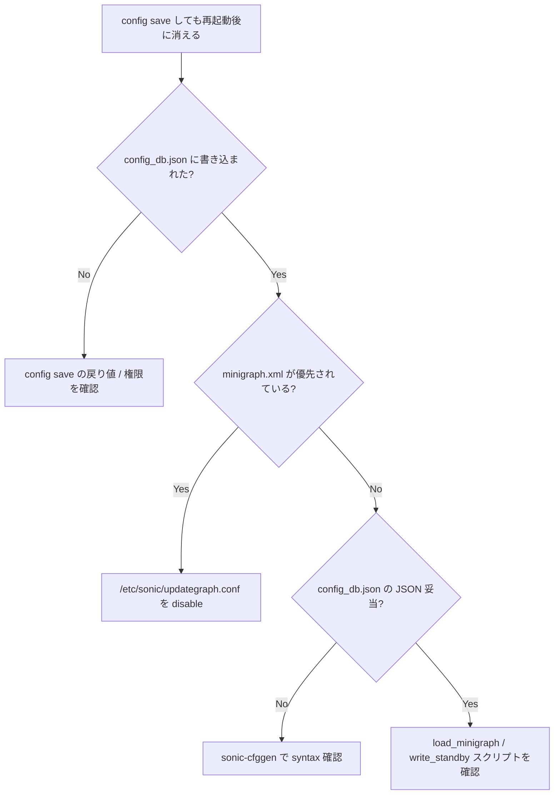

# Runbook: CONFIG_DB の永続化が失敗する (config save 失敗)

!!! danger "実行前提"
    `/etc/sonic/config_db.json` が破損したまま再起動すると default minigraph / 空 config で起動してしまう恐れがある。`config save -y` 前に必ず `sudo cp /etc/sonic/config_db.json /etc/sonic/config_db.json.bak.$(date +%s)` を取得。問題発生時は backup を `cp` で戻して `sudo config reload -y -f`。

## 症状

- `sudo config save -y` がエラーを吐く
- `/etc/sonic/config_db.json` が 0 byte / truncated
- リブート後に変更内容が消える

## 想定原因（優先度順）

1. **disk full**: `/etc/sonic` を含む rootfs が満杯
2. **read-only file system**: ストレージ障害で remount-ro
3. **json schema 違反**: [CONFIG_DB](../../reference/glossary.md#term-config_db) に [YANG](../../reference/glossary.md#term-yang) 違反データが入っている
4. **権限問題**: 直接 redis-cli で書き込んだ場合に group/other write 不可
5. **multi-asic で `config save -y` の subprocess 失敗**

## 切り分け手順




## 確認コマンド

### 1. ディスク状態

```bash
df -h /
mount | grep " / "
```

- 期待: `rw` mount、free 数 GB
- 異常: `ro` → dmesg で I/O error 確認

### 2. ファイルサイズ / 権限

```bash
ls -la /etc/sonic/config_db.json
sudo file /etc/sonic/config_db.json
sudo jq '.' /etc/sonic/config_db.json > /dev/null
```

### 3. config save の verbose

```bash
sudo config save -y 2>&1 | tee /tmp/save.log
```

### 4. YANG validation

```bash
sudo sonic-cfggen -d --print-data > /tmp/cur.json
sudo python3 -c "import sonic_yang; s=sonic_yang.SonicYang('/usr/local/yang-models'); s.loadYangModel(); s.loadData(jsonFile='/tmp/cur.json'); s.validate_data_tree()"
```

### 5. dmesg

```bash
sudo dmesg | tail -50
```

## 対処方法

- disk full: `sudo find /var/log -size +100M -delete` でログ削減
- ro mount: 再起動して fsck 実施
- [YANG](../../reference/glossary.md#term-yang) 違反 key を削除: `sudo sonic-db-cli CONFIG_DB del "<key>"` で除外、再 save
- backup 復旧: `sudo cp /etc/sonic/config_db.json.bak.<ts> /etc/sonic/config_db.json && sudo config reload -y -f`

## 確認

対処後の正常化を以下で裏取りする。

- **症状解消**: 「症状」節で挙げた事象 (counter / log / state) が回復していること
- **再発監視**: 数分〜数十分の間隔で同コマンドを再実行し、値がフラップしていないこと
- **副作用なし**: 関連サブシステム ([syslog](../../reference/glossary.md#term-syslog) / `show interfaces counters errors` / `show ip bgp summary` 等) に新規 error が出ていないこと
- **永続化**: `sudo config save -y` 済みで `config_db.json` に変更が反映されていること (恒久対処の場合)

短時間で再発する場合は「想定原因」リストの次候補に進む。

## 関連ページ

- [config-save-load.md](config-save-load.md)
- [techsupport-size-bloat.md](techsupport-size-bloat.md)

## 引用元

本ページの根拠は引用元 [^1][^2] を参照。

[^1]: sonic-net/[sonic-utilities](../../reference/glossary.md#term-sonic-utilities) @ 39732bceb — config save 実装
[^2]: sonic-net/[sonic-swss-common](../../reference/glossary.md#term-sonic-swss-common) @ 158de8d — configdb.cpp

<!-- glossary-links-injected: d5320e852f7a -->
