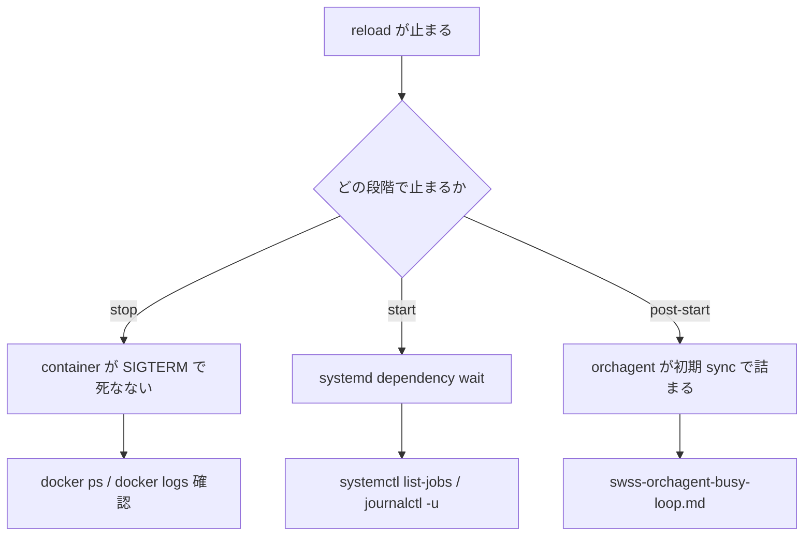

# Runbook: config reload が完了しない / hang する

!!! danger "実行前提"
    `config reload -y` は全 SONiC container を再起動するため転送断が発生する。in-service の機器では warm-reboot か事前 traffic drain を行う。途中で Ctrl-C すると中途半端な状態になりやすく、復旧には reboot が必要になることがある。

## 症状

- `config reload -y` を実行後、`Stopping ... swss` 等で 10 分以上停止
- systemd 側の `swss.service` / `bgp.service` が `activating (start)` のまま
- container は止まったが、新しい設定で起動してこない

## 切り分けフロー



## 確認コマンド

```bash
# 進行中の systemd job
systemctl list-jobs
sudo journalctl -u swss -n 200 --no-pager
sudo journalctl -u bgp -n 200 --no-pager

# Container 状態
docker ps -a | head
docker logs swss 2>&1 | tail -100

# Redis の reload 痕跡
sonic-db-cli CONFIG_DB dbsize
sonic-db-cli APPL_DB dbsize
sonic-db-cli ASIC_DB dbsize

# Feature の依存関係
show feature status

# /etc/sonic/config_db.json の妥当性
python3 -c "import json; json.load(open('/etc/sonic/config_db.json'))" && echo OK
sudo sonic-cfggen -j /etc/sonic/config_db.json --print-data > /dev/null && echo "cfggen OK"
```

## よくある原因

1. **`config_db.json` の構文エラー / 必須 key 欠落** — `sonic-cfggen` が無限 retry に近い動きをする
2. **依存関係のあるサービスが停止しきれない** — `database` container が PID 1 待ちで残る
3. **`bgp.service` が [FRR](../../reference/glossary.md#term-frr) の old socket を握ったまま** — `/var/run/frr/*.pid` の残骸
4. **[orchagent](../../reference/glossary.md#term-orchagent) の初期 sync 中に [ASIC](../../reference/glossary.md#term-asic) エラー** — `swss-orchagent-busy-loop.md` 参照
5. **[gNMI](../../reference/glossary.md#term-gnmi) / telemetry container の graceful stop timeout** — 既定 10 秒だが応答せず 5 分待ち
6. **NTP 未同期で証明書時刻が未来** — gnmi/telemetry が起動失敗

## 対処

1. まず `config_db.json` を json として parse できるか確認
2. `systemctl status` で hanging service を特定し、`systemctl reset-failed` 後 `systemctl restart <unit>`
3. それでも詰まる場合は `sudo reboot`（fast-reboot ではなく完全 reboot）
4. backup から `cp /etc/sonic/config_db.json.bak.* /etc/sonic/config_db.json` で巻き戻し

`config reload` の実装は `sonic-utilities` の `config/main.py` にあり、`stop services → load config_db → start services` の各段で待ち合わせる[^1]。

[^1]: `sonic-net/sonic-utilities` の `config/main.py` における `reload` コマンド実装。停止と起動の各サブステップが順次 systemd を叩くため、いずれか 1 つでも応答しなければ全体が hang する。

## 関連 reference / topics

- [swss-orchagent-busy-loop.md](swss-orchagent-busy-loop.md)
- [warm-reboot-failure.md](warm-reboot-failure.md)
- [config-db-persistence-failure.md](config-db-persistence-failure.md)
- [minigraph-reload-stuck.md](minigraph-reload-stuck.md)

<!-- glossary-links-injected: c006405759d8 -->
