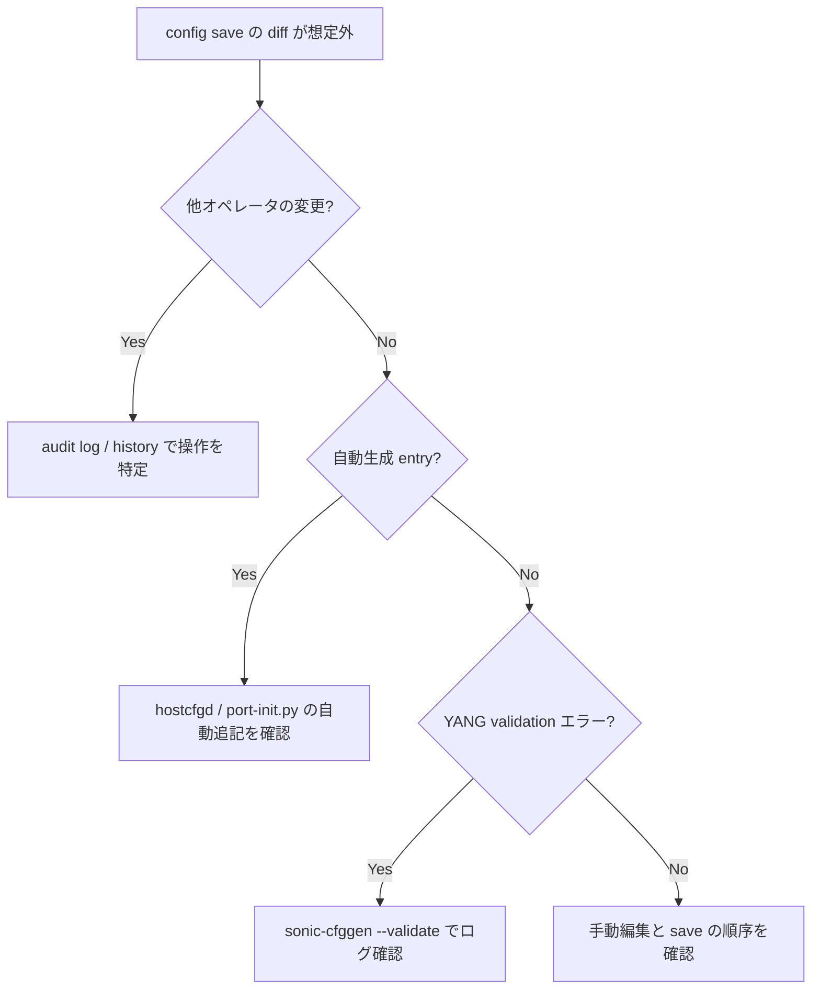

# Runbook: config save 後に予期しない diff が出る

!!! danger "実行前提"
    diff の正体が「default 値の materialize」「動的 generate される runtime key」「他エージェントの commit」の 3 種に分類できる。盲目的に `config replace` を回すと runtime key を消して reload 後に挙動が変わる場合がある。事前に `sudo cp /etc/sonic/config_db.json /etc/sonic/config_db.json.bak.$(date +%s)`。

## 症状

- `config save -y` 直後でも `git diff` 相当の差分が出続ける
- runtime 上は変更していないのに save の度に key が増減
- 別 admin の操作と衝突した可能性

## 想定原因（優先度順）

1. **default 値の auto-fill**: minigraph / [hostcfgd](../../reference/glossary.md#term-hostcfgd) が起動時に default を埋める
2. **runtime-only key の永続化**: `BUFFER_PG` 等 dynamic computed が save に乗る
3. **multi-asic の `config save` で namespace 不整合**
4. **手動で `sonic-db-cli SET` した値が runtime のみ反映**

## 切り分け手順




## 確認コマンド

### 1. 現 running と保存 config の差分

```bash
sudo sonic-cfggen -d --print-data > /tmp/run.json
sudo diff <(jq -S . /tmp/run.json) <(jq -S . /etc/sonic/config_db.json) | head -50
```

### 2. dynamic buffer 等の自動 key 確認

```bash
sonic-db-cli CONFIG_DB hgetall "DEVICE_METADATA|localhost" | grep -i buffer_model
```

- `traditional` か `dynamic` か
- dynamic の場合は [BUFFER_PG](../../reference/glossary.md#term-buffer-pg) 等が自動生成

### 3. multi-asic の各 namespace

```bash
sudo sonic-cfggen -d --print-data -n asic0 > /tmp/run.asic0
sudo diff /tmp/run.asic0 /etc/sonic/config_db_asic0.json | head
```

### 4. hostcfgd の auto-fill

```bash
sudo journalctl -u hostcfgd | grep -i "default" | tail
```

## 対処方法

- 一旦 `sudo config save -y` を再実行して安定化
- multi-asic: `sudo config save -y` （新しい multi-asic 対応版で各 namespace 同時 save）
- runtime のみで良い key は [CONFIG_DB](../../reference/glossary.md#term-config_db) から削除し save し直す: `sudo sonic-db-cli CONFIG_DB del "<key>"`

## 関連ページ

- [config-db-persistence-failure.md](config-db-persistence-failure.md)
- [config-save-load.md](config-save-load.md)
- [multi-asic-namespace.md](multi-asic-namespace.md)

## 引用元

本ページの根拠は引用元 [^1][^2] を参照。

[^1]: sonic-net/[sonic-utilities](../../reference/glossary.md#term-sonic-utilities) @ 39732bceb — config save
[^2]: sonic-net/[sonic-swss-common](../../reference/glossary.md#term-sonic-swss-common) @ 158de8d — configdb get/set

<!-- glossary-links-injected: 1af9c6208afc -->
