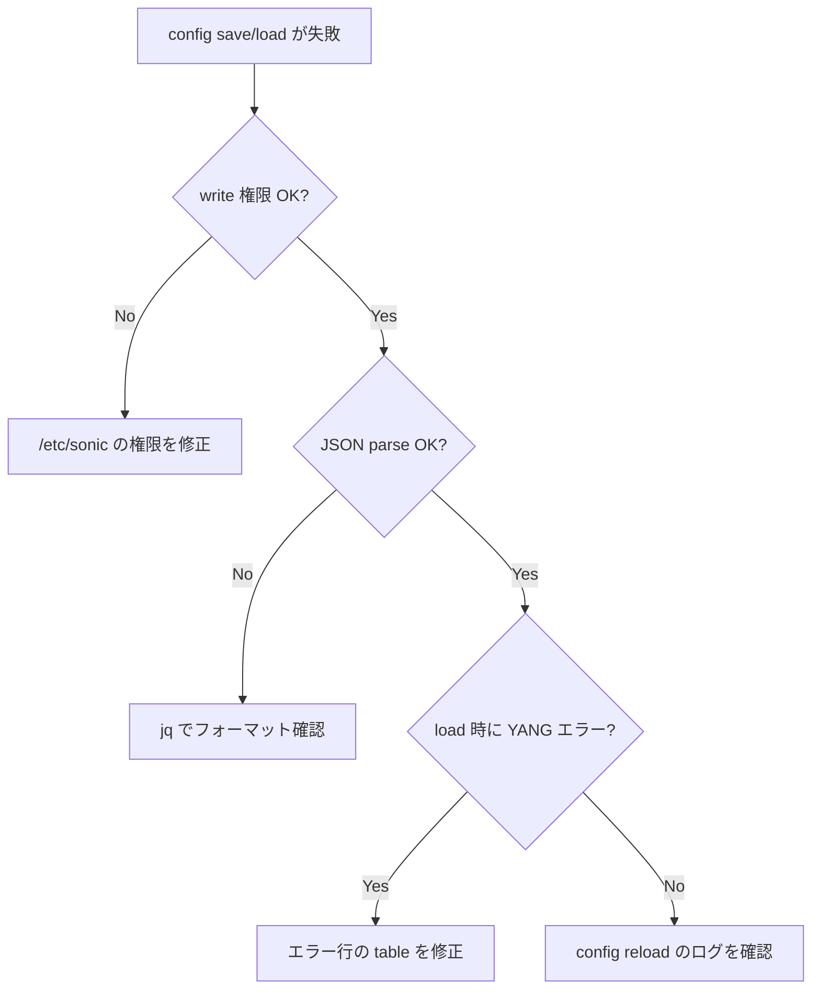

# Runbook: CONFIG_DB save / load が反映されない

!!! danger "実行前提"
    `config reload -y` / `config load_minigraph -y` は **全 swss / syncd / bgp を再起動** し、data plane が 30 秒～数分中断する（cold restart 相当）。実行前に必ず多段 backup を取る: (1) `sudo cp /etc/sonic/config_db.json /etc/sonic/config_db.json.bak.$(date +%s)`、(2) `redis-cli -n 4 --rdb /tmp/cfgdb.rdb.bak.$(date +%s)`、(3) multi-asic は各 namespace 分も同様に。`db_migrator.py` は schema version を変更するため、失敗時は backup から `cp` で戻して `systemctl restart database` 後 `config reload -y` で復旧。Minigraph 投入時は `/etc/sonic/minigraph.xml` も同様に backup。

## 症状

- `config save -y` 後の再起動で設定が古いまま戻る
- `config reload -y` を打っても CLI が処理しない / 完了しても [CONFIG_DB](../../reference/glossary.md#term-config_db) に乗らない
- `config load_minigraph` で [minigraph.xml](../../reference/glossary.md#term-minigraph.xml) から再構成しても期待設定にならない

## 想定原因

1. **`/etc/sonic/config_db.json` の権限 / オーナーが root 以外で書き込み失敗**
2. **multi-asic 環境で host 側だけ save し、`config_db<N>.json` が更新されていない**
3. **[YANG](../../reference/glossary.md#term-yang) / [sonic-cfggen](../../reference/glossary.md#term-sonic-cfggen) 検証で reject されたが ユーザが気付いていない**
4. **db_migrator のバージョン不整合**: ファイル format version と [SONiC](../../reference/glossary.md#term-sonic) ビルドの期待バージョン不一致
5. **[minigraph.xml](../../reference/glossary.md#term-minigraph.xml) を編集したのに `load_minigraph` を打たず `reload` だけしている**

## 切り分け手順




## 確認コマンド

### 1. ファイル時刻 / 権限

```bash
ls -la /etc/sonic/
sudo cat /etc/sonic/config_db.json | jq 'keys | length'
```

- 期待: `config save` 直後に mtime が更新、所有 root:root, 644
- 異常: 古いまま → save が disk まで届いていない

### 2. multi-asic 用 namespace 別ファイル

```bash
ls -la /etc/sonic/config_db*.json
sudo cat /etc/sonic/config_db0.json | jq 'keys | length' 2>/dev/null
```

- 期待: 全 asic 分のファイルが揃っている

### 3. save / reload エラー出力

```bash
sudo config save -y 2>&1 | tee /tmp/save.log
sudo config reload -y 2>&1 | tee /tmp/reload.log
```

- 期待: `Running command:` が無事 0 で終わる
- 異常: [YANG](../../reference/glossary.md#term-yang) validation エラー → 出力中の table / field を [CONFIG_DB](../../reference/glossary.md#term-config_db) から修正

### 4. db_migrator のバージョン

```bash
sonic-db-cli CONFIG_DB hgetall "VERSIONS|DATABASE"
sudo cat /etc/sonic/config_db.json | jq '.VERSIONS'
```

- 期待: 両者一致、または migrator が起動時にアップグレード
- 異常: image とファイルで大きな差 → `sudo db_migrator.py -o migrate` で修復

### 5. minigraph と CONFIG_DB の整合

```bash
sudo sonic-cfggen -m /etc/sonic/minigraph.xml --print-data | jq 'keys | length'
diff <(sudo sonic-cfggen -m /etc/sonic/minigraph.xml --print-data | jq -S .) \
     <(sudo cat /etc/sonic/config_db.json | jq -S .)
```

## 対処方法

- ファイル権限修復: `sudo chown root:root /etc/sonic/config_db*.json && sudo chmod 644 /etc/sonic/config_db*.json`
- multi-asic で per-asic save:

```bash
sudo config save -y    # host
for ns in $(ip netns list | awk '{print $1}'); do
  sudo ip netns exec $ns config save -y
done
```

- minigraph 起点に戻す: `sudo config load_minigraph -y` （注意: 全 dynamic config 上書き）
- db_migrator 不整合: `sudo db_migrator.py -o migrate` 後 `sudo systemctl restart database`

## 確認

対処後の正常化を以下で裏取りする。

- **症状解消**: 「症状」節で挙げた事象 (counter / log / state) が回復していること
- **再発監視**: 数分〜数十分の間隔で同コマンドを再実行し、値がフラップしていないこと
- **副作用なし**: 関連サブシステム ([syslog](../../reference/glossary.md#term-syslog) / `show interfaces counters errors` / `show ip bgp summary` 等) に新規 error が出ていないこと
- **永続化**: `sudo config save -y` 済みで `config_db.json` に変更が反映されていること (恒久対処の場合)

短時間で再発する場合は「想定原因」リストの次候補に進む。

## 関連ページ

- [../cli/show-running-config.md](../cli/show-running-config.md)
- [../cli/sonic-cfggen.md](../cli/sonic-cfggen.md)

## 引用元

本ページの根拠は引用元 [^1] を参照。

[^1]: sonic-net/[sonic-utilities](../../reference/glossary.md#term-sonic-utilities) @ 39732bceb — `config/main.py`, `scripts/db_migrator.py`

<!-- glossary-links-injected: 8ba32e5aa69d -->
