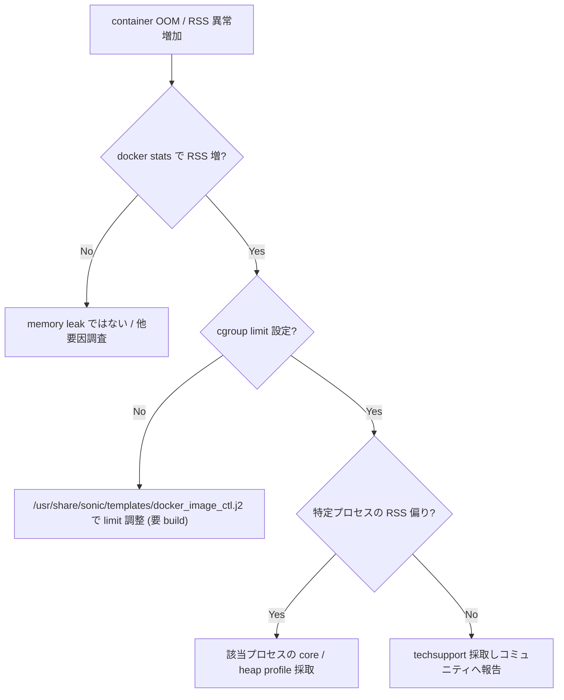

# Runbook: コンテナ memory limit 超過 / OOM kill

!!! danger "実行前提"
    OOM された container は systemd で自動 restart されるが、その間 control plane (BGP / LLDP / SNMP) は不通。原因 container を特定する前に乱暴に limit を上げると swap を消費して host 自体が不安定になる。`sudo cp /etc/sonic/config_db.json /etc/sonic/config_db.json.bak.$(date +%s)` を必ず取得し、limit 変更は段階的に。

## 症状

- syslog に `Out of memory: Killed process` / `oom-killer`
- `docker stats` で memory が `LIMIT` ぎりぎり
- 該当 container (bgp / snmp / lldp 等) が無限 restart

## 想定原因（優先度順）

1. **特定 container の memory leak**: 長時間稼働で増加
2. **大規模 config (1000+ route / [ACL](../../reference/glossary.md#term-acl)) で初期化が memory を食う**
3. **container limit のチューニング不足**: default 512MB で足りない
4. **host 側の swap 無効 + free 不足**

## 切り分け手順




## 確認コマンド

### 1. 各 container の使用量

```bash
docker stats --no-stream
```

### 2. OOM 履歴

```bash
sudo dmesg | grep -i "killed process" | tail
sudo journalctl -u docker | grep -i oom | tail
```

### 3. 該当プロセス内訳

```bash
docker exec <container> top -b -n 1 | head -20
```

### 4. host memory

```bash
free -h
cat /proc/meminfo | head -10
```

### 5. limit 設定

```bash
docker inspect <container> | jq '.[].HostConfig.Memory'
sonic-db-cli CONFIG_DB hgetall "FEATURE|<feature>"
```

## 対処方法

- container 再起動: `sudo systemctl restart <feature>`
- limit 引き上げ: `/usr/share/sonic/templates/docker_image_ctl.j2` を修正してイメージを再 build（sonic-buildimage ビルド時に各コンテナの起動スクリプトへ展開される）
- leak 疑い → memory profiling し upstream issue
- 不要 feature 無効化: `sudo config feature state <feat> disabled`

## 確認

対処後の正常化を以下で裏取りする。

- **症状解消**: 「症状」節で挙げた事象 (counter / log / state) が回復していること
- **再発監視**: 数分〜数十分の間隔で同コマンドを再実行し、値がフラップしていないこと
- **副作用なし**: 関連サブシステム ([syslog](../../reference/glossary.md#term-syslog) / `show interfaces counters errors` / `show ip bgp summary` 等) に新規 error が出ていないこと
- **永続化**: `sudo config save -y` 済みで `config_db.json` に変更が反映されていること (恒久対処の場合)

短時間で再発する場合は「想定原因」リストの次候補に進む。

## 関連ページ

- [container-not-starting.md](container-not-starting.md)
- [sai-failure.md](sai-failure.md)

## 引用元

本ページの根拠は引用元 [^1][^2] を参照。

[^1]: sonic-net/[sonic-buildimage](../../reference/glossary.md#term-sonic-buildimage) @ 4305596 — sonic_debian_extension
[^2]: sonic-net/sonic-host-services @ 4305596 — [hostcfgd](../../reference/glossary.md#term-hostcfgd) feature mgr

<!-- glossary-links-injected: cdc10e959ceb -->
