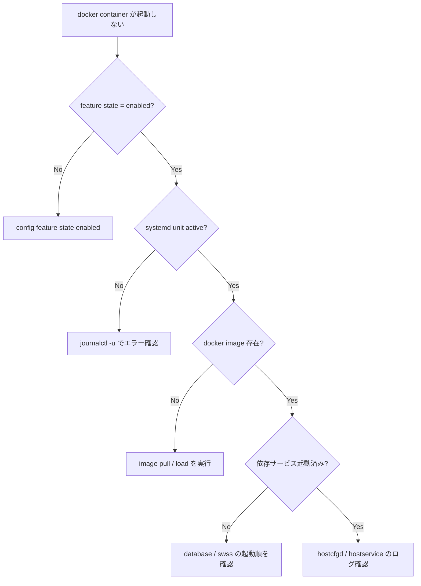

# Runbook: コンテナが起動しない (FEATURE)

!!! danger "実行前提"
    `config feature state <feature> disabled` → `enabled` の toggle は当該機能（bgp / teamd / lldp 等）を 5～15 秒中断する。**`bgp` / `swss` / `syncd` を disabled にすると data plane / control plane が落ちる** ため絶対に redundant ToR がない状態で実施しない。実行前に `sudo cp /etc/sonic/config_db.json /etc/sonic/config_db.json.bak.$(date +%s)` で backup、`show feature status > /tmp/feature.bak` で現状保存。誤って必須 feature を disable してしまった場合は `config feature state <feature> enabled` で即時復旧、それで戻らなければ backup を戻して `config reload -y`。

## 症状

- `show feature status` で対象 feature が `enabled` だが state が `failed` / `exited`
- `docker ps` に該当コンテナが居ない
- `systemctl status <feature>.service` が `activating` / `failed` ループ

## 確認コマンド

```bash
# feature の状態と CONFIG_DB / STATE_DB 整合
show feature status
sonic-db-cli CONFIG_DB hgetall "FEATURE|<name>"
sonic-db-cli STATE_DB  hgetall "FEATURE|<name>"

# systemd unit (multi-asic は <name>@<asic> も確認)
sudo systemctl status <name>
sudo journalctl -u <name> -n 200

# docker image / リソース
docker images | grep -E "sonic-(bgp|swss|teamd|snmp|database|pmon|nat|dhcp)"
df -h / ; df -hi ; free -h
```

## 想定原因

1. **`FEATURE|<name>` の `state` が `disabled` / `always_disabled`** → [hostcfgd](../../reference/glossary.md#term-hostcfgd) が起動を抑制
2. **対象 feature の sub-system 依存が満たされない** (例: `bgp` の起動には `swss` が先に Ready)
3. **イメージ pull / 展開失敗**: docker image が存在しない or 破損
4. **設定ファイル不備**: `/etc/sonic/config_db.json` の必須 key 欠落で起動スクリプトが abort
5. **リソース不足**: tmpfs 領域 / inode / shared memory 枯渇

## 切り分け手順




### 1. feature 設定

```bash
show feature status
sonic-db-cli CONFIG_DB hgetall "FEATURE|bgp"
sonic-db-cli STATE_DB hgetall "FEATURE|bgp"
```

- 期待: `state: enabled`, `auto_restart: enabled`
- 異常: `always_disabled` → そのプラットフォームでサポート対象外

### 2. systemd ユニット状態

```bash
sudo systemctl status bgp
sudo systemctl status bgp@0    # multi-asic
sudo journalctl -u bgp -n 200
```

- 期待: `active (running)`
- 異常: `activating (start-pre)` で stuck → start-pre script の確認

### 3. docker image 存在

```bash
docker images | grep -E "sonic-(bgp|swss|teamd|snmp|database|pmon|nat|dhcp)"
```

- 期待: 該当 image がある
- 異常: 無い / 古い → イメージ再 install 必要 (`sonic-installer install <image>`)

### 4. hostcfgd / hostservice の起動ログ

```bash
sudo journalctl -u hostcfgd -n 200
sudo journalctl -u rc-local -n 100
```

### 5. リソース状況

```bash
df -h /
df -h /var
df -hi
free -h
```

- 期待: `/` `/var` に空きあり、inode 残あり
- 異常: 容量不足 → core file / 古い log / docker image を整理

## 対処方法

- 有効化: `sudo config feature state bgp enabled`
- 個別 unit restart: `sudo systemctl restart bgp` (multi-asic は `bgp@0`)
- イメージ修復: `sudo sonic-installer install <SONiC.bin>` で再導入、または該当 docker image を再 load
- 起動順序問題は `database` → `swss` → `syncd` → 他、の dependency を確認

## 確認

対処後の正常化を以下で裏取りする。

- **症状解消**: 「症状」節で挙げた事象 (counter / log / state) が回復していること
- **再発監視**: 数分〜数十分の間隔で同コマンドを再実行し、値がフラップしていないこと
- **副作用なし**: 関連サブシステム ([syslog](../../reference/glossary.md#term-syslog) / `show interfaces counters errors` / `show ip bgp summary` 等) に新規 error が出ていないこと
- **永続化**: `sudo config save -y` 済みで `config_db.json` に変更が反映されていること (恒久対処の場合)

短時間で再発する場合は「想定原因」リストの次候補に進む。

## 関連ページ

- [../../topics/20-swss-sai-redis/operations.md](../../topics/20-swss-sai-redis/operations.md)
- [../cli/show-feature.md](../cli/show-feature.md)
- [../config-db/feature.md](../config-db/feature.md)

## 引用元

本ページの根拠は引用元 [^1][^2] を参照。

[^1]: sonic-net/sonic-host-services @ c5bbbe8 — [hostcfgd](../../reference/glossary.md#term-hostcfgd)
[^2]: sonic-net/[sonic-utilities](../../reference/glossary.md#term-sonic-utilities) @ 39732bceb — config feature state

<!-- glossary-links-injected: 9bd150521228 -->
