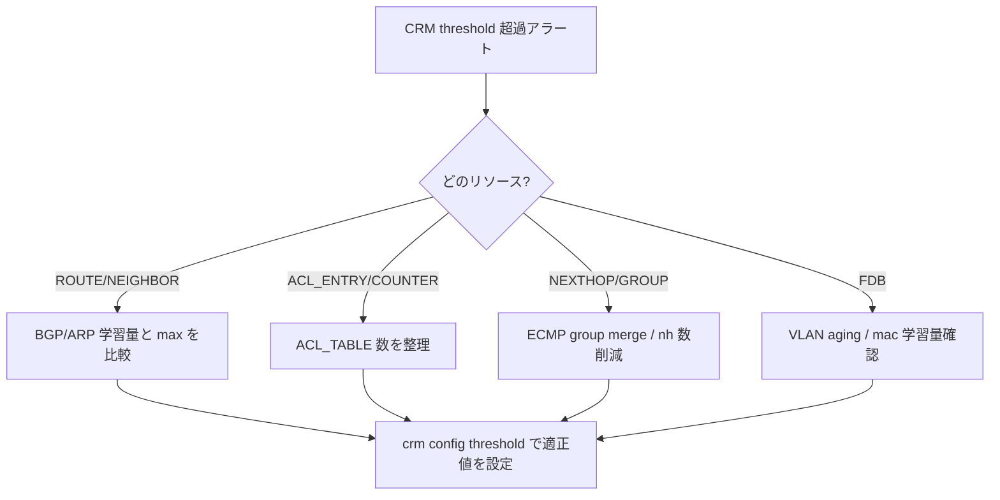

# Runbook: CRM (Critical Resource Monitor) で threshold 越えアラートが出る

!!! danger "実行前提"
    本ページは原則として観測・整理系の手順だが、`config bgp shutdown all` / `config interface shutdown` / 大量 route 削除など、リソース解放のために実行する操作はトラフィック断を伴う。実行前に影響範囲を controller / NOC と合意し、ロールバック手順（`config bgp startup all` / `config interface startup <if>` / 退避済み route の再投入）を準備すること。

## 症状

- syslog に `CRM_THRESHOLD_EXCEEDED` / `THRESHOLD_TYPE_USED` が出力される
- 新しい route / nexthop / [FDB](../../reference/glossary.md#term-fdb) エントリが [ASIC](../../reference/glossary.md#term-asic) に書けず `SAI_STATUS_TABLE_FULL`
- `crm show resources all` の `Used` が `Available` に迫っている

## 想定原因（優先度順）

1. **[ASIC](../../reference/glossary.md#term-asic) 容量に対する実需要超過**: route テーブル / [FDB](../../reference/glossary.md#term-fdb) の物理上限
2. **threshold 設定が低すぎる**: high=70% など過敏設定で誤検知
3. **leak**: [orchagent](../../reference/glossary.md#term-orchagent) が delete を [ASIC](../../reference/glossary.md#term-asic) に流していない（programming bug / [syncd](../../reference/glossary.md#term-syncd) 詰まり）
4. **特定 resource 種別の偏り**: [ACL](../../reference/glossary.md#term-acl) counter / mirror / Nexthop group が過大
5. **multi-asic で 1 ASIC に偏った programming**

## 切り分け手順




## 確認コマンド

### 1. 現在の使用量

```bash
crm show resources all
crm show summary
crm show thresholds all
```

- `Used` / `Available` / `% Used` を確認

### 2. resource 種別の内訳

```bash
crm show resources ipv4 route
crm show resources ipv4 nexthop
crm show resources fdb
crm show resources acl group
crm show resources acl table
```

### 3. COUNTERS_DB / ASIC_DB 突合

```bash
sonic-db-cli COUNTERS_DB hgetall "CRM:STATS"
sonic-db-cli ASIC_DB keys "ASIC_STATE:SAI_OBJECT_TYPE_ROUTE_ENTRY:*" | wc -l
```

- [COUNTERS_DB](../../reference/glossary.md#term-counters_db) と [ASIC_DB](../../reference/glossary.md#term-asic_db) の実数が乖離 → [orchagent](../../reference/glossary.md#term-orchagent) / [syncd](../../reference/glossary.md#term-syncd) の leak 可能性

### 4. 閾値の妥当性

```bash
sonic-db-cli CONFIG_DB hgetall "CRM|Config"
```

- 期待: `*_threshold_type` = `percentage`、`*_high_threshold` / `*_low_threshold` がモデルに合っている

### 5. orchagent ログ

```bash
docker logs swss 2>&1 | grep -iE "crm|table_full|sai_status" | tail -100
```

## 対処方法

- 実需要超過: route summarization、不要 nexthop の削減、[ACL](../../reference/glossary.md#term-acl) の集約
- threshold 調整: `crm config thresholds ipv4 route high 85` 等で適正化（**ロールバック**: 元値を控えて同コマンドで戻す）
- leak 疑い: `docker restart swss` は影響が極めて大きい。先に `sonic-db-cli` で [APPL_DB](../../reference/glossary.md#term-appl_db) と [ASIC_DB](../../reference/glossary.md#term-asic_db) の差分を取得しベンダ / コミュニティに報告
- multi-asic 偏り: [ECMP](../../reference/glossary.md#term-ecmp) hash の見直し、internal [BGP](../../reference/glossary.md#term-bgp) の announce 制御
- [ACL](../../reference/glossary.md#term-acl) counter 過剰: 未使用 ACL rule の整理、`SAI_ACL_COUNTER` 不要分の解放

## 確認

対処後の正常化を以下で裏取りする。

- **症状解消**: 「症状」節で挙げた事象 (counter / log / state) が回復していること
- **再発監視**: 数分〜数十分の間隔で同コマンドを再実行し、値がフラップしていないこと
- **副作用なし**: 関連サブシステム ([syslog](../../reference/glossary.md#term-syslog) / `show interfaces counters errors` / `show ip bgp summary` 等) に新規 error が出ていないこと
- **永続化**: `sudo config save -y` 済みで `config_db.json` に変更が反映されていること (恒久対処の場合)

短時間で再発する場合は「想定原因」リストの次候補に進む。

## 関連ページ

- [./rif-acl-counter-zero.md](./rif-acl-counter-zero.md)
- [./flex-counter-stuck.md](./flex-counter-stuck.md)
- [../config-db/crm.md](../config-db/crm.md)

## 引用元

本ページの根拠は引用元 [^1][^2] を参照。

[^1]: sonic-net/[sonic-swss](../../reference/glossary.md#term-sonic-swss) @ master — crmorch.cpp
[^2]: sonic-net/[sonic-utilities](../../reference/glossary.md#term-sonic-utilities) @ master — crm/main.py

<!-- glossary-links-injected: 8df9850464d2 -->
