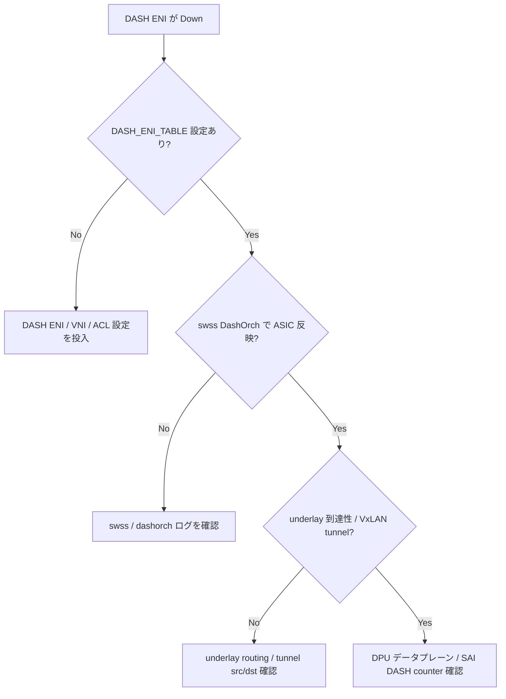

# Runbook: DASH ENI が admin_state=up に遷移しない / トラフィック断

!!! danger "実行前提"
    `dash` 系の orchagent 再起動や `config reload` は DPU 側 datapath のフロー table を消失させる。実行前に SDN controller 側で session migration を実施し、**変更前の `DASH_ENI_TABLE` / `DASH_ROUTE_TABLE` を `redis-dump` で退避**しておくこと。ロールバックは退避から `redis-cli` で再投入。

## 症状

- `show dash eni <eni>` で `oper_status=down` または `admin_state=down`
- [STATE_DB](../../reference/glossary.md#term-state_db) の `DASH_ENI_TABLE` の counter が更新されない
- VM → [DPU](../../reference/glossary.md#term-dpu) → outside の [VNET](../../reference/glossary.md#term-vnet) 通信が無応答

## 想定原因（優先度順）

1. **MAC / underlay_ip 不整合**: [ENI](../../reference/glossary.md#term-eni) の `mac_address` / `underlay_ip` が [SmartSwitch](../../reference/glossary.md#term-smartswitch) の物理構成と合っていない
2. **依存リソース未作成**: `DASH_VNET` / `DASH_APPLIANCE` が [ENI](../../reference/glossary.md#term-eni) より後に作られた / 削除された
3. **[DPU](../../reference/glossary.md#term-dpu) 側 dataplane 異常**: [DPU](../../reference/glossary.md#term-dpu) 内 [ASIC](../../reference/glossary.md#term-asic) programming が失敗
4. **License / capability mismatch**: model がサポートしない [ENI](../../reference/glossary.md#term-eni) count
5. **route / mapping table 衝突**

## 切り分け手順




## 確認コマンド

### 1. CONFIG_DB / APPL_DB

```bash
sonic-db-cli APPL_DB hgetall "DASH_ENI_TABLE|<eni>"
sonic-db-cli APPL_DB keys "DASH_ENI_TABLE:*"
sonic-db-cli STATE_DB hgetall "DASH_ENI_TABLE|<eni>"
```

### 2. orchagent ログ

```bash
docker logs swss 2>&1 | grep -iE "dash|eni" | tail -200
```

### 3. DPU 側状態（SmartSwitch）

```bash
show chassis modules status
show platform inventory
docker exec swss redis-cli -n 0 keys "DASH_*" | head
```

### 4. 関連リソース

```bash
sonic-db-cli CONFIG_DB keys "DASH_VNET|*"
sonic-db-cli CONFIG_DB keys "DASH_APPLIANCE|*"
sonic-db-cli CONFIG_DB keys "DASH_ROUTE_TABLE|*"
```

### 5. counter

```bash
show dash counter eni <eni>
```

## 対処方法

- 依存欠如: 先に `DASH_APPLIANCE` → `DASH_VNET` → `DASH_ENI_TABLE` の順に投入
- MAC / IP 不整合: controller 側 inventory と突合、[CONFIG_DB](../../reference/glossary.md#term-config_db) を `redis-cli hset` で修正（**ロールバック**: 退避値で hset 戻し）
- DPU dataplane 異常: [SmartSwitch](../../reference/glossary.md#term-smartswitch) の DPU を graceful shutdown → 再起動（[smartswitch-dpu-graceful-shutdown-failure.md](smartswitch-dpu-graceful-shutdown-failure.md) を参照）
- 容量超過: ENI 数を削減、ベンダ提供の max_eni を確認

## 確認

対処後の正常化を以下で裏取りする。

- **症状解消**: 「症状」節で挙げた事象 (counter / log / state) が回復していること
- **再発監視**: 数分〜数十分の間隔で同コマンドを再実行し、値がフラップしていないこと
- **副作用なし**: 関連サブシステム ([syslog](../../reference/glossary.md#term-syslog) / `show interfaces counters errors` / `show ip bgp summary` 等) に新規 error が出ていないこと
- **永続化**: `sudo config save -y` 済みで `config_db.json` に変更が反映されていること (恒久対処の場合)

短時間で再発する場合は「想定原因」リストの次候補に進む。

## 関連ページ

- [./smartswitch-dpu-unresponsive.md](./smartswitch-dpu-unresponsive.md)
- [./smartswitch-dpu-graceful-shutdown-failure.md](./smartswitch-dpu-graceful-shutdown-failure.md)
- [../../topics/13-dash-smartswitch/concept.md](../../topics/13-dash-smartswitch/concept.md)

## 引用元

本ページの根拠は引用元 [^1][^2] を参照。

[^1]: sonic-net/sonic-dash-api @ master — dash_eni.proto
[^2]: sonic-net/[sonic-swss](../../reference/glossary.md#term-sonic-swss) @ master — dashorch.cpp

<!-- glossary-links-injected: 6981be1a469d -->
