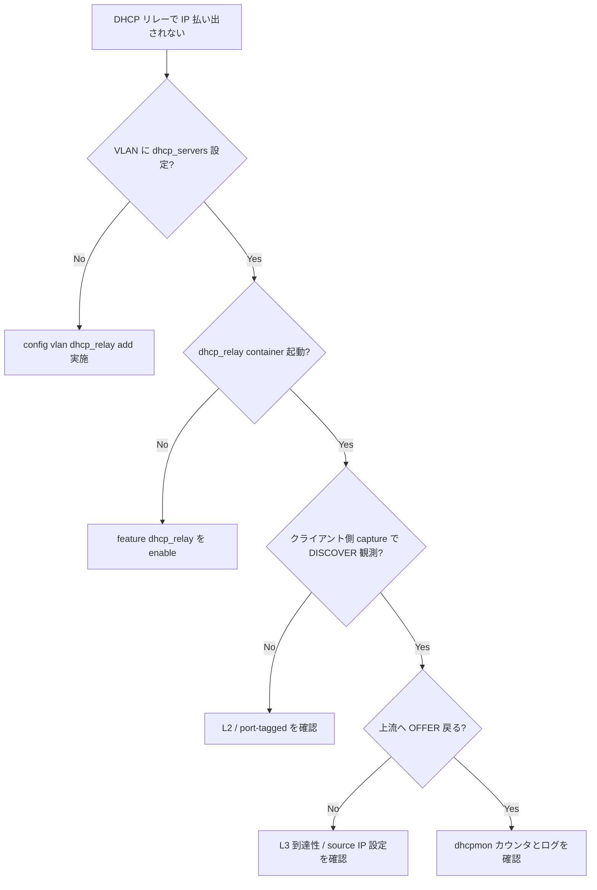

# Runbook: DHCP Relay で IP が払い出されない

!!! danger "実行前提"
    `systemctl restart dhcp_relay` / `docker restart dhcp_relay` は当該 VLAN の新規 DHCP 取得を 5～15 秒中断する（既存リースには影響しないが、リース更新タイミングのクライアントは再 DISCOVER に落ちる）。helper 変更時は `sudo cp /etc/sonic/config_db.json /etc/sonic/config_db.json.bak.$(date +%s)` で backup、誤設定時は backup を戻して `config reload -y` でロールバック。`sonic-clear dhcp_relay ipv4 counters` は統計のみで通信に影響しない。

## 症状

- [VLAN](../../reference/glossary.md#term-vlan) 配下のクライアントが DHCP DISCOVER を出すが OFFER を受け取れない
- `show dhcp_relay ipv4 helper` には正しい helper IP が見えるが pcap で外向き relay フレームが出ていない
- 反対に relay forward は出るが、server からの reply が戻ってこない

## 想定原因

1. **VLAN_INTERFACE に IP が振られていない**: relay agent の `giaddr` が 0.0.0.0 になり server 側で破棄
2. **helper サーバへの L3 到達性なし** (route / firewall / [VRF](../../reference/glossary.md#term-vrf) 不一致)
3. **helper IP の登録漏れ / typo**: `DHCPV4_RELAY|Vlan100` の `dhcpv4_servers` が空
4. **`dhcp_relay` コンテナが起動していない**: `show feature status` で disabled
5. **option 82 (circuit/remote-id) の挿入仕様が server と不一致** → server が DISCOVER を黙って drop

## 切り分け手順




## 確認コマンド

### 1. CONFIG_DB に helper が入っているか

```bash
sonic-db-cli CONFIG_DB hgetall "DHCPV4_RELAY|Vlan100"
sonic-db-cli CONFIG_DB hgetall "VLAN|Vlan100"
sonic-db-cli CONFIG_DB keys "VLAN_INTERFACE|Vlan100*"
```

- 期待: `dhcpv4_servers` に helper IP、`VLAN_INTERFACE|Vlan100|10.10.10.1/24` 等が存在
- 異常: helper 配列が空 → `config vlan dhcp_relay add 100 <helper-ip>`

### 2. 関連コンテナと feature 状態

```bash
show feature status | grep dhcp
docker ps | grep dhcp
docker logs dhcp_relay 2>&1 | tail -100
```

- 期待: feature `enabled` / `state: enabled`、`dhcp_relay` 起動中

### 3. クライアント側 / 上流 capture

```bash
sudo tcpdump -i Vlan100 -nn -e port 67 or port 68
sudo tcpdump -i <upstream> -nn -e port 67 and host <helper-ip>
```

- 期待: [VLAN](../../reference/glossary.md#term-vlan) 側で broadcast DISCOVER、上流で unicast を helper に relay
- 異常: 上流に出ない → relay daemon の判断で drop。`docker logs dhcp_relay` を確認

### 4. L3 到達性

```bash
ping -I <vlan_ip> <helper-ip>
ip route get <helper-ip>
```

- 異常: [VRF](../../reference/glossary.md#term-vrf) 違いで route なし → `mgmt_vrf` から `default` への route leaking 構成を見直し

### 5. statistics / counter

```bash
show dhcp_relay ipv4 counters
sonic-clear dhcp_relay ipv4 counters
```

- 各種 message type のカウンタを観測し、どこで止まっているか特定

## 対処方法

- helper 投入: `config vlan dhcp_relay add 100 10.0.0.1`
- VLAN_INTERFACE に IP 設定: `config interface ip add Vlan100 10.10.10.1/24`
- feature enable: `config feature state dhcp_relay enabled`
- option 82 の制御は実装上 forward-only モード等が存在するため、運用側 server 仕様に合わせて relay daemon の起動オプションを調整（Helm chart / supervisord.conf）

## 確認

対処後の正常化を以下で裏取りする。

- **症状解消**: 「症状」節で挙げた事象 (counter / log / state) が回復していること
- **再発監視**: 数分〜数十分の間隔で同コマンドを再実行し、値がフラップしていないこと
- **副作用なし**: 関連サブシステム ([syslog](../../reference/glossary.md#term-syslog) / `show interfaces counters errors` / `show ip bgp summary` 等) に新規 error が出ていないこと
- **永続化**: `sudo config save -y` 済みで `config_db.json` に変更が反映されていること (恒久対処の場合)

短時間で再発する場合は「想定原因」リストの次候補に進む。

## 関連ページ

- [../../topics/16-nat-dhcp-dns/operations.md](../../topics/16-nat-dhcp-dns/operations.md)
- [../../topics/16-nat-dhcp-dns/concept.md](../../topics/16-nat-dhcp-dns/concept.md)
- [../cli/config-dhcp-relay.md](../cli/config-dhcp-relay.md)
- [../config-db/dhcpv4-relay.md](../config-db/dhcpv4-relay.md)

## 引用元

本ページの根拠は引用元 [^1][^2] を参照。

[^1]: sonic-net/sonic-dhcp-relay @ 7316417 — relay.cpp
[^2]: sonic-net/[sonic-utilities](../../reference/glossary.md#term-sonic-utilities) @ 39732bceb — config vlan dhcp_relay

<!-- glossary-links-injected: ad07899a32d7 -->
