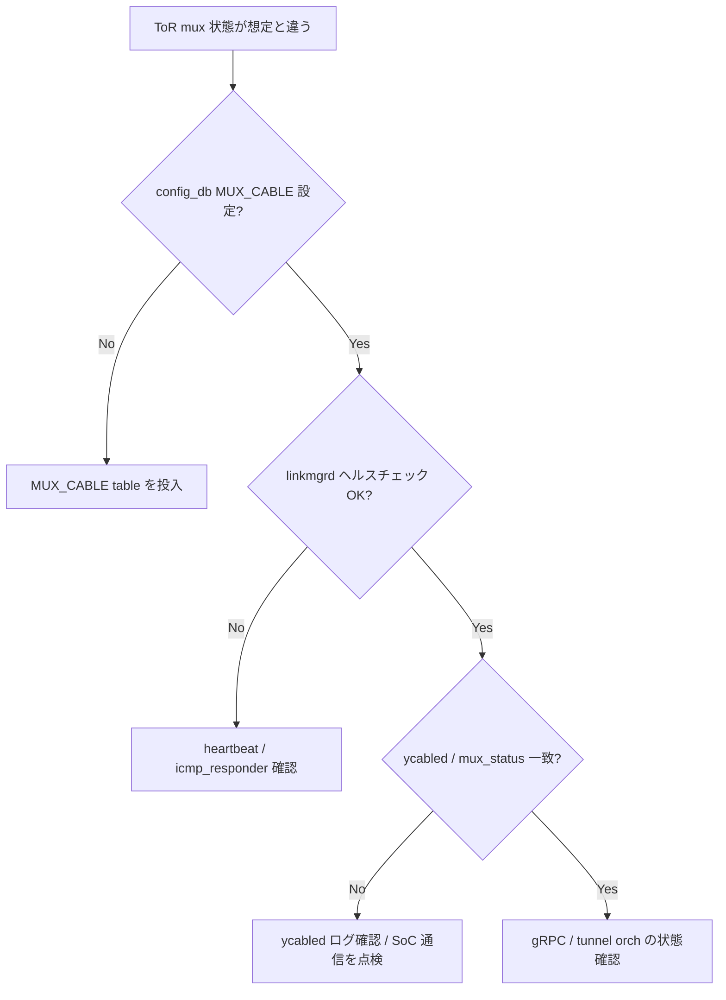

# Runbook: Dual-ToR mux が切り替わらない

!!! danger "実行前提"
    `docker restart mux` / `config reload -y` は **対向 ToR の状態確認なしに mux state を再評価する** ため、両 ToR で同時実施すると両側 standby となり server 通信が完全断する。必ず片側 ToR の linkmgrd / mux state が `active` 確定後にもう一方を操作すること。実行前に `show muxcable status -j > /tmp/mux.bak.$(date +%s).json` で現状 dump、`sudo cp /etc/sonic/config_db.json /etc/sonic/config_db.json.bak.$(date +%s)`。誤って両側 standby になった場合は `config muxcable mode active <port>` でいずれかを強制 active に。

## 症状

- `config muxcable mode active <port>` 実行後に `show muxcable status` の state が `unknown` / `standby` のまま
- `linkmgrd` が `LinkProberMuxState` を反映していない
- mux が flap し続け、Server 側に断続的な reachability 損失

## 想定原因

1. **[linkmgrd](../../reference/glossary.md#term-linkmgrd) / xcvrd / mux_orch のいずれかが down**
2. **PEER_SWITCH / MUX_CABLE 設定不整合** (server_ipv4 / soc_ipv4 等)
3. **active-standby と active-active のモード混在**: 設定が古い形式のまま
4. **ICMP heartbeat (link prober) が対向 ToR へ到達しない** (Loopback 設定 / route)
5. **Y-cable の firmware 異常 / vendor 別 fault**

## 切り分け手順




## 確認コマンド

### 1. mux 状態と peer 状態

```bash
show muxcable status
show muxcable config
sonic-db-cli STATE_DB hgetall "MUX_CABLE_TABLE|Ethernet4"
sonic-db-cli STATE_DB hgetall "HW_MUX_CABLE_TABLE|Ethernet4"
```

- 期待: `state: active` (admin side) / `linkmgrd` view と HW view が一致
- 異常: `linkmgrd: standby`, `hw: active` などの不一致 → [linkmgrd](../../reference/glossary.md#term-linkmgrd) が peer と整合できていない

### 2. linkmgrd / muxcabled / xcvrd

```bash
docker ps | grep -E "mux|linkmgrd|pmon"
sudo systemctl status mux 2>/dev/null || true
docker logs mux 2>&1 | tail -100   # platform 依存名
docker logs pmon 2>&1 | tail -100
```

### 3. ICMP heartbeat の状態

```bash
sonic-db-cli APPL_DB hgetall "LINK_PROBE_STATS|Ethernet4"
sonic-db-cli STATE_DB hgetall "MUX_LINKMGR_TABLE|Ethernet4"
```

- 期待: `link_prober_state: active`、`icmp_echo_replies` が増加
- 異常: replies が増えない → 対向 ToR への ICMP 経路が無い

### 4. mux_orch / SAI 反映

```bash
sonic-db-cli ASIC_DB keys "ASIC_STATE:SAI_OBJECT_TYPE_NEXT_HOP:*" | head
docker logs swss 2>&1 | grep -iE "mux" | tail -50
```

### 5. Y-cable firmware

```bash
show muxcable firmware version <port>
show muxcable cableinfo
```

## 対処方法

- 一時的に手動切替: `sudo config muxcable mode standby <port>` → 再度 `active`
- [linkmgrd](../../reference/glossary.md#term-linkmgrd) を再起動: `sudo docker restart mux`（または platform 別 service）
- LinkProber heartbeat 経路を Loopback0 で確認・修正
- 不整合の根本対策として `config reload -y` で全テーブル再注入
- firmware up-to-date 化 (`config muxcable firmware download/activate`)

## 確認

対処後の正常化を以下で裏取りする。

- **症状解消**: 「症状」節で挙げた事象 (counter / log / state) が回復していること
- **再発監視**: 数分〜数十分の間隔で同コマンドを再実行し、値がフラップしていないこと
- **副作用なし**: 関連サブシステム ([syslog](../../reference/glossary.md#term-syslog) / `show interfaces counters errors` / `show ip bgp summary` 等) に新規 error が出ていないこと
- **永続化**: `sudo config save -y` 済みで `config_db.json` に変更が反映されていること (恒久対処の場合)

短時間で再発する場合は「想定原因」リストの次候補に進む。

## 関連ページ

- [../../topics/05-dual-tor/operations.md](../../topics/05-dual-tor/operations.md)
- [../../topics/05-dual-tor/concept.md](../../topics/05-dual-tor/concept.md)
- [../cli/config-muxcable.md](../cli/config-muxcable.md)
- [../cli/show-muxcable.md](../cli/show-muxcable.md)
- [../config-db/mux-cable.md](../config-db/mux-cable.md)

## 引用元

本ページの根拠は引用元 [^1][^2] を参照。

[^1]: sonic-net/sonic-linkmgrd @ 65f5633 — LinkManagerStateMachine
[^2]: sonic-net/[sonic-swss](../../reference/glossary.md#term-sonic-swss) @ 4305596 — [muxorch](../../reference/glossary.md#term-muxorch)

<!-- glossary-links-injected: fa77d98b9e28 -->
