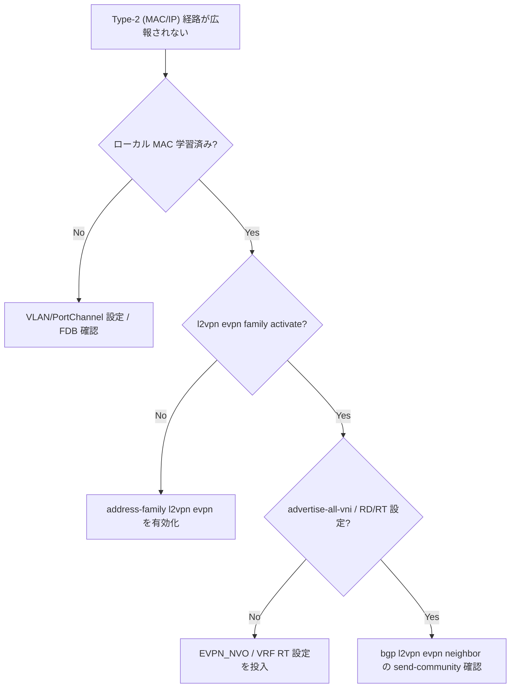

# Runbook: EVPN Type-2 (MAC/IP) route が peer に広告されない

!!! danger "実行前提"
    EVPN / VXLAN 系の `config reload` / `systemctl restart bgp` / VLAN-VNI mapping の変更は VXLAN overlay 経由のテナント通信を瞬断〜数十秒断する。事前に **CONFIG_DB の `VXLAN_TUNNEL` / `VLAN` / `VXLAN_EVPN_NVO` を退避**し、ロールバック手順として `config_db.json` を保存しておく。本番では事前にメンテ枠を確保すること。

## 症状

- `show bgp l2vpn evpn` で local MAC が出ない
- 対向 [VTEP](../../reference/glossary.md#term-vtep) に Type-2 が届かない（受信側で `show bgp l2vpn evpn route type macip` が空）
- [VLAN](../../reference/glossary.md#term-vlan)-to-VNI mapping は設定済みだが overlay 通信できない

## 想定原因（優先度順）

1. **`advertise-all-vni` 未設定**: [FRR](../../reference/glossary.md#term-frr) の `address-family l2vpn evpn` で `advertise-all-vni` がない。これが無効だと per-VNI の Type-2/3 route が広告されず withdraw 対象となる[^1]
2. **[VLAN](../../reference/glossary.md#term-vlan)-VNI mapping 欠落**: `VXLAN_TUNNEL_MAP` が未作成 / VNI 重複。`VxlanTunnelMapOrch::addOperation` で VLAN→VNI を [SAI](../../reference/glossary.md#term-sai) に投入する経路が走らない[^2]
3. **[FDB](../../reference/glossary.md#term-fdb) が学習されていない**: 対象 MAC が `show mac` に出ない
4. **route-target import/export 不整合**
5. **`type-2 prefix` の filter / route-map で drop**

## 切り分け手順




## 確認コマンド

### 1. VXLAN / VNI

```bash
show vxlan tunnel
show vxlan vlanvnimap
show vxlan name <tunnel>
sonic-db-cli CONFIG_DB keys "VXLAN_TUNNEL_MAP|*"
```

### 2. FRR / BGP EVPN

```bash
docker exec bgp vtysh -c "show running-config" | grep -A30 "l2vpn evpn"
docker exec bgp vtysh -c "show bgp l2vpn evpn summary"
docker exec bgp vtysh -c "show bgp l2vpn evpn route"
```

- 期待: `advertise-all-vni` あり、`route-target` が対向と一致

### 3. FDB / MAC 学習

```bash
show mac
sonic-db-cli APPL_DB keys "FDB_TABLE:Vlan*"
```

### 4. EVPN MAC/IP

```bash
docker exec bgp vtysh -c "show evpn mac vni <vni>"
docker exec bgp vtysh -c "show evpn vni"
```

### 5. orchagent

```bash
docker logs swss 2>&1 | grep -iE "vxlan|evpn" | tail -100
```

## 対処方法

- `advertise-all-vni` 追加: `vtysh -c "conf t" -c "router bgp <asn>" -c "address-family l2vpn evpn" -c "advertise-all-vni"` の後 `config save`（**ロールバック**: `no advertise-all-vni` を同経路で）
- [VLAN](../../reference/glossary.md#term-vlan)-VNI mapping 作成: `sudo config vxlan map add <tunnel> <vlan> <vni>`（**ロールバック**: `config vxlan map del`）
- RT 不一致: `route-target import/export` を対向と揃える
- [FDB](../../reference/glossary.md#term-fdb) が学習されない: MAC learning enable、port が trunk として正しいか確認

## 確認

対処後の正常化を以下で裏取りする。

- **症状解消**: 「症状」節で挙げた事象 (counter / log / state) が回復していること
- **再発監視**: 数分〜数十分の間隔で同コマンドを再実行し、値がフラップしていないこと
- **副作用なし**: 関連サブシステム ([syslog](../../reference/glossary.md#term-syslog) / `show interfaces counters errors` / `show ip bgp summary` 等) に新規 error が出ていないこと
- **永続化**: `sudo config save -y` 済みで `config_db.json` に変更が反映されていること (恒久対処の場合)

短時間で再発する場合は「想定原因」リストの次候補に進む。

## 関連ページ

- [../../topics/03-vxlan-evpn/concept.md](../../topics/03-vxlan-evpn/concept.md)
- [../../topics/03-vxlan-evpn/operations.md](../../topics/03-vxlan-evpn/operations.md)
- [../config-db/vxlan-tunnel.md](../config-db/vxlan-tunnel.md)

## 引用元

[^1]: sonic-net/sonic-frr @ `799f47f2` — [`bgpd/bgp_evpn.c` L2308–L2320 `delete_routes_for_vni()`](https://github.com/sonic-net/sonic-frr/blob/799f47f215e4266063c4ebde0041a0c7dd2d11d0/bgpd/bgp_evpn.c#L2308-L2320): [EVPN](../../reference/glossary.md#term-evpn) (advertise-all-vni) 無効化または VNI 削除時に per-VNI table の Type-2 (MAC/IP) → Type-3 ルートを withdraw する。
[^2]: sonic-net/[sonic-swss](../../reference/glossary.md#term-sonic-swss) @ `43055961` — [`orchagent/vxlanorch.cpp` L2010–L2050 `VxlanTunnelMapOrch::addOperation()`](https://github.com/sonic-net/sonic-swss/blob/4305596156d70e9797e8a881b3d19b46de0bce0d/orchagent/vxlanorch.cpp#L2010-L2050): `VXLAN_TUNNEL_MAP` から VLAN ID と VNI ID を取り出し、tunnel / VLAN 存在確認後に [SAI](../../reference/glossary.md#term-sai) tunnel map を作成する。

<!-- glossary-links-injected: 3293e6cc7456 -->
