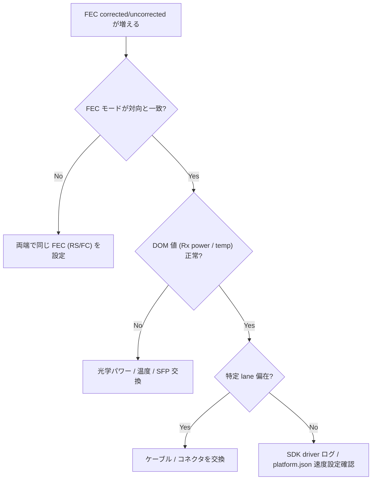

# Runbook: FEC エラーが多発する

!!! danger "実行前提"
    `config interface fec` / `config interface speed` で FEC mode や speed を変更すると当該ポートが down → 再 up し、リンク学習に数秒～数十秒かかる。LAG メンバーや ECMP path の最後の 1 本でないことを確認し、対向側と FEC モード・speed を必ず揃えてから一致タイミングで変更する。誤設定でリンクが上がらなくなった場合は `config interface fec <if> <旧モード>` で即時戻す（CONFIG_DB のみの変更で再起動は不要）。

## 症状

- `show interfaces counters errors` で `RX_ERR` / `SYMBOL_ERR` が継続的に増加
- リンク自体は UP するが、BER が高く上位プロトコル（[BGP](../../reference/glossary.md#term-bgp) / [LACP](../../reference/glossary.md#term-lacp)）が flap
- `show interfaces counters fec-stats` で FEC corrected/uncorrected カウンタが急増 ([portsorch](../../reference/glossary.md#term-portsorch) が `SAI_PORT_STAT_IF_IN_FEC_CORRECTABLE_FRAMES` / `..._NOT_CORRECTABLE_FRAMES` を [COUNTERS_DB](../../reference/glossary.md#term-counters_db) に集計)[^2]

## 想定原因

1. **両端の FEC モード不一致** (`rs` / `fc` / `none` の三択)。100G/400G では `rs` が必須なのに片側 `none`
2. **物理層異常**: 光ファイバ汚れ、MPO 並び順誤り、SFP 故障、コネクタの曲がり
3. **対応していない / 互換性のない光モジュール**: ベンダーが platform.json の許容リストに無い品
4. **ケーブル長と DAC/AOC 規格不一致** (例: 5m 銅 DAC を 100G-DR で使う等)
5. **port speed のミスマッチ**: auto-neg disable + speed 強制で対向と不一致

## 切り分け手順




## 確認コマンド

### 1. FEC モード確認

```bash
show interfaces fec status
sonic-db-cli CONFIG_DB hget "PORT|Ethernet0" fec
sonic-db-cli APPL_DB hget "PORT_TABLE:Ethernet0" fec
```

- 期待: 両端で一致 (`rs` 推奨 for 100G+)
- 異常: 片側のみ `none` → 即時不一致
- [CONFIG_DB](../../reference/glossary.md#term-config_db) の `fec` は [portsorch](../../reference/glossary.md#term-portsorch) (`PortsOrch::doPortTask` → `setPortFec`) が [SAI](../../reference/glossary.md#term-sai) 属性 `SAI_PORT_ATTR_FEC_MODE` として [ASIC](../../reference/glossary.md#term-asic) に適用する。[SAI](../../reference/glossary.md#term-sai) 反映に失敗した場合 syslog に `Failed to set FEC mode` が出る[^2]

### 2. エラーカウンタの内訳

```bash
show interfaces counters errors
show interfaces counters detailed Ethernet0
```

- `RX_ERR`、`SYMBOL_ERR`、`UNDER_SIZE`、`JABBER` のどれが伸びているかを切り分ける
- 期待: idle 時に増加しない
- 異常: 秒単位で増加 → 物理層の問題が濃厚

### 3. Transceiver / DOM の読み取り

```bash
show interfaces transceiver eeprom Ethernet0
show interfaces transceiver presence Ethernet0
show interfaces transceiver lpmode Ethernet0
```

- 期待: 適切な vendor / part number、`Rx Power` が規格内
- 異常: `Rx Power` が `-40dBm` 等異常値 → ファイバ汚れ・断線

### 4. SDK / Driver ログ

```bash
sudo grep -iE "fec|crc|symbol" /var/log/syslog | tail -100
docker logs syncd 2>&1 | grep -iE "fec|err" | tail -50
```

### 5. platform.json の対応速度 / FEC 確認

```bash
sudo cat /usr/share/sonic/device/*/*/platform.json | jq '.interfaces["Ethernet0"]'
```

- 異常: 設定中の speed が `support_speeds` に無い → サポート外組み合わせ

## 対処方法

- FEC モード合わせ: `config interface fec Ethernet0 rs` を両端で実行
- 一時的に `none` で flap を止めて切り分け（恒久対策ではない）
- 光モジュールの清掃 / 交換（業界推奨ツールで PC/UPC 端面清掃）
- DAC 長と速度の組み合わせ表を再確認し、規格適合品に交換
- platform.json の `support_speeds` を超えた設定を巻き戻し: `config interface speed Ethernet0 <support範囲>`

## 関連ページ

- [../../topics/14-platform-port-optics/operations.md](../../topics/14-platform-port-optics/operations.md)
- [../../topics/14-platform-port-optics/concept.md](../../topics/14-platform-port-optics/concept.md)
- [../cli/config-interface.md](../cli/config-interface.md)
- [../cli/show-interfaces.md](../cli/show-interfaces.md)
- [../config-db/port.md](../config-db/port.md)

## 引用元

本ページの根拠は引用元 [^1][^2] を参照。

[^1]: sonic-net/sonic-platform-daemons @ 4ba9612 — xcvrd / DOM 監視 (`sonic-xcvrd/xcvrd/xcvrd.py`)
[^2]: sonic-net/[sonic-swss](../../reference/glossary.md#term-sonic-swss) @ 4305596 — [portsorch](../../reference/glossary.md#term-portsorch) (`orchagent/portsorch.cpp` `setPortFec` L2386-L2411 / FEC カウンタ `SAI_PORT_STAT_IF_IN_FEC_CORRECTABLE_FRAMES` 等 L306-L325)

<!-- glossary-links-injected: 0fef3ea5b562 -->
