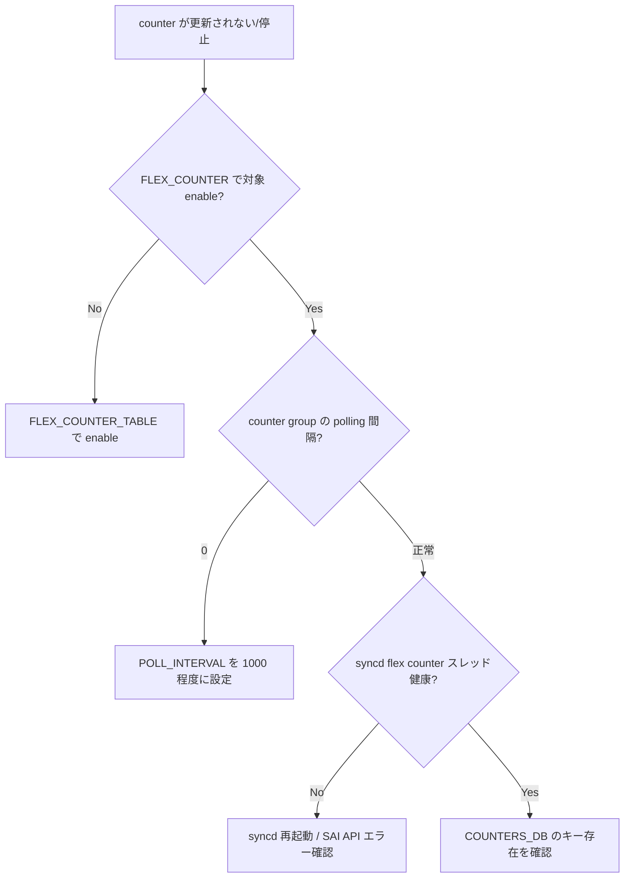

# Runbook: counter が更新されない (FLEX_COUNTER)

!!! danger "実行前提"
    `systemctl restart swss` は data plane を 30 秒～数分中断する重操作のため最後の手段。まずは `counterpoll <group> disable && counterpoll <group> enable` の group 単位 toggle で対処を試みる（これは counter polling thread のみ再生成、forwarding は無影響）。実行前に `redis-cli -n 4 HGETALL FLEX_COUNTER_TABLE > /tmp/fc.bak.$(date +%s)` で polling 設定 backup、`counterpoll show > /tmp/fc.show.bak`。誤って disable した group は `counterpoll <group> enable` で即時復旧。

## 症状

- `show interfaces counters` の数字が固まる / 増加が止まる
- `show queue counters` / `show pfc counters` が古い値のまま
- `show interfaces counters rate` で rate が 0 になる

## 想定原因

1. **`FLEX_COUNTER_TABLE` で該当 group が `disable`**: counterpoll 自体が止まっている
2. **`FLEX_COUNTER_DELAY_STATUS` が `system_ready` 待ち**: 起動直後で polling が始まっていない
3. **polling interval が長過ぎ / 0** で実用上更新されない
4. **[syncd](../../reference/glossary.md#term-syncd) の counter thread が hang / CPU 飽和**
5. **[COUNTERS_DB](../../reference/glossary.md#term-counters_db) の対応 key 欠落**: object が後から作られたが counter 登録が漏れている

## 切り分け手順




### 1. counterpoll の有効状態と interval

```bash
counterpoll show
sonic-db-cli CONFIG_DB hgetall "FLEX_COUNTER_TABLE|PORT"
sonic-db-cli CONFIG_DB hgetall "FLEX_COUNTER_TABLE|QUEUE"
sonic-db-cli CONFIG_DB hgetall "FLEX_COUNTER_TABLE|PFCWD"
```

- 期待: `FLEX_COUNTER_STATUS: enable`, `POLL_INTERVAL: 1000` 程度 (ms)
- 異常: `disable` → counterpoll の意図的停止か、何かのバグでオフになっている

### 2. counter delay status

```bash
sonic-db-cli FLEX_COUNTER_DB keys "FLEX_COUNTER_GROUP_TABLE:*"
sonic-db-cli STATE_DB hget "FLEX_COUNTER_DELAY_STATUS|PORT" status
```

- 期待: `system_ready` または該当無し
- 異常: 長時間 delay → 上位 [orchagent](../../reference/glossary.md#term-orchagent) が ready 状態を出していない

### 3. COUNTERS_DB の生死

```bash
sonic-db-cli COUNTERS_DB keys "COUNTERS:oid:*" | head
sonic-db-cli COUNTERS_DB hgetall "COUNTERS:$(sonic-db-cli COUNTERS_DB hget COUNTERS_PORT_NAME_MAP Ethernet0)"
```

- 期待: 数値が更新されている（前後で diff あり）
- 異常: 値固定 → syncd の counter スレッド停止

### 4. syncd CPU と log

```bash
top -n1 -b | grep -E "syncd|orchagent"
docker logs syncd 2>&1 | grep -iE "counter|flex" | tail
```

### 5. orchagent からの登録漏れ

```bash
docker logs swss 2>&1 | grep -iE "flexcounter|FLEX_COUNTER" | tail -50
```

## 対処方法

- counter 有効化: `counterpoll port enable` / `counterpoll queue enable` / `counterpoll pfcwd enable`
- interval 調整: `counterpoll port interval 1000`
- 救命的 reset: `sudo systemctl restart swss`（syncd / counter thread も再生成）
- 個別 group のみ問題なら、`config save -y` 後に group を disable → enable

## 関連ページ

- [../../internals/sonic-flexcounter-refactor.md](../../internals/sonic-flexcounter-refactor.md)
- [../../internals/sonic-counter-initialization-optimization.md](../../internals/sonic-counter-initialization-optimization.md)
- [../config-db/flex-counter-table.md](../config-db/flex-counter-table.md)

## 引用元

[^1]: sonic-net/[sonic-swss](../../reference/glossary.md#term-sonic-swss) @ 4305596 — flexcounterorch
[^2]: sonic-net/[sonic-utilities](../../reference/glossary.md#term-sonic-utilities) @ 39732bceb — counterpoll CLI

<!-- glossary-links-injected: ce96ade25a61 -->
