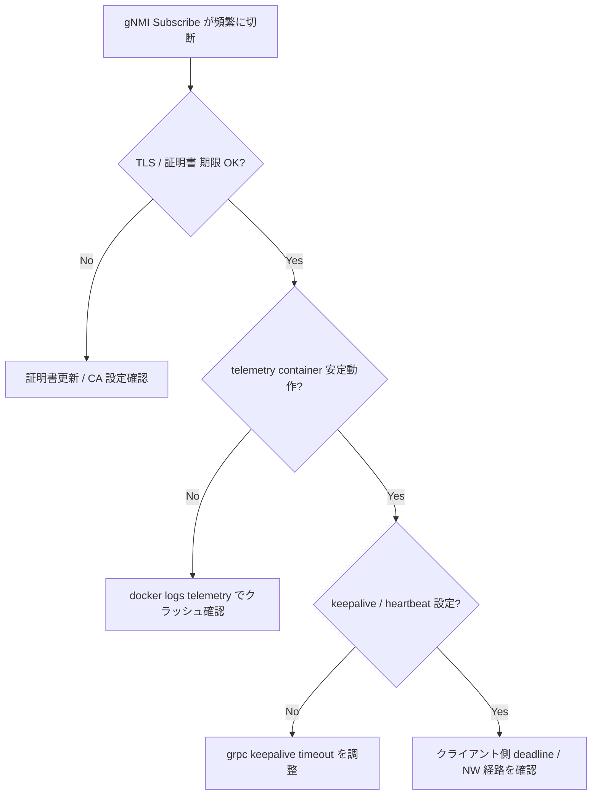

# Runbook: gNMI Subscribe が頻繁に切断される

!!! danger "実行前提"
    `systemctl restart telemetry` / `config reload` は同居している dial-out client や他の subscribe セッションをすべて切る。実行前に並走 collector を notify し、設定変更時は `config_db.json` を退避してロールバック経路を確保すること。

## 症状

- collector 側で `rpc error: code = Unavailable desc = transport is closing` が頻発
- STREAM `ON_CHANGE` で update 受信が止まる（heartbeat も来ない）
- `SAMPLE` モードで sample_interval ごとの message が間欠的に欠落

## 想定原因（優先度順）

1. **TCP keepalive / [NAT](../../reference/glossary.md#term-nat) timeout**: 中間機器（LB / [NAT](../../reference/glossary.md#term-nat) / firewall）のセッション TTL が telemetry の heartbeat 間隔より短い
2. **TLS handshake failure / 証明書期限切れ**: re-handshake 時に失敗してセッション drop
3. **server 側 goroutine が CPU bound**: 多数の path を低 interval で subscribe して queue が溢れる
4. **REDIS subscriber が遅延**: `COUNTERS_DB` の更新頻度に [gNMI](../../reference/glossary.md#term-gnmi) publisher が追いつかない
5. **path syntax 不正で server が close する**: 一部 yang model が未対応で internal error 返却

## 切り分け手順




## 確認コマンド

### 1. セッション統計の確認

```bash
docker exec telemetry netstat -nt | grep :8080
sudo ss -tnpi | grep :8080
```

- `Recv-Q` / `Send-Q` が膨らんでいる → server / client いずれかが追従できていない

### 2. server ログ

```bash
docker logs telemetry 2>&1 | grep -iE "subscribe|closed|tls" | tail -200
```

- `context canceled` 多発 → client 側 timeout が短い
- `tls: bad certificate` → 証明書更新を確認

### 3. CPU / メモリ

```bash
docker stats telemetry --no-stream
docker exec telemetry top -bn1 -p $(pgrep telemetry)
```

### 4. subscribe 内容を最小化して再現確認

```bash
gnmic -a <switch>:8080 --tls-ca ca.pem --tls-cert client.pem --tls-key client.key \
  subscribe --path "/COUNTERS_DB/COUNTERS/Ethernet0" --mode stream --stream-mode sample \
  --sample-interval 10s
```

- 単一 path で安定するなら過剰 subscribe が原因

### 5. 中間機器の keepalive

- 中間 LB / firewall のセッション TTL を 5 分以上に設定
- [gNMI](../../reference/glossary.md#term-gnmi) client 側の `keepalive` を 30 秒に設定

## 対処方法

- 過剰 subscribe: `sample_interval` を緩める（10s → 30s）、wildcard path を具体化
- TLS 期限切れ: 新証明書を退避領域に配置 → `systemctl reload telemetry`。**ロールバック**: 旧証明書に戻し reload
- LB / firewall TTL: 中間機器側で keepalive を 5 分以上に
- redis 遅延: `FLEX_COUNTER_TABLE` の `POLL_INTERVAL` を上げて負荷を軽減（[flex-counter-stuck.md](flex-counter-stuck.md) 参照）

## 関連ページ

- [telemetry-dialout-not-sending.md](telemetry-dialout-not-sending.md)
- [../../topics/10-gnmi-openconfig/operations.md](../../topics/10-gnmi-openconfig/operations.md)

## 引用元

本ページの根拠は引用元 [^1][^2] を参照。

[^1]: sonic-net/sonic-gnmi @ master — client_subscribe.go
[^2]: sonic-net/sonic-gnmi @ master — db_client.go

<!-- glossary-links-injected: 0856be05524a -->
