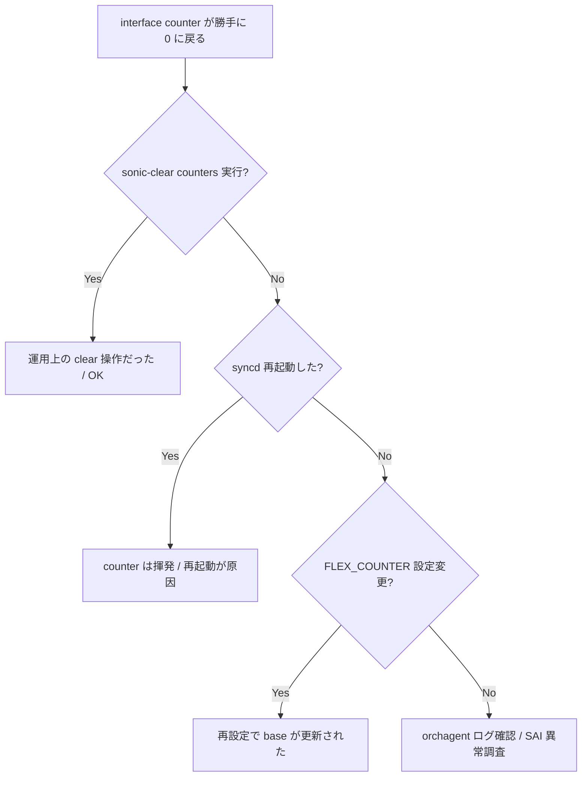

# Runbook: show interfaces counters が突然リセットされる

!!! danger "実行前提"
    counter は ASIC 内部値そのものではなく `portstat` の差分計算 + clear file が絡む。`sonic-clear counters` は意図的 reset なので、誤実行を防ぐ意味で運用 cron / 自動監視スクリプトを先に確認すること。実 ASIC counter は reset されない（再起動を除き）。

## 症状

- 観測中 counter が 0 にリセットされ trend グラフが切れる
- 別 admin が clear した形跡なし
- [syncd](../../reference/glossary.md#term-syncd) / [orchagent](../../reference/glossary.md#term-orchagent) 再起動の直後に発生

## 想定原因（優先度順）

1. **`sonic-clear counters` の意図しない実行**: cron / Ansible / 監視スクリプト
2. **portstat の clear ファイル (`/tmp/portstat-*.cnt`) が削除された**: `/tmp` cleanup
3. **[syncd](../../reference/glossary.md#term-syncd) 再起動で [ASIC](../../reference/glossary.md#term-asic) counter 自体リセット**
4. **container 再起動で [COUNTERS_DB](../../reference/glossary.md#term-counters_db) が初期化**: redis ephemeral

## 切り分け手順




## 確認コマンド

### 1. 直近の clear 実行

```bash
sudo grep -E "sonic-clear|portstat" /var/log/syslog | tail
sudo ls -la /tmp/portstat-* /tmp/.portstat-* 2>/dev/null
```

### 2. COUNTERS_DB の生値

```bash
sonic-db-cli COUNTERS_DB hget "COUNTERS:oid:0x1000000000001" SAI_PORT_STAT_IF_IN_OCTETS
```

- 期待: [ASIC](../../reference/glossary.md#term-asic) 起動以来の累計（再起動以降で増え続ける）

### 3. syncd / database container restart 履歴

```bash
docker ps -a --format "table {{.Names}}\t{{.Status}}"
```

### 4. cron / Ansible

```bash
sudo grep -r "sonic-clear\|portstat -c" /etc/cron* 2>/dev/null
```

## 対処方法

- 監視は `COUNTERS_DB` の raw 値を直接 poll（portstat 差分 cache に依存しない）
- [gNMI](../../reference/glossary.md#term-gnmi) / telemetry で counters subscribe する方式に切り替え
- portstat 用 cache を別場所へ: 環境変数 `PORTSTAT_CACHE_FILE` を設定（実装次第）

## 確認

対処後の正常化を以下で裏取りする。

- **症状解消**: 「症状」節で挙げた事象 (counter / log / state) が回復していること
- **再発監視**: 数分〜数十分の間隔で同コマンドを再実行し、値がフラップしていないこと
- **副作用なし**: 関連サブシステム ([syslog](../../reference/glossary.md#term-syslog) / `show interfaces counters errors` / `show ip bgp summary` 等) に新規 error が出ていないこと
- **永続化**: `sudo config save -y` 済みで `config_db.json` に変更が反映されていること (恒久対処の場合)

短時間で再発する場合は「想定原因」リストの次候補に進む。

## 関連ページ

- [flex-counter-stuck.md](flex-counter-stuck.md)
- [rif-acl-counter-zero.md](rif-acl-counter-zero.md)
- [telemetry-dialout-not-sending.md](telemetry-dialout-not-sending.md)

## 引用元

本ページの根拠は引用元 [^1][^2] を参照。

[^1]: sonic-net/[sonic-utilities](../../reference/glossary.md#term-sonic-utilities) @ 39732bceb — scripts/portstat
[^2]: sonic-net/[sonic-swss](../../reference/glossary.md#term-sonic-swss) @ 4305596 — [orchagent](../../reference/glossary.md#term-orchagent)/flexcounterorch.cpp

<!-- glossary-links-injected: e82be350a384 -->
