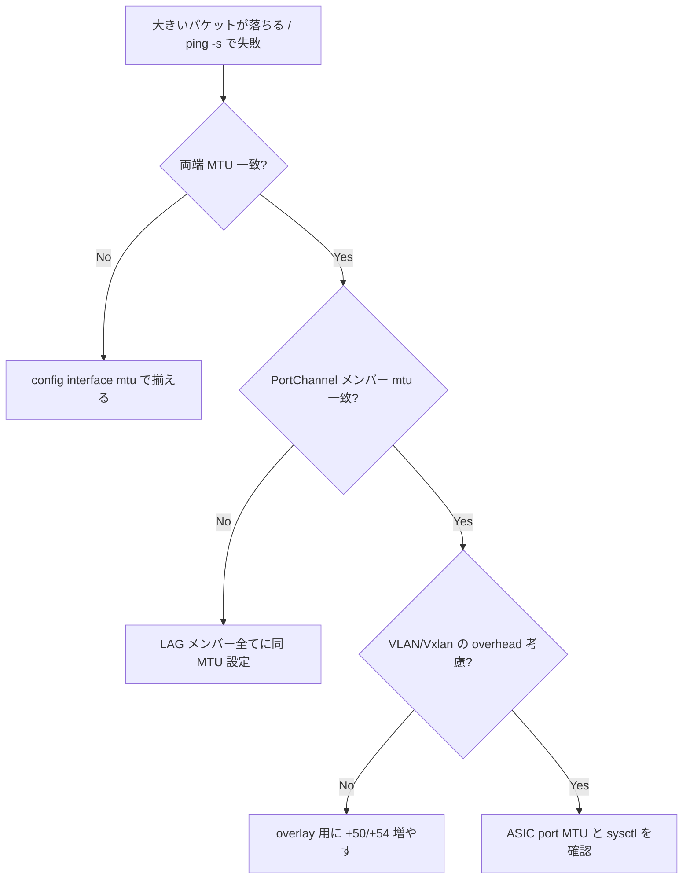

# Runbook: Interface MTU mismatch によるパケットドロップ

!!! danger "実行前提"
    `config interface mtu <if> <N>` は ASIC への即時反映で、当該 port を一瞬 reset する実装になっている SAI ベンダーが多い。L3 隣接 (BGP/OSPF) が flap する。事前に `show interfaces status > /tmp/if.before` を取り、変更後 `show interfaces status` で差分確認。問題発生時は元の MTU に戻して `config save -y`。

## 症状

- 大きい packet (>1500B) のみ落ちる
- `ping -s 1472 -M do` が通り、`ping -s 8000 -M do` が通らない
- [BGP](../../reference/glossary.md#term-bgp) UPDATE が大きい場合のみ session reset

## 想定原因（優先度順）

1. **両端 MTU 不一致**: ローカル 9100、対向 1500 等
2. **[VLAN](../../reference/glossary.md#term-vlan) / [PortChannel](../../reference/glossary.md#term-portchannel) の MTU が member より小さい**: 上位論理 IF が L1 を絞る
3. **[MPLS](../../reference/glossary.md#term-mpls) / [VXLAN](../../reference/glossary.md#term-vxlan) encapsulation オーバーヘッド未考慮**: [VTEP](../../reference/glossary.md#term-vtep) で +50B 越え
4. **PMTUD ブラックホール**: 中間 [ACL](../../reference/glossary.md#term-acl) が ICMP `frag-needed` を破棄

## 切り分け手順




## 確認コマンド

### 1. 両端 MTU 比較

```bash
show interfaces status | grep -E "Ethernet0|PortChannel"
ip -d link show Ethernet0
```

- 期待: 両端で同値
- [SONiC](../../reference/glossary.md#term-sonic) default: 9100

### 2. PMTUD テスト

```bash
ping -M do -s 1472 <peer>
ping -M do -s 8972 <peer>
```

### 3. ASIC_DB 反映

```bash
sonic-db-cli ASIC_DB hgetall "ASIC_STATE:SAI_OBJECT_TYPE_PORT:<oid>" | grep -i mtu
```

### 4. counters

```bash
show interfaces counters errors
portstat -c
```

- `RX_ERR` / `RX_OVR` の増加を確認

## 対処方法

- 両端を揃える: `sudo config interface mtu Ethernet0 9100` を双方で実行
- [VLAN](../../reference/glossary.md#term-vlan) / [PortChannel](../../reference/glossary.md#term-portchannel): `sudo config interface mtu Vlan100 9100`
- 保存: `sudo config save -y`

## 確認

対処後の正常化を以下で裏取りする。

- **症状解消**: 「症状」節で挙げた事象 (counter / log / state) が回復していること
- **再発監視**: 数分〜数十分の間隔で同コマンドを再実行し、値がフラップしていないこと
- **副作用なし**: 関連サブシステム ([syslog](../../reference/glossary.md#term-syslog) / `show interfaces counters errors` / `show ip bgp summary` 等) に新規 error が出ていないこと
- **永続化**: `sudo config save -y` 済みで `config_db.json` に変更が反映されていること (恒久対処の場合)

短時間で再発する場合は「想定原因」リストの次候補に進む。

## 関連ページ

- [bgp-session-down.md](bgp-session-down.md)
- [../cli/config-interface.md](../cli/config-interface.md)
- [../config-db/port.md](../config-db/port.md)

## 引用元

本ページの根拠は引用元 [^1][^2] を参照。

[^1]: sonic-net/[sonic-swss](../../reference/glossary.md#term-sonic-swss) @ 4305596 — portsorch.cpp の MTU 反映
[^2]: sonic-net/[sonic-utilities](../../reference/glossary.md#term-sonic-utilities) @ 39732bceb — config interface mtu

<!-- glossary-links-injected: c5c8b661ae7e -->
