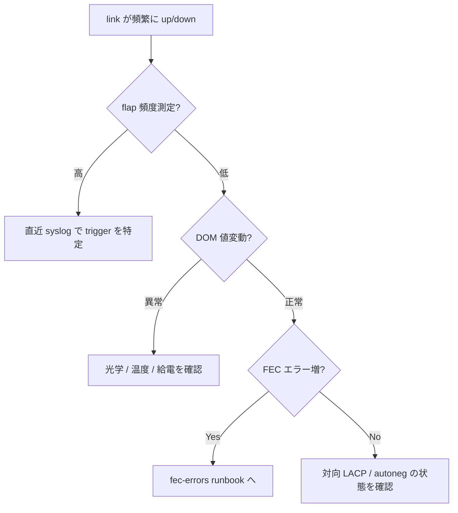

# Runbook: T0/T1 リンクが flap し続ける

!!! danger "実行前提"
    `config interface shutdown` / `startup` の連打や `config reload` は周辺 BGP / ECMP 経路を巻き込む。flap 中の interface のみ admin down にして安定化させ、ピア側の状態を確認すること。事前に `show interfaces status > /tmp/if.before` と `show interfaces transceiver eeprom -d > /tmp/xcvr.before` を取得。

## 症状

- syslog に `Port <if> oper status changed from up to down` が断続
- `show interfaces counters errors` の `RX_ERR` / `FCS` が増加
- [BGP](../../reference/glossary.md#term-bgp) peer が頻繁に flap

## 想定原因（優先度順）

1. **光モジュール (SFP/QSFP) の劣化**: DOM 値がベンダー定義の閾値外
2. **FEC mismatch**: 両端 FEC mode 違い → [fec-errors.md](fec-errors.md)
3. **autoneg / speed mismatch**: → [asic-link-autoneg-mismatch.md](asic-link-autoneg-mismatch.md)
4. **ケーブル / patch panel の物理劣化**
5. **対向側 OS の panic / reboot ループ**

## 切り分け手順



## 確認コマンド

### 1. flap 頻度の定量化

```bash
sudo grep "oper status changed" /var/log/syslog | grep Ethernet0 | tail -20
```

### 2. DOM 値と threshold

```bash
show interfaces transceiver eeprom -d Ethernet0
show interfaces transceiver lpmode
```

DOM 出力には `RX Power` / `TX Power` / `Temperature` / `Voltage` 等の現在値と、`RxPowerLowAlarm` / `RxPowerHighAlarm` / `TxPowerLowWarning` 等の **threshold** がモジュールから読み出されて表示される[^2][^3]。

!!! warning "閾値はモジュール依存"
    SFP/QSFP の alarm/warning threshold (`rxpowerlowalarm` 等) は **トランシーバ自身の EEPROM に格納されたベンダー定義値** であり、SONiC は `sfp_base.get_transceiver_threshold_info()` API で読み出すだけで固定の閾値を持たない[^2]。「RX power が -15dBm 未満なら異常」のような一律基準は誤りで、現在値が同モジュールの `RxPowerLowAlarm` / `RxPowerLowWarning` を下回るか、あるいは隣接ポートと比べて明らかに劣化しているかで判断する。

### 3. FEC / counter

```bash
show interfaces counters fec-stats
show interfaces counters errors Ethernet0
```

### 4. ASIC notification

```bash
docker logs syncd 2>&1 | grep -i "port_state_change" | tail -20
```

`portsorch` が [SAI](../../reference/glossary.md#term-sai) port state change を受け取り `PORT_TABLE` の `oper_status` を更新する[^1]。

## 対処方法

- 一時 admin down で安定化: `sudo config interface shutdown Ethernet0`
- SFP 入れ替え / 清掃
- 両端 FEC mode 統一: `sudo config interface fec Ethernet0 rs`
- 暫定で `config interface speed Ethernet0 <lower>` に落とす

## 確認

対処後の正常化を以下で裏取りする。

- **症状解消**: 「症状」節で挙げた事象 (counter / log / state) が回復していること
- **再発監視**: 数分〜数十分の間隔で同コマンドを再実行し、値がフラップしていないこと
- **副作用なし**: 関連サブシステム ([syslog](../../reference/glossary.md#term-syslog) / `show interfaces counters errors` / `show ip bgp summary` 等) に新規 error が出ていないこと
- **永続化**: `sudo config save -y` 済みで `config_db.json` に変更が反映されていること (恒久対処の場合)

短時間で再発する場合は「想定原因」リストの次候補に進む。

## 関連ページ

- [fec-errors.md](fec-errors.md)
- [asic-link-autoneg-mismatch.md](asic-link-autoneg-mismatch.md)

## 引用元

[^1]: sonic-net/[sonic-swss](../../reference/glossary.md#term-sonic-swss) @ 4305596 — `orchagent/[portsorch](../../reference/glossary.md#term-portsorch).cpp` の port state change handler が [SAI](../../reference/glossary.md#term-sai) からの notification を `APPL_DB:PORT_TABLE` に反映する。
[^2]: sonic-net/sonic-platform-common @ 64beade8 — `sonic_platform_base/sfp_base.py` L182-L213 `get_transceiver_threshold_info()` が `rxpowerlowalarm` / `rxpowerhighalarm` / `txpowerlowalarm` 等のモジュール固有閾値を返す抽象 API。各 platform 実装が EEPROM から値を読み取り供給する。
[^3]: sonic-net/[sonic-utilities](../../reference/glossary.md#term-sonic-utilities) @ master — `scripts/sfpshow` (`show interfaces transceiver eeprom -d` の実体) が DOM 値と threshold をフォーマットして表示する (`rxpowerlowalarm` 等のキーを `dBm` 単位でレンダリング)。

<!-- glossary-links-injected: 765a25b13022 -->
