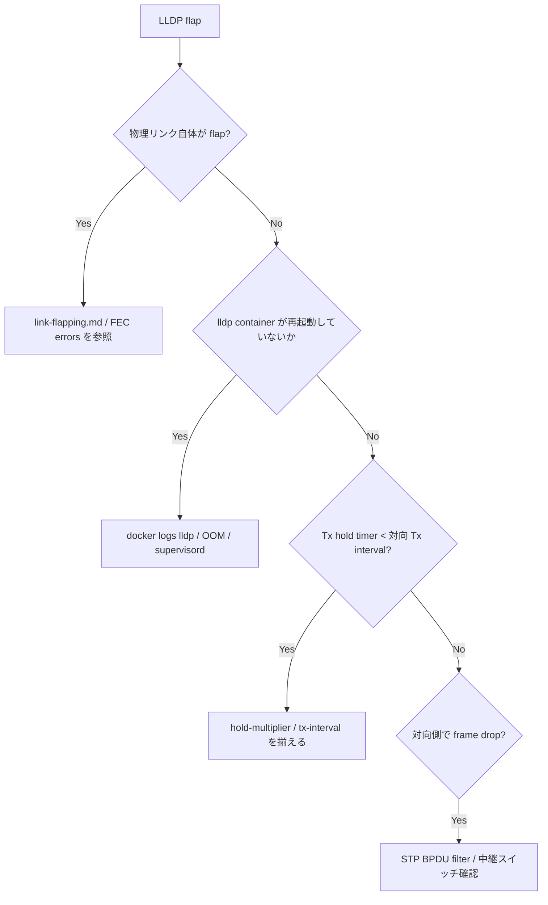

# Runbook: LLDP 隣接が頻繁に up/down する

!!! warning "HLD-only"
    本ページは LLDP 一般動作 + SONiC `docker-lldp` 構造に基づく運用ノート。

## 症状

- `show lldp table` で隣接が表示されたり消えたりを 30 秒〜数分単位で繰り返す
- `/var/log/syslog` に `lldpd: removing neighbor` が連続出力
- [ZTP](../../reference/glossary.md#term-ztp) / minigraph の自動構成や topology 検証が断続的に失敗する

## 切り分けフロー



## 確認コマンド

```bash
# 隣接状態と最終受信時刻
docker exec lldp lldpcli show neighbors detail

# Tx / Rx 統計
docker exec lldp lldpcli show statistics

# 設定値 (interval / hold)
docker exec lldp lldpcli show configuration

# 物理側 flap 確認
show interface counters errors
sudo dmesg -T | grep -iE "link|phy" | tail -50

# lldp container 自体の再起動有無
docker ps --format '{{.Names}} {{.Status}}' | grep lldp
sudo journalctl -u lldp --since "1 hour ago" | tail
```

## よくある原因

1. **物理リンクの瞬断** — FEC error / SFP 接触不良。`link-flapping.md` 参照
2. **対向の [LLDP](../../reference/glossary.md#term-lldp) tx-interval が長く、hold-time を超過** — 既定 30 秒、hold-multiplier 4 が標準
3. **lldp container の OOM / 再起動** — `container-memory-limit-exceeded.md` 参照
4. **中継機の [LLDP](../../reference/glossary.md#term-lldp) BPDU フィルタ** — DAC 直結ではなく Hub / Tap 経由で frame が間引かれる
5. **port admin down/up の運用スクリプト** — 監視スクリプトが [LLDP](../../reference/glossary.md#term-lldp)-MED の都合で port toggle している

[SONiC](../../reference/glossary.md#term-sonic) の LLDP は専用 `docker-lldp` コンテナ内で `lldpd` を実行し、`lldp_syncd` が隣接情報を [APPL_DB](../../reference/glossary.md#term-appl_db) に書き出す構成のため、container の再起動や supervisord の異常もコントロールプレーン側 flap の原因になる[^1]。

[^1]: `sonic-net/sonic-buildimage` `dockers/docker-lldp/` 配下の `Dockerfile`・`supervisord.conf`・`lldp_syncd.py`。`lldpd` 本体と `lldp_syncd` が別プロセスで動作し、いずれかが落ちると `show lldp table` の隣接が消える。

## 関連 reference / topics

- [link-flapping.md](link-flapping.md)
- [fec-errors.md](fec-errors.md)
- [container-memory-limit-exceeded.md](container-memory-limit-exceeded.md)
- [../cli/show-lldp.md](../cli/show-lldp.md)

<!-- glossary-links-injected: 8ba32e5aa69d -->
