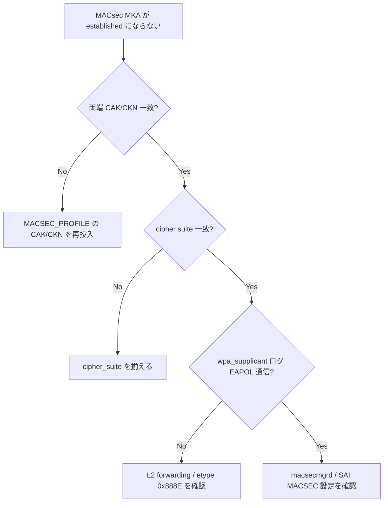

# Runbook: MACsec が UP しない / MKA セッション確立失敗

!!! danger "実行前提"
    MACsec 設定変更（`config macsec port add/del` / profile 変更 / key 更新）は対象 port のトラフィックを暗号化境界の再ネゴ中に断続させる。事前に対向と鍵更新タイミングを合意し、**変更前の `MACSEC_PROFILE` キー値とポート割当を控える**こと。ロールバックは退避値を `sonic-db-cli` で hset し直すか `config reload` で復旧。鍵漏洩の懸念がある場合は退避ファイルの取り扱いに注意。

## 症状

- `show macsec <port>` で `secure-channel` が表示されない
- `show macsec` の `Egress SA` / `Ingress SA` が `0` のまま
- 対向との link は UP しているが、暗号化フレームが流れず通信不能

## 想定原因（優先度順）

1. **CAK / CKN 不一致**: 対向と pre-shared key の hex 表現が一致していない
2. **[MACsec](../../reference/glossary.md#term-macsec) profile が port に紐付いていない**: `config macsec port add <port> <profile>` 未実行
3. **cipher_suite 不一致**: `GCM-AES-128` vs `GCM-AES-256` の食い違い
4. **MKA priority / key_server 不適切**: 双方とも server_priority=0 等で衝突
5. **時刻同期ズレで replay window エラー**

## 切り分け手順




## 確認コマンド

### 1. profile / port 状態

```bash
sonic-db-cli CONFIG_DB hgetall "MACSEC_PROFILE|<profile>"
sonic-db-cli CONFIG_DB hgetall "PORT|Ethernet0" | grep -i macsec
show macsec Ethernet0
```

### 2. APPL_DB / STATE_DB

```bash
sonic-db-cli APPL_DB hgetall "MACSEC_PORT_TABLE:Ethernet0"
sonic-db-cli STATE_DB keys "MACSEC_SA_TABLE|*"
sonic-db-cli STATE_DB hgetall "MACSEC_PORT_TABLE|Ethernet0"
```

### 3. MKA daemon (wpa_supplicant) ログ

```bash
docker exec macsec ps aux | grep wpa_supplicant
docker logs macsec 2>&1 | grep -iE "mka|kay" | tail -200
docker exec macsec cat /etc/wpa_supplicant/wpa_supplicant_<port>.conf
```

### 4. 対向との CAK / CKN 突合

- `ckn` は hex 文字列、`cak` は cipher_suite と長さが整合する必要がある
- 両側で同一値（先頭 / 末尾 / 文字数）を再確認

### 5. orchagent

```bash
docker logs swss 2>&1 | grep -iE "macsec" | tail -100
```

## 対処方法

- key 修正: profile を一旦 detach → key 再投入 → re-attach（**ロールバック**: 旧 key 値を控えて同手順で戻す）
- profile 紐付け: `sudo config macsec port add Ethernet0 <profile>`
- cipher 統一: `sudo config macsec profile add <profile> --cipher_suite GCM-AES-XPN-256 ...`
- 時刻同期: NTP 復旧後に MKA 再確立を待つ

## 確認

対処後の正常化を以下で裏取りする。

- **症状解消**: 「症状」節で挙げた事象 (counter / log / state) が回復していること
- **再発監視**: 数分〜数十分の間隔で同コマンドを再実行し、値がフラップしていないこと
- **副作用なし**: 関連サブシステム ([syslog](../../reference/glossary.md#term-syslog) / `show interfaces counters errors` / `show ip bgp summary` 等) に新規 error が出ていないこと
- **永続化**: `sudo config save -y` 済みで `config_db.json` に変更が反映されていること (恒久対処の場合)

短時間で再発する場合は「想定原因」リストの次候補に進む。

## 関連ページ

- [../../topics/15-security-aaa/concept.md](../../topics/15-security-aaa/concept.md)
- [../../topics/15-security-aaa/operations.md](../../topics/15-security-aaa/operations.md)

## 引用元

本ページの根拠は引用元 [^1][^2] を参照。

[^1]: sonic-net/[sonic-swss](../../reference/glossary.md#term-sonic-swss) @ master — macsecorch.cpp
[^2]: sonic-net/wpa_supplicant @ master — ieee802_1x_kay.c

<!-- glossary-links-injected: e9c9fcf0f205 -->
