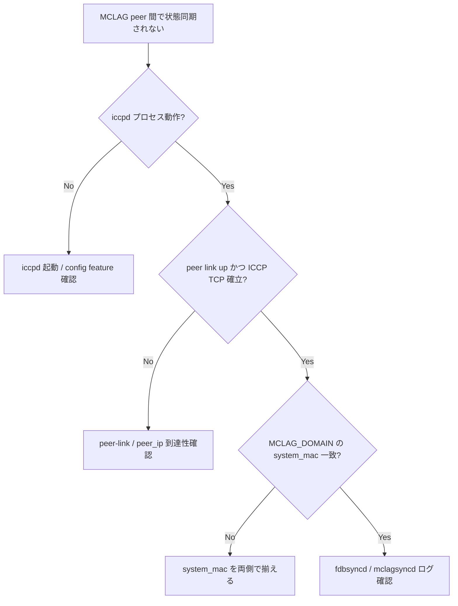

# Runbook: MCLAG peer 同期が確立しない / state inconsistent

!!! danger "実行前提"
    MCLAG 設定変更 / `systemctl restart iccpd` / keepalive interface の up/down は active-active ペアの片系を一時的に standalone 化し、トラフィックの flow 偏りや MAC flap を引き起こす。**実行前に peer 側で reload を抑止し、対象ノードのみ作業**すること。両系同時に再起動するとデュアル故障となる。ロールバックは `config_db.json` 退避からの `config reload`。

## 症状

- `show mclag brief` で `Keepalive` が `Down` または `peer status` が `inconsistent`
- 片側 [PortChannel](../../reference/glossary.md#term-portchannel) が `up` だが peer 側で `not-syncd`
- MAC が peer 間で同期されない（片側だけ [FDB](../../reference/glossary.md#term-fdb) に出る）

## 想定原因（優先度順）

1. **keepalive interface 不達**: peer-link または management 経由の TCP/8888 が通らない
2. **system mac 衝突 / 設定ミス**
3. **iccpd プロセス未起動 / crash loop**
4. **domain ID / peer IP 不整合**
5. **[MCLAG](../../reference/glossary.md#term-mclag) interface 設定漏れ**: [PortChannel](../../reference/glossary.md#term-portchannel) が `MCLAG_INTERFACE` に登録されていない

## 切り分け手順




## 確認コマンド

### 1. MCLAG state

```bash
show mclag brief
show mclag interface
mclagdctl -i <domain_id> dump state
mclagdctl -i <domain_id> dump arp
mclagdctl -i <domain_id> dump mac
```

### 2. iccpd

```bash
docker ps | grep iccpd
docker logs iccpd 2>&1 | tail -200
ps -ef | grep iccpd
```

### 3. keepalive 疎通

```bash
ping <peer_ip>
sudo tcpdump -i any -nn host <peer_ip> and port 8888
```

### 4. CONFIG_DB

```bash
sonic-db-cli CONFIG_DB hgetall "MCLAG_DOMAIN|<id>"
sonic-db-cli CONFIG_DB keys "MCLAG_INTERFACE|*"
sonic-db-cli CONFIG_DB hgetall "DEVICE_METADATA|localhost" | grep -i mac
```

### 5. peer 側突合

- domain_id / peer_ip / source_ip / system_mac の 4 つが peer と整合しているか

## 対処方法

- keepalive 経路修正: routing / [VLAN](../../reference/glossary.md#term-vlan) を確認
- iccpd 再起動: `docker restart iccpd` （**注意**: 片系のみ。**ロールバック**: peer 側との設定整合性は `config_db.json` 退避から復元）
- [MCLAG](../../reference/glossary.md#term-mclag) interface 追加: `sudo config mclag member add <domain_id> <PortChannelN>`（**ロールバック**: `config mclag member del`）
- system_mac 設定: `DEVICE_METADATA|localhost` の `mac` を peer と一致させる（注意: 通常変更不要）

## 確認

対処後の正常化を以下で裏取りする。

- **症状解消**: 「症状」節で挙げた事象 (counter / log / state) が回復していること
- **再発監視**: 数分〜数十分の間隔で同コマンドを再実行し、値がフラップしていないこと
- **副作用なし**: 関連サブシステム ([syslog](../../reference/glossary.md#term-syslog) / `show interfaces counters errors` / `show ip bgp summary` 等) に新規 error が出ていないこと
- **永続化**: `sudo config save -y` 済みで `config_db.json` に変更が反映されていること (恒久対処の場合)

短時間で再発する場合は「想定原因」リストの次候補に進む。

## 関連ページ

- [./dualtor-mux.md](./dualtor-mux.md)
- [../config-db/mclag-domain.md](../config-db/mclag-domain.md)

## 引用元

本ページの根拠は引用元 [^1][^2] を参照。

[^1]: sonic-net/[sonic-swss](../../reference/glossary.md#term-sonic-swss) @ master — mclagsyncd.cpp
[^2]: sonic-net/sonic-iccpd @ master — iccpd_main.c

<!-- glossary-links-injected: bebcd3486125 -->
