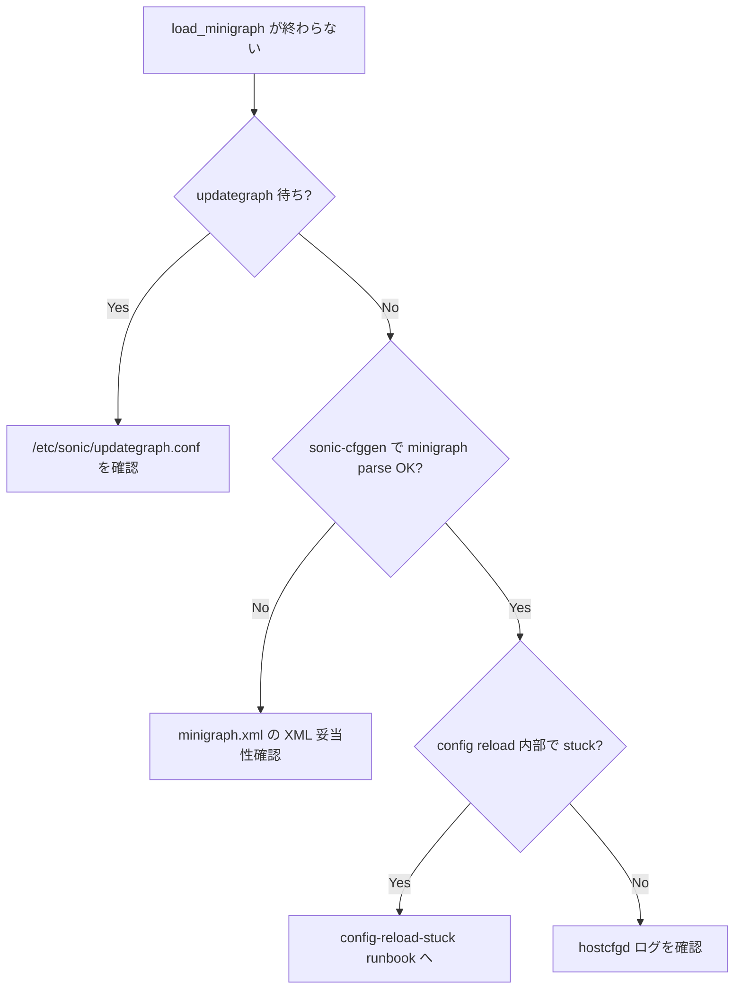

# Runbook: minigraph 適用後に reload が完了しない / 起動が固まる

!!! danger "実行前提"
    `config load_minigraph -y` は config_db.json を minigraph.xml から再生成する破壊的操作で、現行設定は丸ごと上書きされる。SSH session が切れる可能性が高いため、必ず console / mgmt から実施し、`sudo cp /etc/sonic/config_db.json /etc/sonic/config_db.json.bak.$(date +%s)` と `sudo cp /etc/sonic/minigraph.xml /etc/sonic/minigraph.xml.bak.$(date +%s)` を取得すること。最悪時は `cp` で戻し `sudo config reload -y -f` で復旧する。

## 症状

- `config load_minigraph` が数十分経っても完了しない
- `systemctl status swss` が `activating` のまま
- リブート後 `show interfaces status` が空

## 想定原因（優先度順）

1. **[minigraph.xml](../../reference/glossary.md#term-minigraph.xml) 構文エラー**: 解析失敗で `sonic-cfggen` が exception
2. **hwsku / platform 不整合**: minigraph 内 hwsku が `/usr/share/sonic/device/<platform>/` に存在しない
3. **portmap ([port_config.ini](../../reference/glossary.md#term-port-config-ini)) との port 数不一致**
4. **`hostcfgd` が [CONFIG_DB](../../reference/glossary.md#term-config_db) 待ちで block**: 依存サービスが起動順を待っている
5. **swss / [syncd](../../reference/glossary.md#term-syncd) が初期化中に [SAI](../../reference/glossary.md#term-sai) エラー**

## 切り分け手順




## 確認コマンド

### 1. minigraph 構文

```bash
sudo sonic-cfggen -m /etc/sonic/minigraph.xml -p /usr/share/sonic/device/<platform>/<hwsku>/port_config.ini --print-data | head
```

- 期待: JSON 出力
- 異常: Python traceback / XML parse error

### 2. systemd unit 状態

```bash
sudo systemctl --failed
sudo systemctl status swss syncd database -n 20
```

### 3. hostcfgd の状態

```bash
sudo journalctl -u hostcfgd -n 100 --no-pager
```

### 4. config_db.json の生成確認

```bash
sudo jq '.PORT | keys | length' /etc/sonic/config_db.json
sudo jq '.DEVICE_METADATA.localhost' /etc/sonic/config_db.json
```

### 5. SAI 側のエラー

```bash
docker logs syncd 2>&1 | grep -iE "ERR|SAI_STATUS" | tail -50
```

## 対処方法

- minigraph 修正後 `sudo config load_minigraph -y` 再実行
- hwsku 差し替え: `sudo sonic-cfggen -H -m -k <hwsku> --write-to-db`
- 最悪時の復旧: `sudo cp config_db.json.bak.<ts> /etc/sonic/config_db.json && sudo config reload -y -f`

## 関連ページ

- [container-not-starting.md](container-not-starting.md)
- [sai-failure.md](sai-failure.md)
- [config-save-load.md](config-save-load.md)

## 引用元

本ページの根拠は引用元 [^1][^2] を参照。

[^1]: sonic-net/[sonic-utilities](../../reference/glossary.md#term-sonic-utilities) @ 39732bceb — config/main.py
[^2]: sonic-net/[sonic-buildimage](../../reference/glossary.md#term-sonic-buildimage) @ 4305596 — sonic-config-engine/minigraph.py

<!-- glossary-links-injected: 8772b091b635 -->
