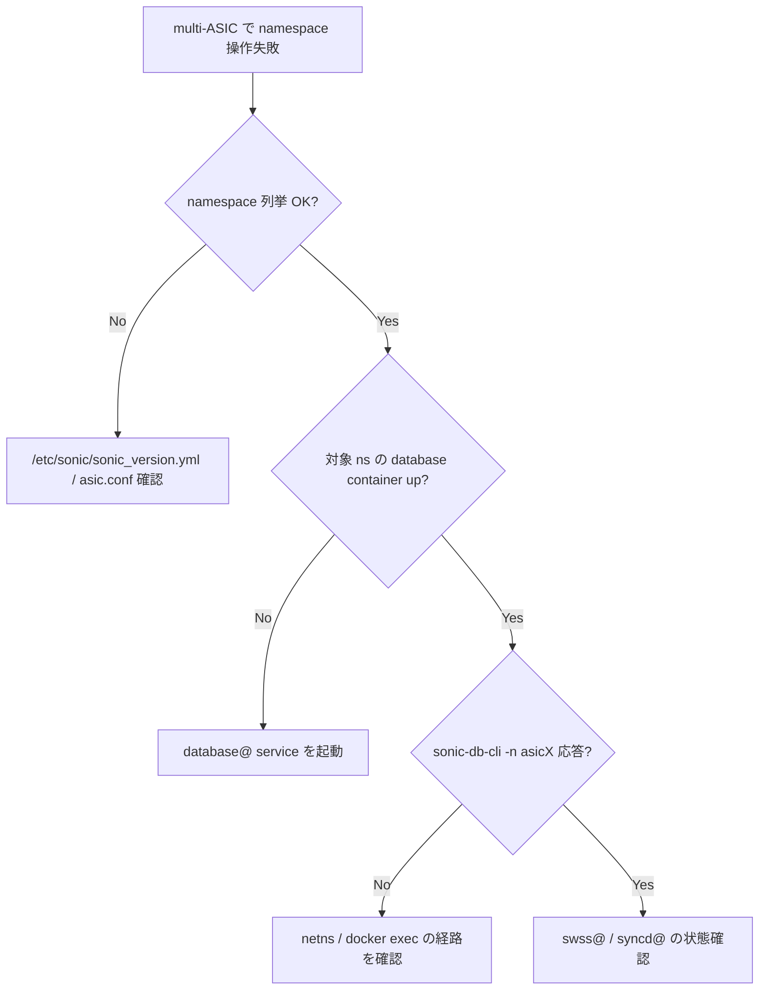

# Runbook: Multi-ASIC で namespace 間通信できない

!!! danger "実行前提"
    `systemctl restart swss@N` は当該 ASIC namespace の forwarding を 10～30 秒中断する。`config reload -y -f` は **全 namespace を一度に再構成** するため chassis 全体が数分間 down する（cold reboot に近い）。実行前に各 namespace の `config_db.json` を `for ns in asic0 asic1 host; do sudo cp /etc/sonic/$ns/config_db.json /etc/sonic/$ns/config_db.json.bak.$(date +%s); done` で backup（host は `/etc/sonic/config_db.json`）。`config reload -y -f` は最後の手段とし、まずは個別 namespace `systemctl restart swss@<n>` から試す。

## 症状

- VoQ Chassis / multi-[ASIC](../../reference/glossary.md#term-asic) platform で内部 fabric link は UP しているが iBGP が立たない
- ホスト namespace と `asic0` / `asic1` の間で ping が通らない
- `show ip bgp summary -n asic0` で internal neighbor が Idle

## 想定原因

1. **internal port-channel が片側だけ UP**: backend portchannel の片側が member 0 のまま
2. **`asic.conf` / `topology.conf` の不一致**: namespace 数と [CONFIG_DB](../../reference/glossary.md#term-config_db) の `asic_id` 不整合
3. **internal route の漏れ**: `BGP_INTERNAL_NEIGHBOR` が片側のみ
4. **inband interface 未設定** (`VOQ_INBAND_INTERFACE` 関連)
5. **swss / [syncd](../../reference/glossary.md#term-syncd) コンテナがいずれかの namespace で異常終了**

## 切り分け手順




## 確認コマンド

### 1. namespace 一覧と feature 状態

```bash
ip netns list
show platform summary
sudo sonic-cfggen -d -v DEVICE_METADATA.localhost.asic_name
```

- 期待: `asic0`, `asic1`, ... が並ぶ。host 用 namespace は無印
- 異常: 1 つしかない → multi-asic として認識されていない

### 2. 各 namespace の CONFIG_DB / feature

```bash
for ns in $(ip netns list | awk '{print $1}'); do
  echo "== $ns =="
  sudo ip netns exec $ns sonic-db-cli CONFIG_DB hgetall "DEVICE_METADATA|localhost"
done
```

- 期待: 各 namespace で `sub_role`, `switch_type` 等が一致した方針で設定されている

### 3. internal portchannel / BGP

```bash
for ns in asic0 asic1; do
  show interfaces portchannel -n $ns
  show ip bgp summary -n $ns
done
```

- 期待: backend portchannel が UP、internal iBGP Established
- 異常: backend portchannel down → 物理リンク / [LACP](../../reference/glossary.md#term-lacp) の問題（[fec-errors.md](fec-errors.md)）

### 4. 各 namespace のコンテナ生存

```bash
docker ps --format '{{.Names}}' | sort
sudo systemctl list-units 'swss@*' 'syncd@*' 'bgp@*'
```

- 期待: `swss@0`, `syncd@0`, `bgp@0`, `swss@1`, ... 全部 active
- 異常: いずれか dead → `journalctl -u swss@1 -n 200` を確認

### 5. control plane traffic 確認

```bash
sudo ip netns exec asic0 ping <asic1 inband ip>
sudo ip netns exec asic0 sonic-db-cli APPL_DB keys "ROUTE_TABLE:*" | head
```

## 対処方法

- internal portchannel の片側 member 修正、もしくは `config save -y && sudo systemctl restart swss@0`
- どこかの namespace が出ていない場合は `sudo config reload -y -f` で全 namespace の再構成
- 設定の根本ずれは `/usr/share/sonic/device/.../<asic>/config_db.json` を編集して再 import
- VoQ inband が空の場合: `VOQ_INBAND_INTERFACE` テーブルを `minigraph` から再生成

## 関連ページ

- [../../topics/12-multi-asic-voq/operations.md](../../topics/12-multi-asic-voq/operations.md)
- [../../topics/12-multi-asic-voq/architecture.md](../../topics/12-multi-asic-voq/architecture.md)
- [../../internals/support-redis-databases-in-multiple-namespaces.md](../../internals/support-redis-databases-in-multiple-namespaces.md)

## 引用元

本ページの根拠は引用元 [^1][^2] を参照。

[^1]: sonic-net/[sonic-utilities](../../reference/glossary.md#term-sonic-utilities) @ 39732bceb — `multi_asic.py`
[^2]: sonic-net/[sonic-swss](../../reference/glossary.md#term-sonic-swss) @ 4305596 — orchdaemon の namespace 認識

<!-- glossary-links-injected: c006405759d8 -->
