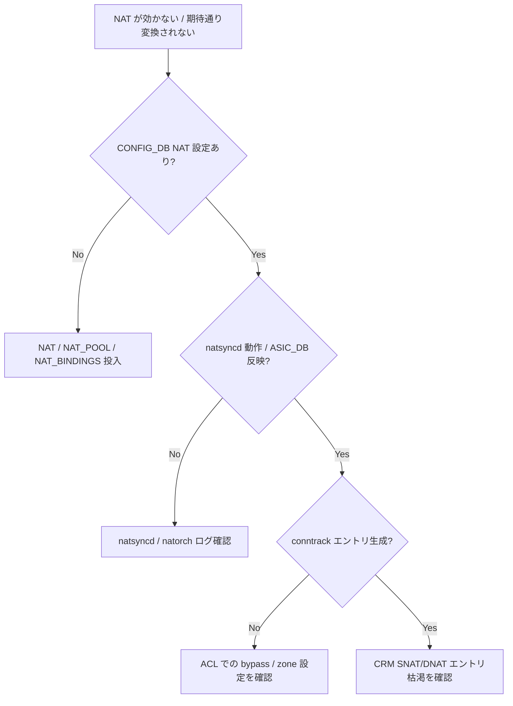

# Runbook: NAT translation が一部のフローで効かない

!!! danger "実行前提"
    `config nat reset-statistics` は無害だが、`config nat remove static` / `config nat remove bindings` / `config nat feature disable` はアクティブセッションを切る。実行前に **`sonic-db-cli CONFIG_DB hgetall` で関連 NAT エントリを退避**し、影響範囲（VRF / interface）を controller / NOC と合意すること。ロールバックは退避値の再投入。

## 症状

- 一部 source IP からのフローだけ translation されない
- `show nat translations` に出ているのに対向側で original src が見える
- TCP / UDP は OK だが ICMP のみ NG（または逆）

## 想定原因（優先度順）

1. **[NAT](../../reference/glossary.md#term-nat) zone 設定漏れ**: interface に `nat_zone` が未設定 / inside/outside の組合せ不正
2. **[CRM](../../reference/glossary.md#term-crm) [NAT](../../reference/glossary.md#term-nat) table の枯渇**: dynamic [NAT](../../reference/glossary.md#term-nat) で空きエントリなし
3. **timeout 短すぎ**: idle timeout / udp_timeout で先に削除
4. **protocol 別 binding ない**: TCP のみ pool に bind され UDP / ICMP は通らない
5. **conntrack 連携の不整合**: `nf_conntrack` が [ASIC](../../reference/glossary.md#term-asic) 側 NAT と乖離

## 切り分け手順




## 確認コマンド

### 1. グローバル / interface

```bash
show nat config globalvalues
show nat config zones
sonic-db-cli CONFIG_DB hgetall "NAT_GLOBAL|Values"
sonic-db-cli CONFIG_DB hgetall "INTERFACE|Ethernet0" | grep -i nat
```

### 2. binding / pool

```bash
show nat config pool
show nat config bindings
show nat config static
```

### 3. 実フローの translation 状態

```bash
show nat translations
show nat statistics
sudo conntrack -L | grep <src_ip>
```

### 4. CRM

```bash
crm show resources snat-entry
crm show resources dnat-entry
```

### 5. natorch ログ

```bash
docker logs swss 2>&1 | grep -iE "nat" | tail -200
sudo dmesg | grep -i nf_conntrack | tail -50
```

## 対処方法

- zone 設定: `sudo config nat add interface <if> -nat_zone <0|1>` （**ロールバック**: 元 zone に同コマンドで戻す）
- timeout 拡張: `sudo config nat set timeout 600` / `udp-timeout` / `tcp-timeout` 調整
- protocol binding 追加: `sudo config nat add binding <name> -pool <pool> -acl <acl>`
- [CRM](../../reference/glossary.md#term-crm) 枯渇: pool 拡張 / static NAT の整理
- conntrack 不整合: `sudo conntrack -F` は全フロー消失する破壊的操作。実施前に **トラフィック断を許容できるメンテ枠**で実行

## 確認

対処後の正常化を以下で裏取りする。

- **症状解消**: 「症状」節で挙げた事象 (counter / log / state) が回復していること
- **再発監視**: 数分〜数十分の間隔で同コマンドを再実行し、値がフラップしていないこと
- **副作用なし**: 関連サブシステム ([syslog](../../reference/glossary.md#term-syslog) / `show interfaces counters errors` / `show ip bgp summary` 等) に新規 error が出ていないこと
- **永続化**: `sudo config save -y` 済みで `config_db.json` に変更が反映されていること (恒久対処の場合)

短時間で再発する場合は「想定原因」リストの次候補に進む。

## 関連ページ

- [./crm-threshold-exceeded.md](./crm-threshold-exceeded.md)
- [../config-db/nat.md](../config-db/nat.md)
- [../../topics/16-nat-dhcp-dns/operations.md](../../topics/16-nat-dhcp-dns/operations.md)

## 引用元

本ページの根拠は引用元 [^1][^2] を参照。

[^1]: sonic-net/[sonic-swss](../../reference/glossary.md#term-sonic-swss) @ master — natorch.cpp
[^2]: sonic-net/[sonic-swss](../../reference/glossary.md#term-sonic-swss) @ master — natsyncd.cpp

<!-- glossary-links-injected: c006405759d8 -->
