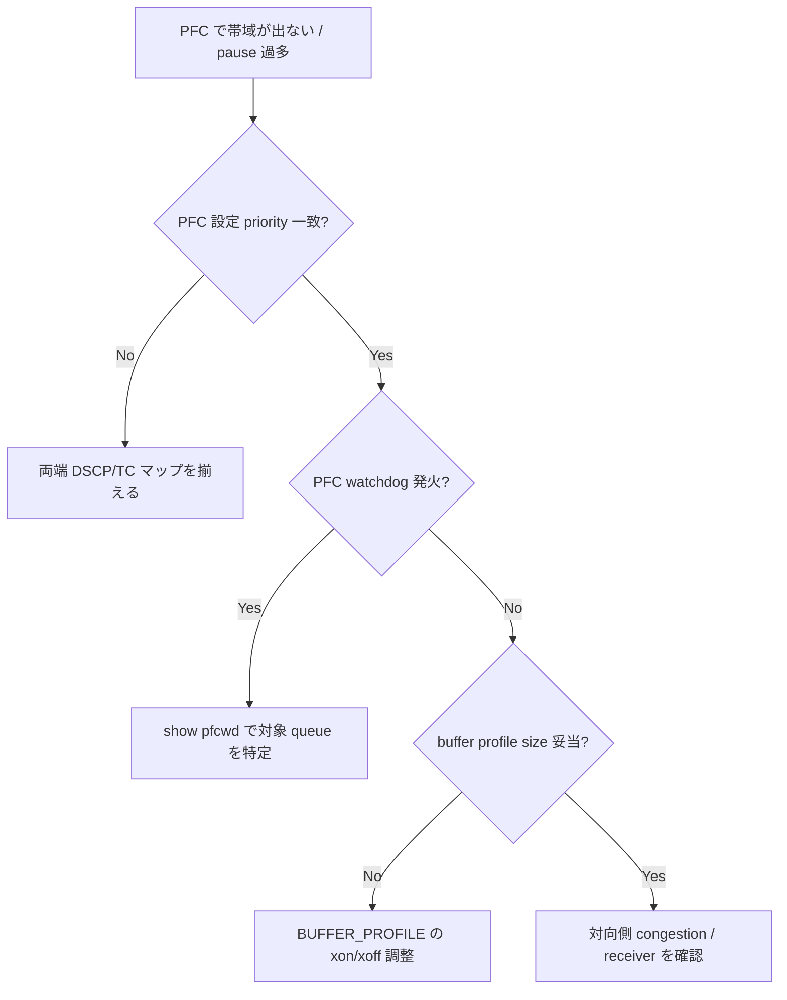

# Runbook: PFC で帯域が出ない / Buffer overflow

!!! danger "実行前提"
    `pfcwd stop` / `pfcwd start` および `BUFFER_*` テーブル変更は lossless queue の watchdog action を一旦解除するため、PFC storm が再発すると HoL blocking で全 priority に影響が波及する可能性がある。実行前に `redis-cli -n 4 --rdb /tmp/cfgdb.bak.$(date +%s).rdb` で CONFIG_DB の snapshot を取り、buffer profile 変更時は `sonic-cfggen -d -v "BUFFER_PROFILE"` で現値を保存。誤設定時は backup から該当テーブルのみ `redis-cli -n 4 HMSET ...` で戻すか、`config reload -y` で全体ロールバック。

## 症状

- [RoCE](../../reference/glossary.md#term-roce) / lossless トラフィックでスループットが想定の数 % にとどまる
- `pfcwd show stats` で `STORM` が継続検出され、特定 queue が `disabled` 状態
- `show queue counters` で `pkts_dropped` が増え続ける
- `show priority-group persistent-watermark` で PG buffer の usage が常時 100% 近い

## 想定原因

1. **[PFC](../../reference/glossary.md#term-pfc) enabled priority と PORT_QOS_MAP の [DSCP](../../reference/glossary.md#term-dscp)→TC マッピング不一致** → 想定の queue に乗っていない
2. **buffer profile / pool sizing 不足**: `BUFFER_POOL|ingress_lossless_pool` の `size` がトラフィック量に対して過小
3. **対向側で [PFC](../../reference/glossary.md#term-pfc) pause を生成し続け、[PFC](../../reference/glossary.md#term-pfc) storm に陥っている**: PFC WD が queue を強制 disable
4. **headroom 計算が cable length と一致していない** (`CABLE_LENGTH` テーブル誤設定)
5. **MMU 共有プールの先頭飽和**: 他 priority のトラフィックが共有プールを食い潰し、lossless 用 reserved が確保できない

## 切り分け手順




## 確認コマンド

### 1. QoS マッピングと PFC enabled priority の整合

```bash
sonic-db-cli CONFIG_DB hgetall "PORT_QOS_MAP|Ethernet0"
sonic-db-cli CONFIG_DB hgetall "DSCP_TO_TC_MAP|AZURE"
sonic-db-cli CONFIG_DB hgetall "TC_TO_PRIORITY_GROUP_MAP|AZURE"
```

- 期待: 送信側 [DSCP](../../reference/glossary.md#term-dscp)（例: 26 / 48 など）が `pfc_enable` に含まれる TC に紐づく
- 異常: 別 TC にマップ → 期待 queue/PG にトラフィックが乗っていない

### 2. Buffer 使用量と headroom

```bash
show priority-group persistent-watermark headroom
show priority-group persistent-watermark shared
show buffer_pool persistent-watermark
sonic-db-cli CONFIG_DB hgetall "BUFFER_POOL|ingress_lossless_pool"
sonic-db-cli CONFIG_DB hgetall "BUFFER_PROFILE|pg_lossless_100000_5m_profile"
```

- 期待: headroom は burst 時のみ消費、常時は shared を使う
- 異常: headroom が常時 100% → 対向 PFC pause を受け続けている可能性

### 3. PFC Watchdog 状態

```bash
pfcwd show config
pfcwd show stats
sonic-db-cli COUNTERS_DB hgetall "COUNTERS:Ethernet0:PFC_WD"
```

- 期待: `STORM` 検出が稀 / ゼロに近い
- 異常: 特定 queue で連続検出 → ホストの PFC 発行を疑う

### 4. PFC counters (Rx / Tx pause frames)

```bash
show pfc counters
```

- `Rx_PFC_<TC>` が伸び続ける → 対向が pause を送り続けている (受信側の問題)
- `Tx_PFC_<TC>` が伸び続ける → 自機の buffer が逼迫し pause を出している

### 5. CABLE_LENGTH 設定の妥当性

```bash
sonic-db-cli CONFIG_DB hgetall "CABLE_LENGTH|AZURE"
```

- 期待: 実際のリンク長を反映（例: ToR 間 5m、ToR-Spine 40m）
- 異常: 全ポート `300m` 等のデフォルト → headroom が過大 / 過小に

## 対処方法

- PFC storm を起こした queue の復旧: `pfcwd start_default` の再有効化、または特定ポートで `pfcwd start <action> <detect> <restore> <ports>` を実行
- buffer pool / profile を `buffers.json.j2` / `buffers_defaults_*.j2` を見直して再生成
- CABLE_LENGTH を実値に: `config interface cable-length Ethernet0 5m`
- 根本対策: 対向 NIC 側 PFC 設定を点検（送信し過ぎていないか、CNP / ECN との連携が壊れていないか）

## 確認

対処後の正常化を以下で裏取りする。

- **症状解消**: 「症状」節で挙げた事象 (counter / log / state) が回復していること
- **再発監視**: 数分〜数十分の間隔で同コマンドを再実行し、値がフラップしていないこと
- **副作用なし**: 関連サブシステム ([syslog](../../reference/glossary.md#term-syslog) / `show interfaces counters errors` / `show ip bgp summary` 等) に新規 error が出ていないこと
- **永続化**: `sudo config save -y` 済みで `config_db.json` に変更が反映されていること (恒久対処の場合)

短時間で再発する場合は「想定原因」リストの次候補に進む。

## 関連ページ

- [../../topics/08-qos-buffer/operations.md](../../topics/08-qos-buffer/operations.md)
- [../../topics/08-qos-buffer/concept.md](../../topics/08-qos-buffer/concept.md)
- [../cli/config-pfcwd.md](../cli/config-pfcwd.md)
- [../config-db/pfc-wd.md](../config-db/pfc-wd.md)
- [../config-db/buffer-pool.md](../config-db/buffer-pool.md)

## 引用元

本ページの根拠は引用元 [^1][^2] を参照。

[^1]: sonic-net/[sonic-swss](../../reference/glossary.md#term-sonic-swss) @ 4305596 — bufferorch / pfcwdorch
[^2]: sonic-net/[sonic-utilities](../../reference/glossary.md#term-sonic-utilities) @ 39732bceb — pfcwd CLI

<!-- glossary-links-injected: eebb97ac8e67 -->
