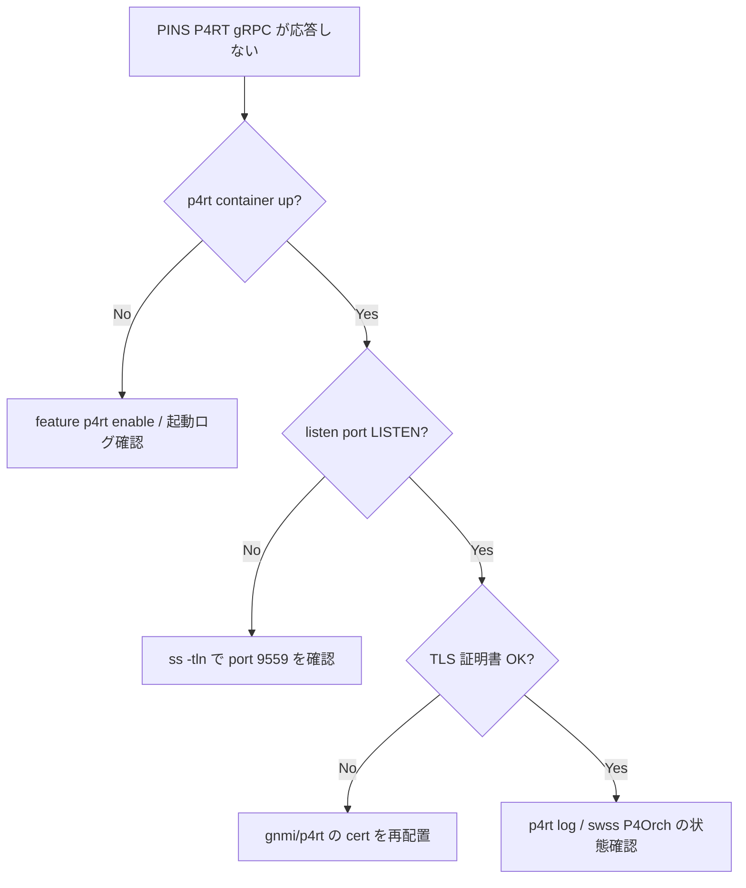

# Runbook: PINS p4rt gRPC が応答しない / セッション張れない

!!! danger "実行前提"
    `config reload` / `docker restart p4rt` は controller との P4Runtime セッションを切断し、controller 側で再 push が必要になる。pipeline の再 push 完了までデータプレーンに ACL / route 反映が止まる。**ロールバック**は controller 側で前回 commit の P4Info / table entries を再 push する。controller の再 push 経路がない状態での再起動は禁止。

## 症状

- controller から `SetForwardingPipelineConfig` が `UNAVAILABLE` / `DEADLINE_EXCEEDED`
- `StreamChannel` で primary election が失敗（`PERMISSION_DENIED`）
- `WriteRequest` が `INTERNAL: failed to program ACL` で返る

## 想定原因（優先度順）

1. **p4rt container が未起動 / crash loop**
2. **`PORT_ID` 未割当**: [PINS](../../reference/glossary.md#term-pins) は port_id を持たない interface に対して write を拒否
3. **primary election ID 衝突**: 複数 controller が同 election_id で接続
4. **[APPL_DB](../../reference/glossary.md#term-appl_db) → [ASIC_DB](../../reference/glossary.md#term-asic_db) pipeline が詰まる**: [orchagent](../../reference/glossary.md#term-orchagent) / [syncd](../../reference/glossary.md#term-syncd) 滞留
5. **TLS / mTLS 証明書失敗**

## 切り分け手順




## 確認コマンド

### 1. container / process

```bash
docker ps | grep p4rt
docker logs p4rt 2>&1 | tail -200
sudo ss -tnp | grep 9559
```

### 2. PORT_ID

```bash
sonic-db-cli CONFIG_DB hgetall "PORT|Ethernet0" | grep -i id
sonic-db-cli APPL_DB hgetall "PORT_TABLE:Ethernet0" | grep -i id
```

- 期待: `id` フィールドが空でない（[PINS](../../reference/glossary.md#term-pins) では required）

### 3. APPL_DB / ASIC_DB の滞留

```bash
sonic-db-cli APPL_STATE_DB keys "*" | head
sonic-db-cli ASIC_DB dbsize
docker logs swss 2>&1 | grep -iE "error|fail" | tail -50
```

### 4. controller 側で gRPC 直叩き

```bash
grpc_cli ls <switch>:9559
grpc_cli call <switch>:9559 p4.v1.P4Runtime/Capabilities ""
```

### 5. 証明書

```bash
docker exec p4rt ls /etc/sonic/credentials/
openssl x509 -in /etc/sonic/credentials/ca.crt -noout -dates
```

## 対処方法

- container down: `docker start p4rt`、原因は `docker logs p4rt --tail 500` で追跡
- PORT_ID 未割当: `config interface portchannel/port id <port> <id>` で割当（実装に依る）
- election ID 衝突: controller 側で election_id を一意に
- 滞留: [orchagent](../../reference/glossary.md#term-orchagent) restart は影響大なので、まず `sonic-db-cli APPL_STATE_DB` で何が pending か確認
- 証明書: 旧証明書を退避 → 新証明書配置 → `docker restart p4rt`。**ロールバック**: 退避から戻す

## 確認

対処後の正常化を以下で裏取りする。

- **症状解消**: 「症状」節で挙げた事象 (counter / log / state) が回復していること
- **再発監視**: 数分〜数十分の間隔で同コマンドを再実行し、値がフラップしていないこと
- **副作用なし**: 関連サブシステム ([syslog](../../reference/glossary.md#term-syslog) / `show interfaces counters errors` / `show ip bgp summary` 等) に新規 error が出ていないこと
- **永続化**: `sudo config save -y` 済みで `config_db.json` に変更が反映されていること (恒久対処の場合)

短時間で再発する場合は「想定原因」リストの次候補に進む。

## 関連ページ

- [../../topics/18-p4-pins/concept.md](../../topics/18-p4-pins/concept.md)

## 引用元

本ページの根拠は引用元 [^1][^2] を参照。

[^1]: sonic-net/sonic-pins @ master — p4runtime_impl.cc
[^2]: sonic-net/sonic-pins @ master — app_db_manager.cc

<!-- glossary-links-injected: c16fb11ac157 -->
