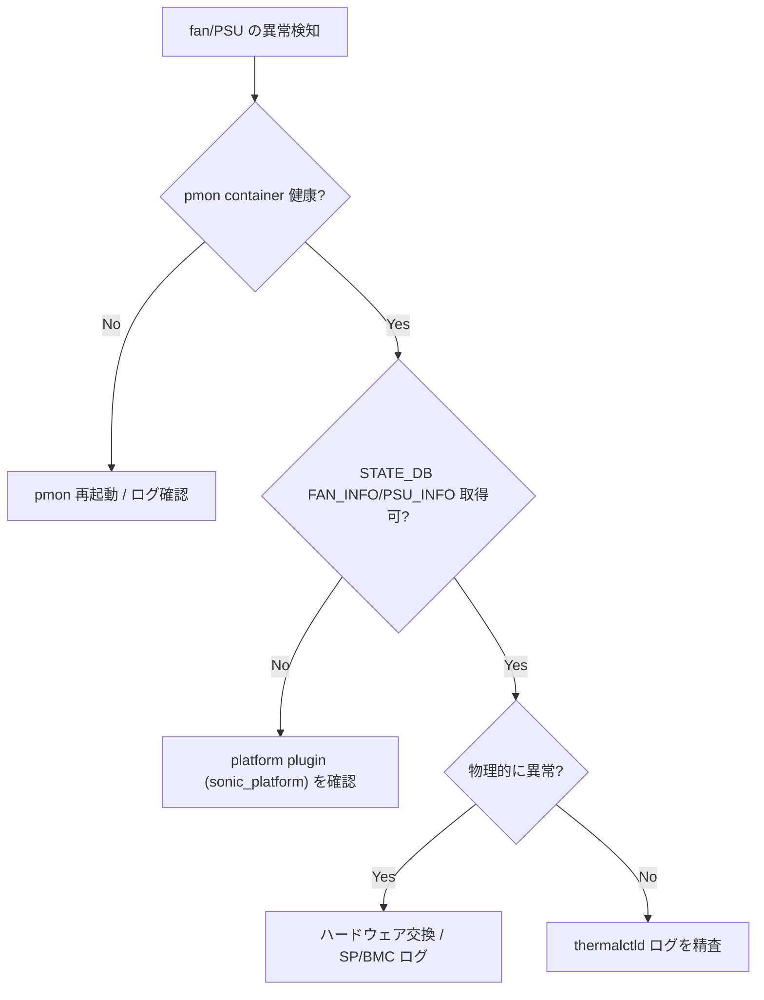

# Runbook: show platform fan / psu で異常値が出る

!!! danger "実行前提"
    fan / PSU の物理交換は装置の冷却 / 給電に直結する。fan 1 つ抜くだけで熱暴走→自動 reboot のリスク。**現地作業者と必ず手順合意し、片肺運転中は予備が確実に冗長化されている事を `show platform psustatus` で確認**してから抜くこと。物理交換以外の対処は thermalctld restart 程度で限定的。

## 症状

- `show platform fan` で `STATUS not OK` / RPM 0
- `show platform psustatus` で `Voltage` / `Power` 異常
- 自動 thermal shutdown でリブートする

## 想定原因（優先度順）

1. **fan / PSU の物理故障**
2. **sensor の i2c 通信エラー**: smbus に他デバイスが詰まる
3. **thermalctld の bug / panic**
4. **platform API plugin の値変換ミス**

## 切り分け手順




## 確認コマンド

### 1. STATE_DB / sensor

```bash
show platform fan
show platform psustatus
show platform temperature
sonic-db-cli STATE_DB keys "FAN_INFO|*"
sonic-db-cli STATE_DB keys "PSU_INFO|*"
```

### 2. thermalctld ログ

```bash
sudo journalctl -u thermalctld -n 200 --no-pager | tail
```

### 3. i2c bus

```bash
sudo i2cdetect -l
sudo i2cdetect -y <bus>
```

### 4. platform plugin

```bash
sudo python3 -c "from sonic_platform.chassis import Chassis; c=Chassis(); [print(f.get_name(), f.get_speed(), f.get_status()) for f in c.get_all_fans()]"
```

## 対処方法

- 物理交換（現地作業）
- thermalctld 再起動: `sudo systemctl restart thermalctld`
- i2c reset（ベンダー依存）
- 一時的に thermal policy を緩める（自動 shutdown を遅らせる）

## 確認

対処後の正常化を以下で裏取りする。

- **症状解消**: 「症状」節で挙げた事象 (counter / log / state) が回復していること
- **再発監視**: 数分〜数十分の間隔で同コマンドを再実行し、値がフラップしていないこと
- **副作用なし**: 関連サブシステム ([syslog](../../reference/glossary.md#term-syslog) / `show interfaces counters errors` / `show ip bgp summary` 等) に新規 error が出ていないこと
- **永続化**: `sudo config save -y` 済みで `config_db.json` に変更が反映されていること (恒久対処の場合)

短時間で再発する場合は「想定原因」リストの次候補に進む。

## 関連ページ

- [container-not-starting.md](container-not-starting.md)
- [techsupport-timeout.md](techsupport-timeout.md)

## 引用元

本ページの根拠は引用元 [^1][^2] を参照。

[^1]: sonic-net/sonic-platform-daemons @ 4305596 — thermalctld
[^2]: sonic-net/sonic-platform-common @ 4305596 — fan_base / psu_base
