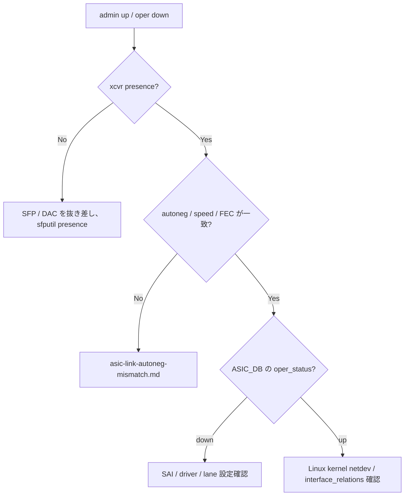

# Runbook: Port が admin up なのに oper down のまま

!!! warning "HLD-only"
    portsorch / xcvrd / SAI の標準動作に基づく運用ノート。

## 症状

- `show interface status Ethernet0` で `Admin = up` だが `Oper = down`
- `config interface startup Ethernet0` を発行しても変化なし
- 対向ポートは別の機器で問題なく動作する

## 切り分けフロー



## 確認コマンド

```bash
# Admin/Oper、speed、FEC、type を一括
show interface status Ethernet0

# Transceiver の有無 / EEPROM
sudo sfputil show presence -p Ethernet0
sudo sfputil show eeprom -p Ethernet0 | head -40

# APPL_DB / ASIC_DB
sonic-db-cli APPL_DB hgetall "PORT_TABLE:Ethernet0"
sonic-db-cli ASIC_DB keys "ASIC_STATE:SAI_OBJECT_TYPE_PORT:*" | head
sonic-db-cli STATE_DB hgetall "PORT_TABLE|Ethernet0"

# orchagent / syncd のログ
docker logs swss 2>&1 | grep -iE "Ethernet0|portsorch" | tail -50
docker logs syncd 2>&1 | grep -iE "Ethernet0|SAI_PORT" | tail -50

# kernel 側
ip -d link show Ethernet0
ethtool Ethernet0
```

## よくある原因

1. **Transceiver 未挿入 / EEPROM 異常** — `sfputil show presence` が `Not present`
2. **speed / FEC / autoneg の不一致** — 25G で FEC 設定が片側 RS、片側 none など
3. **[portsorch](../../reference/glossary.md#term-portsorch) が [CONFIG_DB](../../reference/glossary.md#term-config_db) を [APPL_DB](../../reference/glossary.md#term-appl_db) に反映できていない** — `swss` container の異常
4. **lane / serdes 設定の platform.json バグ** — port-breakout 後の設定残り
5. **[SAI](../../reference/glossary.md#term-sai) driver / FW のリンクトレーニング失敗** — `syncd` ログに `link training failed`
6. **kernel netdev は up だが [ASIC](../../reference/glossary.md#term-asic) 側で down** — host-side のみ up となる multi-asic 構成の罠

`portsorch` は [CONFIG_DB](../../reference/glossary.md#term-config_db) の `PORT` 変更を [SAI](../../reference/glossary.md#term-sai) 属性 (`SAI_PORT_ATTR_ADMIN_STATE` 等) に変換して [syncd](../../reference/glossary.md#term-syncd) へ渡し、`xcvrd` は EEPROM 読出し結果を [STATE_DB](../../reference/glossary.md#term-state_db) の `TRANSCEIVER_INFO` に書き戻す[^1]。

[^1]: `sonic-net/sonic-swss` `orchagent/portsorch.cpp` ([CONFIG_DB](../../reference/glossary.md#term-config_db) → [SAI](../../reference/glossary.md#term-sai) mapping) と `sonic-net/sonic-platform-daemons` の `sonic-xcvrd` (SFP EEPROM 監視) が分担する。

## 関連 reference / topics

- [asic-link-autoneg-mismatch.md](asic-link-autoneg-mismatch.md)
- [fec-errors.md](fec-errors.md)
- [link-flapping.md](link-flapping.md)
- [interface-mtu-mismatch.md](interface-mtu-mismatch.md)
- [../cli/show-interfaces.md](../cli/show-interfaces.md)

<!-- glossary-links-injected: 9937abcefc29 -->
