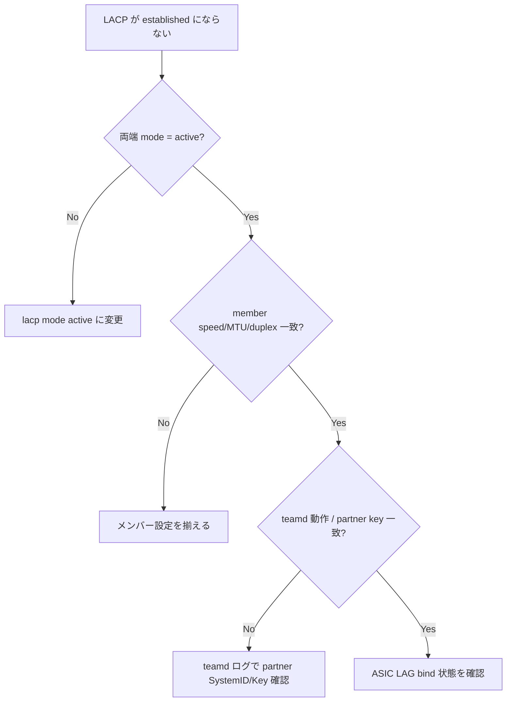

# Runbook: PortChannel メンバーで LACP が確立しない

!!! danger "実行前提"
    `teammgrd` 再起動や `config portchannel member del/add` は LACP 再ネゴシエーションをトリガーし、該当 PortChannel が一時的に down する。ECMP / MCLAG 経路がある場合は数百 ms ～数秒の通信断が出る。先に `sudo cp /etc/sonic/config_db.json /etc/sonic/config_db.json.bak.$(date +%s)` を取得し、対向側で「graceful な PortChannel drain」が可能かを確認すること。問題悪化時は backup を戻し `config reload -y` で復旧する。

## 症状

- `show interfaces portchannel` で `S` (Selected) ではなく `D` (DOWN) / `I` (Individual) のままになる
- `teamdctl <PortChannel> state` の `runner.aggregator.selected` が `false`
- 片側のみ UP（[LACP](../../reference/glossary.md#term-lacp) unidirectional）

## 想定原因（優先度順）

1. **物理リンク oper down**: メンバーポートが L1 で UP していない
2. **対向側の [LACP](../../reference/glossary.md#term-lacp) mode 不一致**: 一方が `active` / 他方が `off`（static）
3. **speed / duplex mismatch**: メンバーごとに速度が異なると [LACP](../../reference/glossary.md#term-lacp) は member を eligible にしない
4. **`min_links` 未達**: PORTCHANNEL の `min_links` を満たすメンバーが UP していない
5. **[teamd](../../reference/glossary.md#term-teamd-teamsyncd-teammgrd) / teammgrd の異常**: `teamd@<PortChannel>.service` が crash ループ

## 切り分け手順




## 確認コマンド

### 1. メンバーポートの L1 状態

```bash
show interfaces status | grep -E "Ethernet|PortChannel"
show interfaces portchannel
```

- 期待: 全メンバーが `up/up`、[PortChannel](../../reference/glossary.md#term-portchannel) の Protocol が `LACP(A)(Up)`
- 異常: メンバーが down → SFP / FEC を確認（[fec-errors.md](fec-errors.md)）

### 2. teamd の生の状態

```bash
sudo teamdctl PortChannel0001 state
sudo teamdctl PortChannel0001 config dump
```

- 期待: `setup.runner_name = lacp`、各 port の `selected: true`
- 異常: `selected: false` で reason 表示 → speed mismatch / system_id 同一 等

### 3. 対向側との LACP PDU 観測

```bash
sudo tcpdump -i Ethernet0 -nn ether proto 0x8809 -vv -c 5
```

- 期待: 双方向に LACPDU が 1 秒間隔（fast）または 30 秒間隔（slow）で流れる
- 異常: 片方向のみ → 対向側のポートチャネル設定確認

### 4. CONFIG_DB の整合

```bash
sonic-db-cli CONFIG_DB hgetall "PORTCHANNEL|PortChannel0001"
sonic-db-cli CONFIG_DB keys "PORTCHANNEL_MEMBER|PortChannel0001|*"
```

- 期待: `min_links` を満たすメンバー数が登録されている
- 異常: メンバーが想定数より少ない → `config portchannel member add` で追加

### 5. teammgrd ログ

```bash
sudo grep -iE "teamd|portchannel" /var/log/syslog | tail -100
```

## 対処方法

- speed mismatch: `config interface speed Ethernet0 <speed>` で揃える
- LACP mode 不一致: 対向と協調し `mode active` で揃える
- `min_links` の見直し: 既存 [PortChannel](../../reference/glossary.md#term-portchannel) への直接更新コマンドは存在しないため、(1) `config portchannel member del <name> <member>` で全メンバー解除 → (2) `config portchannel del <name>` で削除 → (3) `config portchannel add <name> --min-links <N>` で再作成、の手順で変更する
- [teamd](../../reference/glossary.md#term-teamd-teamsyncd-teammgrd) crash: `sudo systemctl restart teamd@PortChannel0001`

## 関連ページ

- [../../topics/06-l2-vlan-lag/concept.md](../../topics/06-l2-vlan-lag/concept.md)
- [../cli/show-interfaces.md](../cli/show-interfaces.md)
- [../config-db/portchannel.md](../config-db/portchannel.md)

## 引用元

本ページの根拠は引用元 [^1][^2] を参照。

[^1]: sonic-net/[sonic-swss](../../reference/glossary.md#term-sonic-swss) @ 4305596 — cfgmgr/teammgr.cpp
[^2]: sonic-net/[sonic-utilities](../../reference/glossary.md#term-sonic-utilities) @ 39732bceb — show interfaces portchannel

<!-- glossary-links-injected: 774b9119d65a -->
