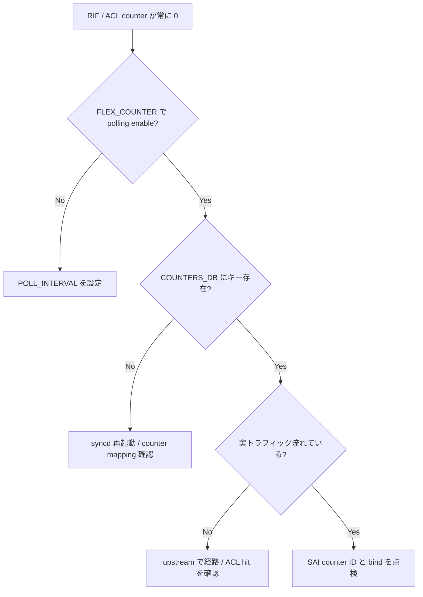

# Runbook: RIF / ACL counter が 0 のまま

!!! danger "実行前提"
    `aclshow -c` (clear) や `counterpoll acl disable && counterpoll acl enable` は統計のみで forwarding には影響しない。一方 `config load <file>` / `acl-loader update full` で ACL rule を再投入すると、**rule 入れ替え瞬間に該当 ACL table が一時的に空** になり、deny rule が消える時間窓が発生する。実行前に `aclshow -a > /tmp/aclshow.bak.$(date +%s)` と該当 ACL rule の JSON を `sonic-cfggen -d --var-json "ACL_RULE" > /tmp/acl_rule.bak.json` で退避。誤った rule 投入時は `acl-loader update full` で退避 JSON を戻して即時復旧。

## 症状

- トラフィックは流れているのに `aclshow -a` が全 rule 0 のまま
- `show interfaces counters rif` で RX/TX bytes が 0
- 一部 rule だけが increment し、他は 0

## 想定原因

1. **`FLEX_COUNTER_TABLE|ACL` / `FLEX_COUNTER_TABLE|RIF` が disable**
2. **[ACL](../../reference/glossary.md#term-acl) rule が [ASIC](../../reference/glossary.md#term-asic) に install されていない**: [orchagent](../../reference/glossary.md#term-orchagent) エラーで install 失敗
3. **rule の match 条件にトラフィックが該当していない** ([DSCP](../../reference/glossary.md#term-dscp) / src_ip / in_port のミスマッチ)
4. **rule 優先度 (`PRIORITY`) が他 rule に隠されている**: 先に match した別 rule に取られている
5. **stage / type 不一致**: L3 rule を `INGRESS_L2` テーブルに入れている

## 切り分け手順




## 確認コマンド

### 1. FLEX_COUNTER の状態

```bash
counterpoll show
sonic-db-cli CONFIG_DB hgetall "FLEX_COUNTER_TABLE|ACL"
sonic-db-cli CONFIG_DB hgetall "FLEX_COUNTER_TABLE|RIF"
```

- 期待: `enable`
- 異常: `disable` → `counterpoll acl enable`, `counterpoll rif enable`

### 2. ACL の ASIC 反映

```bash
aclshow -a
sonic-db-cli ASIC_DB keys "ASIC_STATE:SAI_OBJECT_TYPE_ACL_ENTRY:*" | head
docker logs swss 2>&1 | grep -iE "aclorch|acl_entry" | tail
```

- 期待: rule 数と [ASIC](../../reference/glossary.md#term-asic) entry 数が概ね一致
- 異常: 0 件 → [orchagent](../../reference/glossary.md#term-orchagent) install 失敗

### 3. rule の match 条件確認

```bash
sonic-db-cli CONFIG_DB hgetall "ACL_RULE|MY_TABLE|MY_RULE"
sonic-db-cli CONFIG_DB hgetall "ACL_TABLE|MY_TABLE"
```

- 期待: `type: L3` / `stage: ingress`, `ports` リストに対象ポート、match key が現実トラフィックに合う
- 異常: stage / type が L2 になっている → トラフィック種別と不一致

### 4. capture で実トラフィック確認

```bash
sudo tcpdump -i Ethernet0 -nn -c 20 host <expected_src>
```

- 想定流量に対し packet が見えないなら、そもそも match していない可能性大

### 5. RIF counter のオブジェクト ID 確認

```bash
sonic-db-cli COUNTERS_DB hgetall "COUNTERS_RIF_NAME_MAP"
sonic-db-cli COUNTERS_DB hgetall "COUNTERS:oid:<RIF OID>"
```

- 期待: 各 [VLAN](../../reference/glossary.md#term-vlan) / portchannel L3 interface に対応する OID あり、increment あり

## 対処方法

- counter group の enable: `counterpoll acl enable` / `counterpoll rif enable`
- rule の install 失敗時: 該当 rule を `config acl update full <json>` で再投入
- match の見直し（src_ip / [DSCP](../../reference/glossary.md#term-dscp) / ip_protocol 等を実トラフィックに合わせる）
- 優先度衝突は `PRIORITY` を引き上げ / 下げて切り分け

## 関連ページ

- [../../topics/07-acl-copp-mirror/operations.md](../../topics/07-acl-copp-mirror/operations.md)
- [../../topics/07-acl-copp-mirror/concept.md](../../topics/07-acl-copp-mirror/concept.md)
- [../cli/show-acl.md](../cli/show-acl.md)
- [../cli/config-acl.md](../cli/config-acl.md)
- [../config-db/acl-rule.md](../config-db/acl-rule.md)

## 引用元

本ページの根拠は引用元 [^1][^2] を参照。

[^1]: sonic-net/[sonic-swss](../../reference/glossary.md#term-sonic-swss) @ 4305596 — aclorch / intfsorch
[^2]: sonic-net/[sonic-utilities](../../reference/glossary.md#term-sonic-utilities) @ 39732bceb — acl_loader / aclshow

<!-- glossary-links-injected: e82be350a384 -->
