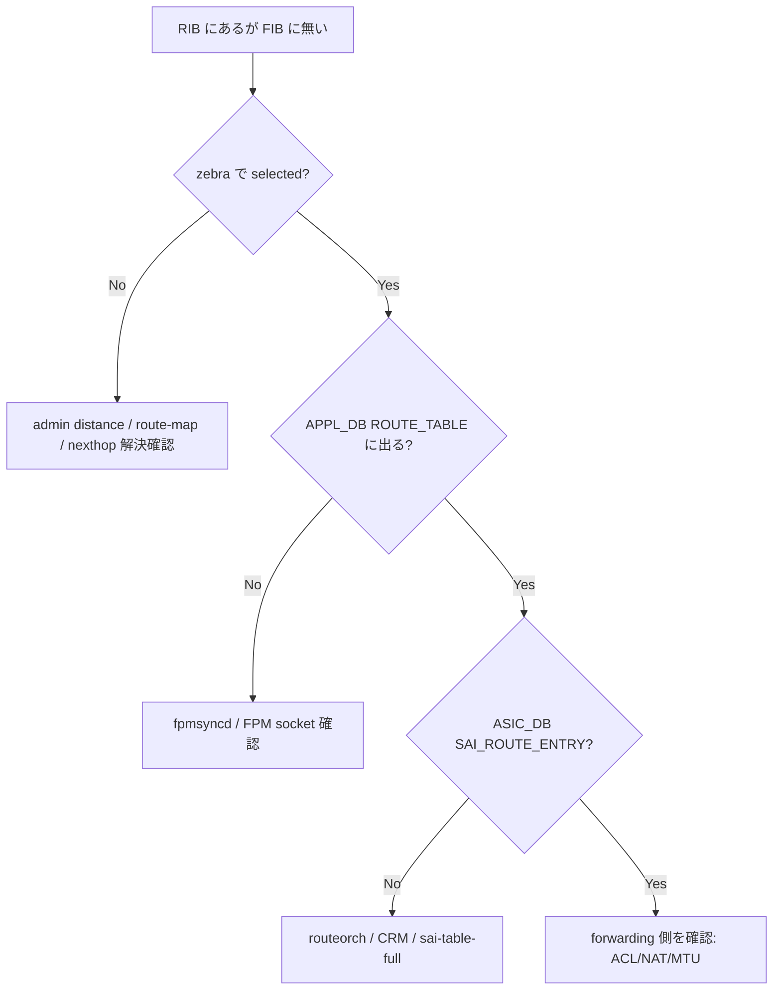

# Runbook: 経路は RIB にあるが FIB / ASIC に降りない

## 症状

- `vtysh -c "show ip route <prefix>"` に該当経路が出るが `*` (FIB selected) が付かない
- `show ip route <prefix>` ([SONiC](../../reference/glossary.md#term-sonic) 側) に出ない、または出るのに traffic は DROP
- `APPL_DB ROUTE_TABLE` に entry が無い

## 切り分けフロー



## 確認コマンド

```bash
# FRR (RIB)
docker exec bgp vtysh -c "show ip route <prefix>"
docker exec bgp vtysh -c "show ip route <prefix> json" | python3 -m json.tool | head -40

# zebra の FIB 選択
docker exec bgp vtysh -c "show ip route <prefix>" | grep -E "^[A-Z]\*|^[A-Z] "

# SONiC 側
show ip route <prefix>
sonic-db-cli APPL_DB hgetall "ROUTE_TABLE:<prefix>"
sonic-db-cli ASIC_DB keys "ASIC_STATE:SAI_OBJECT_TYPE_ROUTE_ENTRY:*" | grep "<prefix>"

# fpmsyncd の状態
docker exec swss supervisorctl status fpmsyncd
sudo grep -i fpmsyncd /var/log/syslog | tail -50

# CRM (FIB capacity)
crm show resources route
crm show resources nexthop

# Nexthop 解決
docker exec bgp vtysh -c "show ip nht"
ip neigh | grep <nexthop_ip>
```

## よくある原因

1. **Nexthop が unresolved** — [ARP](../../reference/glossary.md#term-arp) が無く、[zebra](../../reference/glossary.md#term-zebra) が FIB に入れない
2. **[fpmsyncd](../../reference/glossary.md#term-fpmsyncd) と [zebra](../../reference/glossary.md#term-zebra) の [FPM](../../reference/glossary.md#term-fpm) socket 断** — [FRR](../../reference/glossary.md#term-frr) の [FPM](../../reference/glossary.md#term-fpm) が disable / socket reconnect ループ
3. **routeorch の bulk pending** — [ASIC](../../reference/glossary.md#term-asic) への書き込みが queue 滞留中
4. **[CRM](../../reference/glossary.md#term-crm) route / nexthop 枯渇** — `crm show resources` で `used == max`
5. **[ASIC](../../reference/glossary.md#term-asic) FIB table full** — `sai-table-full.md` 参照
6. **同一 prefix を別 source が上書き** — static route と [BGP](../../reference/glossary.md#term-bgp) route の admin distance
7. **Blackhole / Null route** — `null0` が選択されていて意図せず DROP

[FRR](../../reference/glossary.md#term-frr) [zebra](../../reference/glossary.md#term-zebra) → [FPM](../../reference/glossary.md#term-fpm) → [fpmsyncd](../../reference/glossary.md#term-fpmsyncd) → [APPL_DB](../../reference/glossary.md#term-appl_db) → routeorch → [ASIC_DB](../../reference/glossary.md#term-asic_db) のパイプライン構造は `sonic-frr` の `zebra_fpm.c` と `sonic-swss` の `fpmsyncd.cpp` / `routeorch.cpp` の組合せで実装される[^1]。

[^1]: `sonic-net/sonic-frr` `zebra/zebra_fpm.c` (FPM client / [Netlink](../../reference/glossary.md#term-netlink) encoding) と `sonic-net/sonic-swss` `fpmsyncd/fpmsyncd.cpp` (FPM server / [APPL_DB](../../reference/glossary.md#term-appl_db) writer)、`orchagent/routeorch.cpp` ([APPL_DB](../../reference/glossary.md#term-appl_db) → [ASIC_DB](../../reference/glossary.md#term-asic_db)) で経路が伝播する。

## 関連 reference / topics

- [bgp-route-not-advertised.md](bgp-route-not-advertised.md)
- [sai-table-full.md](sai-table-full.md)
- [crm-threshold-exceeded.md](crm-threshold-exceeded.md)
- [swss-orchagent-busy-loop.md](swss-orchagent-busy-loop.md)
- [arp-entry-stuck.md](arp-entry-stuck.md)

<!-- glossary-links-injected: 1288c04b3f8a -->
