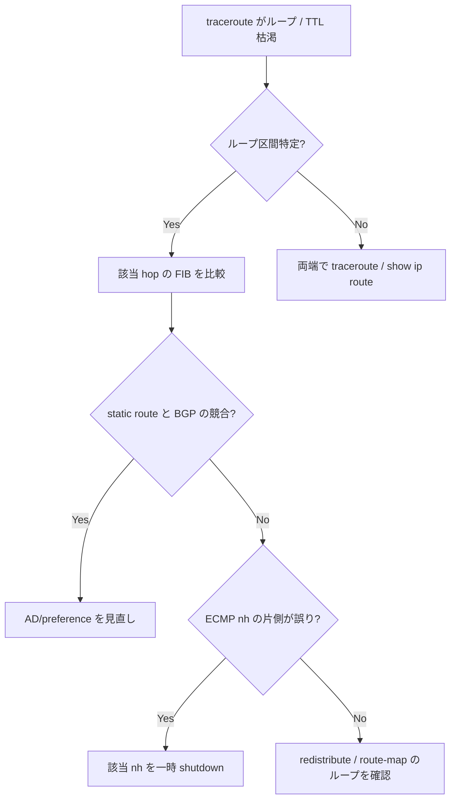

# Runbook: Routing loop が発生している

!!! danger "実行前提"
    loop は CPU / バックプレーン帯域を消費し、control plane (BGP / LLDP / management) を巻き込みダウンさせる恐れがある。即時切り分けが最優先。修正前に `show ip route > /tmp/rib.before` と `sudo cp /etc/sonic/config_db.json /etc/sonic/config_db.json.bak.$(date +%s)` を取得。間違って正常経路を消した場合は backup を `config reload -y` で戻す。

## 症状

- `traceroute` で同一 hop の繰り返し
- TTL exceeded が大量に発生（`show interfaces counters` の `RX_ERR` 増加 / control plane CPU 急上昇）
- ping が通らずレイテンシ巨大

## 想定原因（優先度順）

1. **static route と [BGP](../../reference/glossary.md#term-bgp) 経路の競合**: 自身を next-hop に向ける static
2. **default route の相互広告**: ToR ↔ Leaf 双方が default を交換
3. **redistribute connected + summary-only が一致しない**: 集約経路で自分の subnet が抜ける
4. **[BGP](../../reference/glossary.md#term-bgp) の next-hop unchanged 設定誤り**

## 切り分け手順




## 確認コマンド

### 1. traceroute で loop hop 特定

```bash
traceroute -n -q 1 -w 1 <dst>
mtr -n --no-dns <dst>
```

### 2. 該当 prefix の RIB

```bash
docker exec bgp vtysh -c "show ip route <prefix>"
show ip route <prefix>
```

- 期待: 1 つの best 経路
- 異常: 自身に戻る next-hop / 不適切な [ECMP](../../reference/glossary.md#term-ecmp) メンバー

### 3. static route 確認

```bash
sonic-db-cli CONFIG_DB keys "STATIC_ROUTE|*"
docker exec bgp vtysh -c "show running-config staticd"
```

### 4. control plane CPU

```bash
top -bn1 | head -20
show processes cpu | head -20
```

### 5. counter 急上昇

```bash
show interfaces counters | head -20
```

## 対処方法

- 怪しい static を一時 disable: `sudo config route del prefix <p>`
- [BGP](../../reference/glossary.md#term-bgp) の default 広告抑制: `neighbor <peer> default-originate` を外す
- summary 配下を明示 announce: `aggregate-address <p> as-set` の見直し
- ループ確定箇所の interface を一時 admin down: `sudo config interface shutdown Ethernet0`

## 関連ページ

- [bgp-route-not-advertised.md](bgp-route-not-advertised.md)
- [../../topics/04-vrf-ecmp/concept.md](../../topics/04-vrf-ecmp/concept.md)

## 引用元

本ページの根拠は引用元 [^1][^2] を参照。

[^1]: sonic-net/sonic-frr @ 799f47f — [zebra](../../reference/glossary.md#term-zebra)/zebra_rib.c
[^2]: sonic-net/[sonic-swss](../../reference/glossary.md#term-sonic-swss) @ 4305596 — routeorch.cpp

<!-- glossary-links-injected: 758aafff1fd5 -->
