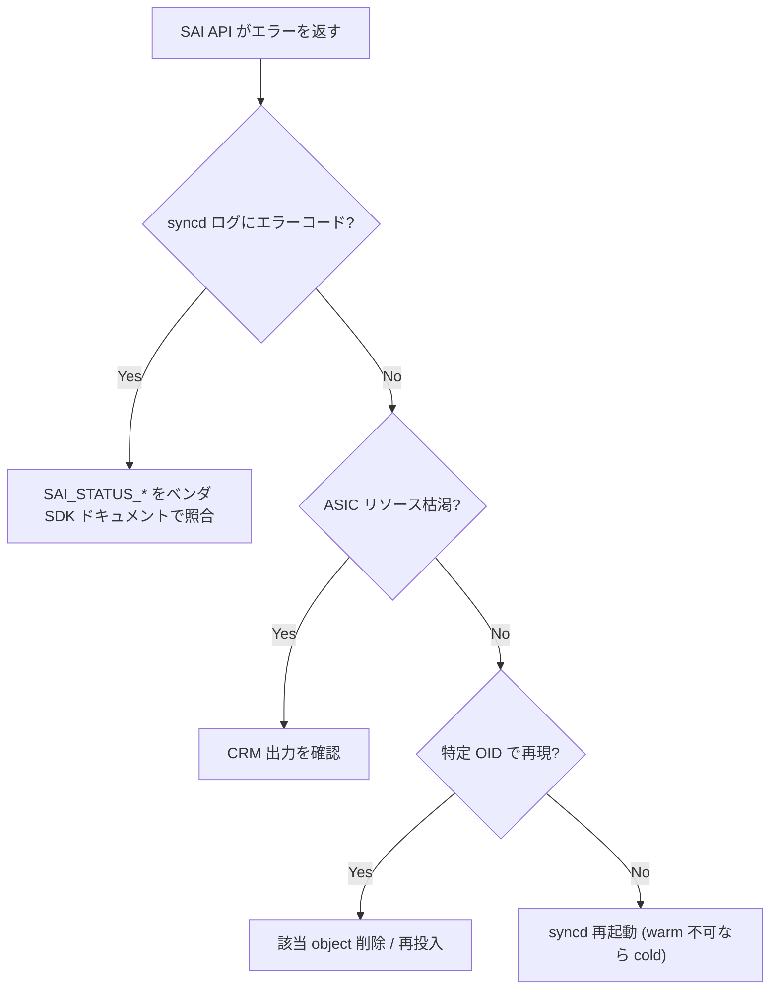

# Runbook: SAI failure / syncd リスタート多発

!!! danger "実行前提"
    `systemctl restart swss` は syncd 連動再起動を伴い、**ASIC を一度再初期化** するため data plane が 30 秒～数分中断する（cold restart 相当）。warm_restart が enable でも syncd crash 直後は再生成必須。実行前に `sudo cp -r /var/log/syncd* /tmp/syncd.bak.$(date +%s)/` で crash log を退避し、`show techsupport` を取得して原因解析用 evidence を残す。問題が ASIC ハード障害の場合は再起動しても改善せず、platform vendor の RMA フロー（chassis 全交換）が必要。

## 症状

- `syncd` コンテナが `Exited (134)` / `Aborted (core dumped)` で再起動を繰り返す
- `ASIC_DB` への書き込みが詰まる、[orchagent](../../reference/glossary.md#term-orchagent) ログに `SAI API failed` が連続
- [ASIC](../../reference/glossary.md#term-asic) レベルのテーブル限界エラー (`CRM` の overflow) が観測される

## 確認コマンド

```bash
# syncd 異常終了 / core
docker ps -a | grep syncd
sudo journalctl -u syncd -n 200
docker logs syncd 2>&1 | tail -200
ls /var/core/ /var/dump/ 2>/dev/null

# SAI API エラー (orchagent 側)
docker logs swss 2>&1 | grep -iE "SAI_STATUS|SAI API failed" | tail -50

# ASIC リソース枯渇 (CRM)
crm show resources all
crm show thresholds all
```

## 想定原因

1. **[CRM](../../reference/glossary.md#term-crm) (Critical Resource Monitor) で table 枯渇**: [FDB](../../reference/glossary.md#term-fdb) / ROUTE / NEXTHOP / [ACL](../../reference/glossary.md#term-acl) のいずれかが [ASIC](../../reference/glossary.md#term-asic) 容量を超過
2. **[SAI](../../reference/glossary.md#term-sai) 属性の未対応**: SDK バージョンが古く、[orchagent](../../reference/glossary.md#term-orchagent) が新属性を打って失敗
3. **同名 object の重複作成 / 削除順序ミス**: 古い参照を残したまま親 object を削除
4. **メモリ / shared memory 不足**: redis / [syncd](../../reference/glossary.md#term-syncd) が OOM kill
5. **HW 側の障害**: [ASIC](../../reference/glossary.md#term-asic) reset、PCIe link down、Fabric link error

## 切り分け手順




### 1. syncd の異常終了情報

```bash
docker ps -a | grep syncd
sudo journalctl -u syncd -n 200
docker logs syncd 2>&1 | tail -200
ls /var/core/ /var/dump/ 2>/dev/null
```

- 期待: 直近 Exit code 0、core file なし
- 異常: `SIGABRT` / `coredump` → core を解析（gdb 必要）

### 2. CRM の閾値超過

```bash
crm show summary
crm show resources all
crm show thresholds all
```

- 期待: usage がいずれの table も threshold 未満
- 異常: `fdb_entry`, `ipv4_route`, `ipv6_nexthop`, `acl_table_entry` 等が 95% 超 → 容量超過

### 3. orchagent ログから具体的失敗 API

```bash
docker logs swss 2>&1 | grep -iE "SAI_STATUS|sai_api|sai_create|sai_remove" | tail -100
```

- `SAI_STATUS_TABLE_FULL` → [CRM](../../reference/glossary.md#term-crm) 枯渇
- `SAI_STATUS_NOT_SUPPORTED` → SDK 非対応属性
- `SAI_STATUS_INVALID_OBJECT_ID` → object 削除順序の問題

### 4. プラットフォーム / SDK バージョン

```bash
show platform summary
show version
sudo cat /etc/sonic/sonic_version.yml
docker exec syncd ls /usr/lib/aarch64-linux-gnu/ | grep -i sai 2>/dev/null
```

### 5. メモリ

```bash
free -h
docker stats --no-stream
dmesg | grep -i -E "oom|kill" | tail
```

## 対処方法

- [CRM](../../reference/glossary.md#term-crm) 枯渇: 容量設計を見直す（[FDB](../../reference/glossary.md#term-fdb) aging を短く、[ACL](../../reference/glossary.md#term-acl) の `match_in_ports` を集約、route summarization）
- [syncd](../../reference/glossary.md#term-syncd) / swss の単発復旧: `sudo systemctl restart swss` → [syncd](../../reference/glossary.md#term-syncd) も連動再起動
- 重大障害（PCIe 等）の疑い時: techsupport を取得して保守問い合わせ
- SDK のバグの場合: 該当 image にバックポートされた fix を持つ build に更新

## 関連ページ

- [../../topics/20-swss-sai-redis/architecture.md](../../topics/20-swss-sai-redis/architecture.md)
- [../../topics/20-swss-sai-redis/internals.md](../../topics/20-swss-sai-redis/internals.md)
- [../config-db/crm.md](../config-db/crm.md)

## 引用元

本ページの根拠は引用元 [^1][^2] を参照。

[^1]: sonic-net/[sonic-sairedis](../../reference/glossary.md#term-sonic-sairedis) @ 88bc51a — syncd 本体
[^2]: sonic-net/[sonic-swss](../../reference/glossary.md#term-sonic-swss) @ 4305596 — [orchagent](../../reference/glossary.md#term-orchagent)

<!-- glossary-links-injected: 8df9850464d2 -->
