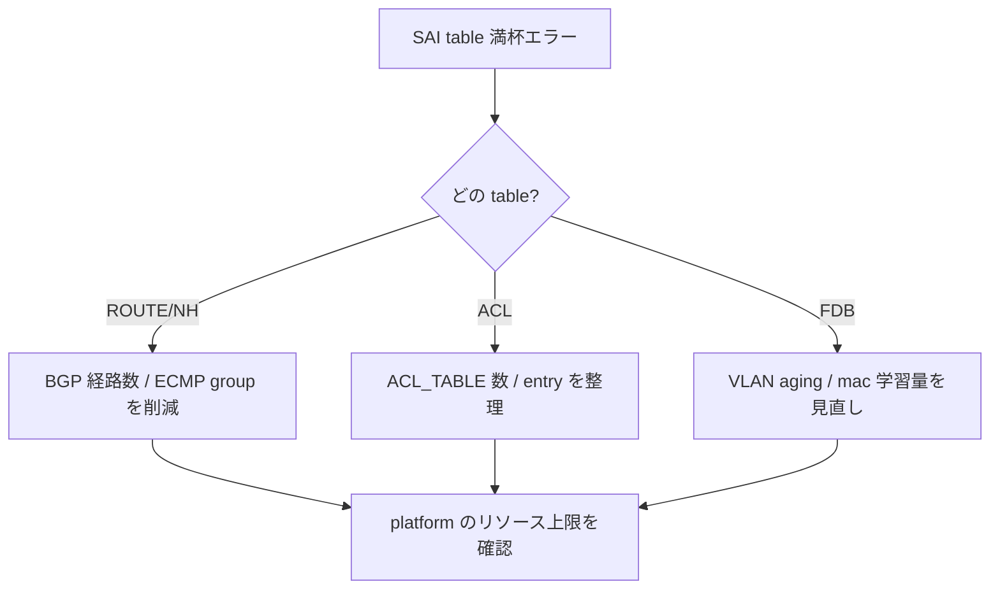

# Runbook: SAI table full (route / nexthop / FDB 上限到達)

!!! danger "実行前提"
    table full は data plane で「新規 route が programming されない」状態を生む。直接的に新規通信が黒落ちする可能性がある。CRM threshold 越えと同時に発生していることが多く [crm-threshold-exceeded.md](crm-threshold-exceeded.md) と併読のこと。`config reload` は問題を悪化させうる（再 program 中の race）ので、まずは投入 prefix を絞る方向で対処する。

## 症状

- syslog に `SAI_STATUS_TABLE_FULL` / `SAI_STATUS_INSUFFICIENT_RESOURCES`
- 新規 [BGP](../../reference/glossary.md#term-bgp) route が `Inactive` のまま
- `crm show resources` で `used / available` 比が 95%+

## 想定原因（優先度順）

1. **route prefix の過剰投入**: peer から default + specific の二重広告
2. **next-hop group の枯渇**: [ECMP](../../reference/glossary.md#term-ecmp) メンバー組み合わせが爆発
3. **[FDB](../../reference/glossary.md#term-fdb) age out 不足**: aging 0 で MAC が滞留
4. **[ACL](../../reference/glossary.md#term-acl) [TCAM](../../reference/glossary.md#term-tcam) 競合**: 同 stage の table が [ACL](../../reference/glossary.md#term-acl) リソースを奪い合う

## 切り分け手順




## 確認コマンド

### 1. CRM

```bash
crm show resources all
```

- 期待: 80% 以下
- 異常: ipv4_route / ipv4_nexthop / fdb_entry が 95%+

### 2. syncd ログ

```bash
docker logs syncd 2>&1 | grep -iE "TABLE_FULL|INSUFFICIENT" | tail
```

### 3. RIB のサイズ

```bash
show ip route summary
docker exec bgp vtysh -c "show ip bgp summary" | tail
```

### 4. FDB

```bash
show mac | wc -l
```

## 対処方法

- [BGP](../../reference/glossary.md#term-bgp) inbound filter で prefix を絞る: `neighbor <peer> prefix-list PL_IN in`
- [ECMP](../../reference/glossary.md#term-ecmp) next-hop group を縮小: [BGP](../../reference/glossary.md#term-bgp) の `maximum-paths` を下げる / `bgp bestpath as-path multipath-relax` を見直す等で next-hop group 数を抑制する[^3]
- [CRM](../../reference/glossary.md#term-crm) 観測周期を短縮して推移を追う: `crm config polling interval 60`（既定 300 秒、`CRM_POLLING_INTERVAL`）。これは観測周期の調整のみで、リソース自体は減らない[^1]
- [FDB](../../reference/glossary.md#term-fdb) aging を有効化: `sudo config mac aging-time 600`
- 不要 [ACL](../../reference/glossary.md#term-acl) table 削除

## 関連ページ

- [crm-threshold-exceeded.md](crm-threshold-exceeded.md)
- [sai-failure.md](sai-failure.md)
- [acl-rule-no-hit.md](acl-rule-no-hit.md)

## 引用元

本ページの根拠は引用元 [^1][^2] を参照。

[^1]: sonic-net/[sonic-swss](../../reference/glossary.md#term-sonic-swss) @ 4305596 — [orchagent](../../reference/glossary.md#term-orchagent)/crmorch.cpp
[^2]: sonic-net/[sonic-sairedis](../../reference/glossary.md#term-sonic-sairedis) @ 88bc51a — [syncd](../../reference/glossary.md#term-syncd)/Syncd.cpp
[^3]: sonic-net/[sonic-utilities](../../reference/glossary.md#term-sonic-utilities) — crm/main.py L351-352（`crm config polling interval` は [CRM](../../reference/glossary.md#term-crm) polling interval のみ調整、[ECMP](../../reference/glossary.md#term-ecmp) 数を変更する効果はない）

<!-- glossary-links-injected: d4c7d4df3b3a -->
