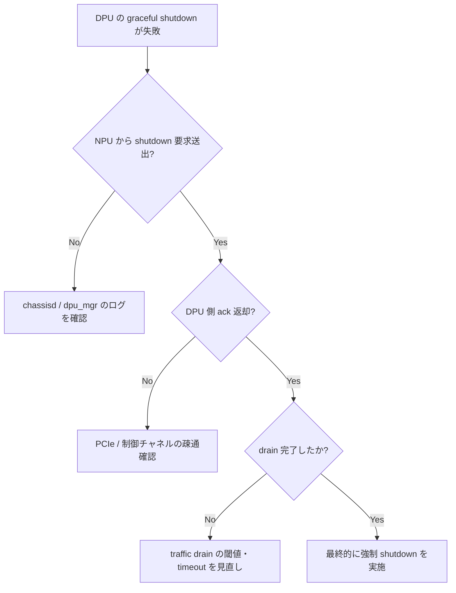

# Runbook: SmartSwitch DPU の graceful shutdown が完了しない

!!! danger "実行前提"
    DPU の shutdown は当該 DPU に hosting されている ENI / VNET datapath を即時停止する。SDN controller 側で session migration が完了していない状態での shutdown は VM 通信断につながる。**実行前に controller 側で ENI を別 DPU へ migration し、`show dash eni` で対象 DPU 上の ENI が 0 になったことを確認**してから shutdown する。ロールバックは `config chassis modules startup DPU<n>`、ただし保留中フローは復元できない。

## 症状

- `config chassis modules shutdown DPU0` がタイムアウト
- `show chassis modules status` で `oper_status` が `Online` のまま
- shutdown 後も [DPU](../../reference/glossary.md#term-dpu) プロセスが残り CPU を消費

## 想定原因（優先度順）

1. **active [ENI](../../reference/glossary.md#term-eni) / flow 残存**: drain 完了前に shutdown 要求
2. **chassisd ↔ [DPU](../../reference/glossary.md#term-dpu) 内部 RPC タイムアウト**
3. **[STATE_DB](../../reference/glossary.md#term-state_db) の状態遷移が遅延**: `CHASSIS_MODULE_TABLE` 更新詰まり
4. **PCIe / power 制御コマンドの失敗**: platform plugin の異常
5. **暴走プロセスが SIGTERM を無視**

## 切り分け手順




## 確認コマンド

### 1. 現状

```bash
show chassis modules status
show chassis modules midplane-status
sonic-db-cli STATE_DB hgetall "CHASSIS_MODULE_TABLE|DPU0"
sonic-db-cli STATE_DB hgetall "CHASSIS_MIDPLANE_TABLE|CHASSIS_MIDPLANE DPU0"
```

### 2. DPU 上の ENI 残

```bash
show dash eni | grep DPU0
sonic-db-cli APPL_DB keys "DASH_ENI_TABLE:*"
```

### 3. chassisd ログ

```bash
docker logs pmon 2>&1 | grep -iE "chassisd|dpu" | tail -200
sudo journalctl -u pmon | tail -200
```

### 4. DPU 内部状態

```bash
docker exec pmon platform_chassisd --get-dpu-status DPU0
```

### 5. PCIe

```bash
sudo lspci | grep -i dpu
sudo cat /sys/class/pci_bus/.../power/control
```

## 対処方法

- [ENI](../../reference/glossary.md#term-eni) 残: controller 側で migration を実行、完了後に再 shutdown
- chassisd 詰まり: `docker restart pmon` （**注意**: 他センサ / fan / xcvrd も再起動される）
- 強制 shutdown: `config chassis modules shutdown DPU0 -f` （対応 utilities 版でのみ。**ロールバック**: `config chassis modules startup DPU0`、ただしフロー復元不可）
- platform plugin 異常: ベンダ提供 plugin の log と GitHub Issue で確認

## 関連ページ

- [./smartswitch-dpu-unresponsive.md](./smartswitch-dpu-unresponsive.md)
- [./dash-eni-down.md](./dash-eni-down.md)

## 引用元

本ページの根拠は引用元 [^1][^2] を参照。

[^1]: sonic-net/sonic-platform-daemons @ master — chassisd
[^2]: sonic-net/[sonic-utilities](../../reference/glossary.md#term-sonic-utilities) @ master — chassis_modules.py

<!-- glossary-links-injected: 4353e5992ae2 -->
