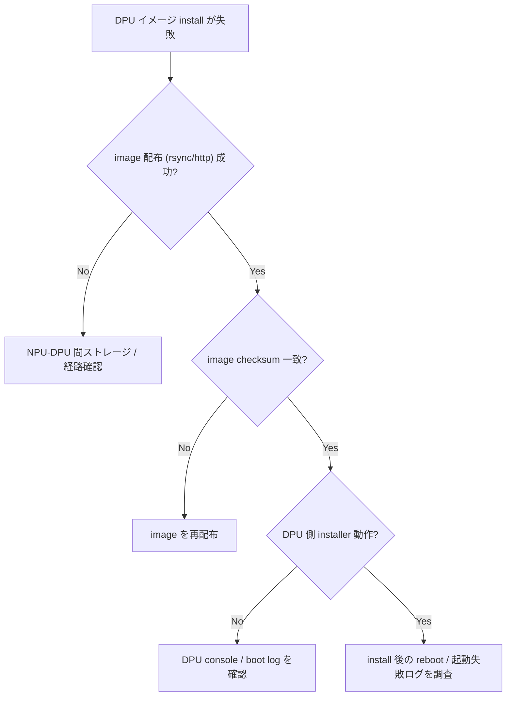

# Runbook: SmartSwitch DPU image インストールが失敗する

!!! danger "実行前提"
    DPU image install は対象 DPU を完全に reboot する。SmartSwitch では DPU が data plane の一部を担うため、host NPU 側で affected ENI を migrate / drain してから実施すること。事前に `show chassis modules > /tmp/chassis.before` および `sonic-db-cli CHASSIS_STATE_DB dump > /tmp/chassis.state` を取得。失敗時は previous slot から `sonic-installer set-default` で戻す。

## 症状

- `sonic-installer install --dpu <DPU0> <image.bin>` が exit code 非 0
- [DPU](../../reference/glossary.md#term-dpu) が `installing` 状態で固まる
- 再起動後 `show chassis modules` で [DPU](../../reference/glossary.md#term-dpu) が DOWN

## 想定原因（優先度順）

1. **image の [DPU](../../reference/glossary.md#term-dpu) platform 不一致**: [NPU](../../reference/glossary.md#term-npu) 用 image を DPU に流した
2. **空き flash 不足**: DPU の SSD 使用率 90%+
3. **PCIe / chassisd 通信失敗**: DPU 側 control plane に届かない
4. **DPU が graceful shutdown できていない**

## 切り分け手順




## 確認コマンド

### 1. DPU 状態

```bash
show chassis modules
sonic-db-cli CHASSIS_STATE_DB hgetall "CHASSIS_MODULE_TABLE|DPU0"
```

### 2. image 互換性

```bash
sudo file <image.bin>
sonic-installer list
```

### 3. chassisd ログ

```bash
docker logs pmon 2>&1 | grep -iE "chassisd|DPU0|install" | tail -50
```

### 4. DPU 側 disk

```bash
sudo dpuctl exec DPU0 df -h /
```

## 対処方法

- 正しい DPU 向け image を再取得
- DPU 上の不要 image 削除: `sudo dpuctl exec DPU0 sonic-installer cleanup -y`
- chassisd 再起動: `sudo systemctl restart chassisd`
- 強制 reboot DPU: `sudo config chassis modules startup DPU0`

## 関連ページ

- [smartswitch-dpu-unresponsive.md](smartswitch-dpu-unresponsive.md)
- [smartswitch-dpu-graceful-shutdown-failure.md](smartswitch-dpu-graceful-shutdown-failure.md)

## 引用元

本ページの根拠は引用元 [^1][^2] を参照。

[^1]: sonic-net/sonic-platform-daemons @ 4305596 — chassisd
[^2]: sonic-net/[sonic-utilities](../../reference/glossary.md#term-sonic-utilities) @ 39732bceb — sonic-installer

<!-- glossary-links-injected: f4b4be230bca -->
