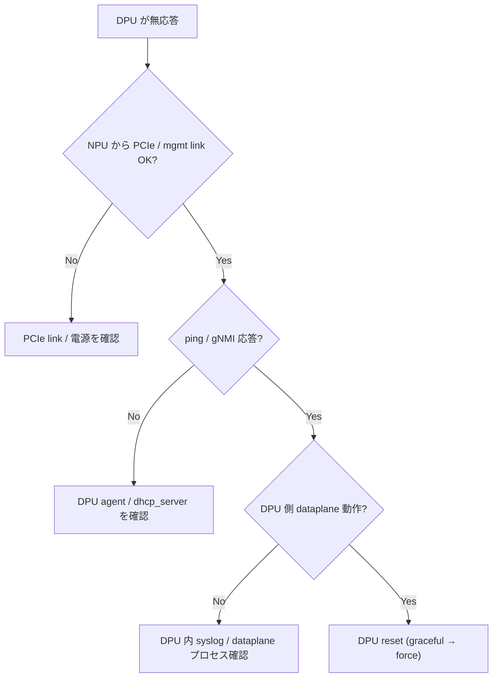

# Runbook: SmartSwitch DPU が応答しない

!!! danger "実行前提"
    `config chassis modules shutdown DPU<n>` / `startup` および `systemctl restart pmon` は当該 DPU 上の DASH ENI / packet pipeline を 30 秒～数分中断する（DPU host OS の再起動を含むベンダーもある）。実行前に対象 DPU の `show dash eni > /tmp/eni.bak.$(date +%s)` で ENI 一覧を退避、`sudo cp /etc/sonic/config_db.json /etc/sonic/config_db.json.bak.$(date +%s)` で host 設定 backup。Active flow がある DPU を停止する場合は ECMP redundancy か peer DPU に明示的に flow drain してから実施。DPU が完全に応答不能で graceful shutdown が効かない場合は最後の手段として `config chassis modules shutdown DPU<n> -f` で強制断する（運用中 flow は drop）。

## 症状

- `show chassis modules status` で [DPU](../../reference/glossary.md#term-dpu) の state が `Offline` / `Empty` のまま
- [DPU](../../reference/glossary.md#term-dpu) 上の [DASH](../../reference/glossary.md#term-dash) service にトラフィックが乗らない
- mid-plane bridge 経由の ping (host → [DPU](../../reference/glossary.md#term-dpu)) が落ちる

## 想定原因

1. **DPU electrical power が startup-pending**: `chassisd` から起動命令が出ていない / DPU が応答しない
2. **mid-plane bridge IP の設計不整合**: [NPU](../../reference/glossary.md#term-npu) 側と DPU 側で同一 subnet 期待だが片側のみ設定
3. **PCIe / management link の障害**: HW 側
4. **DPU OS イメージが boot 不能**: DPU 内 [SONiC](../../reference/glossary.md#term-sonic) が起動途中で stuck
5. **`CHASSIS_MODULE|DPU0` の admin_status が `down`**

## 切り分け手順




## 確認コマンド

### 1. モジュール状態

```bash
show chassis modules status
show platform inventory
sonic-db-cli STATE_DB hgetall "CHASSIS_MODULE_TABLE|DPU0"
sonic-db-cli CHASSIS_STATE_DB hgetall "DPU_STATE|DPU0"
```

- 期待: `oper-status: Online`, `admin-status: up`
- 異常: `Offline` → 電源 / chassisd / DPU OS のどこかで stuck

### 2. mid-plane bridge

```bash
sonic-db-cli CONFIG_DB hgetall "MID_PLANE_BRIDGE|GLOBAL"
ip -d link show bridge-midplane 2>/dev/null
ping <DPU midplane ip>
```

- 期待: bridge UP、DPU の midplane IP に reach
- 異常: ping 不可 → DPU 側 boot 完了していない

### 3. chassisd ログ

```bash
docker logs pmon 2>&1 | grep -iE "chassisd|dpu" | tail -200
sudo systemctl status chassis-db@0 chassis-db@1 2>/dev/null
```

### 4. DPU 側 console / shell （アクセス可能なら）

```bash
# host 経由 console / mgmt access
ssh admin@<dpu-ip>     # 起動済みなら
```

- 期待: [SONiC](../../reference/glossary.md#term-sonic) プロンプト
- 異常: timeout → DPU 内で boot 失敗 (`/var/log/syslog` を取り寄せ)

### 5. PCIe / HW

```bash
sudo lspci | grep -i -E "dpu|smartnic|nvidia|pensando"
dmesg | grep -iE "pcie|dpu" | tail
```

## 対処方法

- ソフト reset: `sudo config chassis modules shutdown DPU0` → `startup DPU0`
- chassisd 再起動: `sudo systemctl restart pmon`
- mid-plane bridge を再構成 ([CONFIG_DB](../../reference/glossary.md#term-config_db) の `MID_PLANE_BRIDGE` を minigraph 由来で再生成)
- DPU OS image を再 install（ベンダー手順に従う。[SONiC](../../reference/glossary.md#term-sonic) [SmartSwitch](../../reference/glossary.md#term-smartswitch) では `dpu-installer` 系コマンド）
- HW 障害が疑われる場合は techsupport で chassis 全体を取得し保守依頼

## 関連ページ

- [../../topics/13-dash-smartswitch/operations.md](../../topics/13-dash-smartswitch/operations.md)
- [../../topics/13-dash-smartswitch/concept.md](../../topics/13-dash-smartswitch/concept.md)
- [../../architecture/smart-switch-database-design.md](../../architecture/smart-switch-database-design.md)

## 引用元

本ページの根拠は引用元 [^1][^2] を参照。

[^1]: sonic-net/sonic-platform-daemons @ 4305596 — chassisd
[^2]: sonic-net/sonic-host-services @ c5bbbe8 — DPU state スクリプト

<!-- glossary-links-injected: 97063dcb81c4 -->
