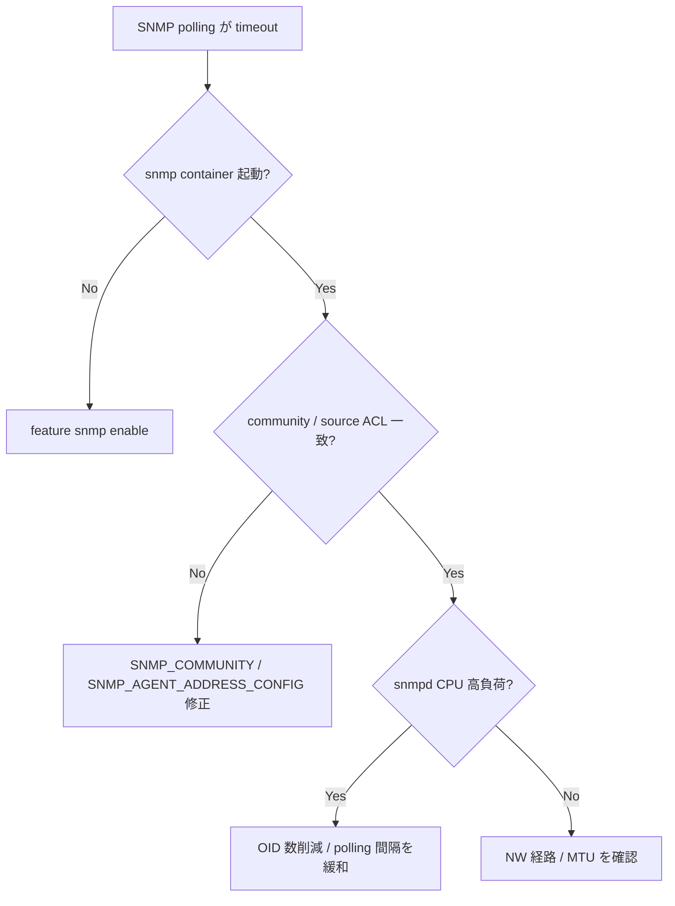

# Runbook: SNMP polling が timeout する

!!! danger "実行前提"
    `systemctl restart snmp` は ax_impl と net-snmp の両方を一度落とすため、監視サーバ側でアラートが出る。事前に監視窓を確保し、`sudo cp /etc/sonic/config_db.json /etc/sonic/config_db.json.bak.$(date +%s)` を取得。問題悪化時は backup 戻し + `systemctl restart snmp`。

## 症状

- NMS (Zabbix / SNMPc 等) からの polling が timeout
- `snmpwalk -v2c -c <com> <ip>` が hang
- 特定 OID のみ重い（IF-MIB::ifTable で時間がかかる）

## 想定原因（優先度順）

1. **`sonic_ax_impl` の hang**: [COUNTERS_DB](../../reference/glossary.md#term-counters_db) poll で blocking。`sonic_ax_impl` は AgentX subagent として動作し、SIGINT/SIGTERM で shutdown するが、background task が zombie 化する既知の FIXME がある [^1]
2. **[ACL](../../reference/glossary.md#term-acl) / management interface で [SNMP](../../reference/glossary.md#term-snmp) port (161/udp) が遮断**
3. **community / SNMPv3 認証ミス**: net-snmp 側で reject。`snmpd.conf.j2` は `SNMP_COMMUNITY` テーブルの `TYPE=RO/RW` を `rocommunity` / `rwcommunity` directive に展開する [^2]
4. **大規模 port 数 (256+) でテーブル取得が遅い**
5. **snmp container の CPU 飽和**

## 切り分け手順



## 確認コマンド

### 1. host 側 reachability

```bash
sudo ss -ulnp | grep :161
sudo tcpdump -i eth0 -nn udp port 161 -c 10
```

`SNMP_AGENT_ADDRESS_CONFIG` が設定されている場合、`snmpd.conf.j2` は各 (agentip, port, vrf) を個別の `agentAddress` directive として書き出す。未設定時のみ `udp:161` / `udp6:161` の wildcard listen にフォールバックする [^2]。

### 2. 簡易 walk

```bash
snmpwalk -v2c -c public <mgmt_ip> system
snmpwalk -v2c -c public <mgmt_ip> IF-MIB::ifDescr
time snmpbulkwalk -v2c -c public <mgmt_ip> IF-MIB::ifTable
```

### 3. container 状態

```bash
docker stats snmp --no-stream
docker logs snmp 2>&1 | tail -100
```

### 4. ax_impl の MIB extension

```bash
docker exec snmp ps aux | grep -E "snmpd|sonic_ax"
```

`sonic_ax_impl` の `SonicMIB` クラスは IF-MIB (rfc2863) / Entity-MIB (rfc2737) / IP-MIB (rfc1213) / [LLDP](../../reference/glossary.md#term-lldp)-MIB (ieee802_1ab) / Cisco BGP4 / [PFC](../../reference/glossary.md#term-pfc) ext 等を multiple inheritance で束ねており、background task は既定で 5 秒間隔 (`DEFAULT_UPDATE_FREQUENCY = 5`) で [COUNTERS_DB](../../reference/glossary.md#term-counters_db) を polling する [^1]。

### 5. ACL

```bash
sudo iptables -L INPUT -n -v | grep 161
show acl rule
```

<!-- evidence: sonic_ax_impl/main.py L18 DEFAULT_UPDATE_FREQUENCY=5 / L24-44 SonicMIB の MIB 合成 / L57-87 main() の event loop と shutdown 処理 -->
<!-- evidence: docker-snmp/snmpd.conf.j2 L27-34 agentAddress / L48-64 rocommunity・rwcommunity 展開 -->

## 対処方法

- container 再起動: `sudo systemctl restart snmp`
- community 設定確認: `sonic-db-cli CONFIG_DB hgetall "SNMP_COMMUNITY|public"`
- 大規模環境: `snmpbulkwalk` への切り替えを NMS 側に依頼
- SNMPv3 はまず [snmpv3-auth-failure.md](snmpv3-auth-failure.md) を確認

## 関連ページ

- [snmpv3-auth-failure.md](snmpv3-auth-failure.md)
- [telemetry-dialout-not-sending.md](telemetry-dialout-not-sending.md)

## 引用元

本ページの根拠は引用元 [^1][^2] を参照。

[^1]: sonic-net/sonic-snmpagent `src/sonic_ax_impl/main.py` @ 329f1cc L1-L87 — AgentX subagent エントリポイント、`SonicMIB` 構成、`DEFAULT_UPDATE_FREQUENCY=5` 秒
[^2]: sonic-net/[sonic-buildimage](../../reference/glossary.md#term-sonic-buildimage) `dockers/docker-snmp/snmpd.conf.j2` @ 9ea932e L16-L77 — `SNMP_AGENT_ADDRESS_CONFIG` と `SNMP_COMMUNITY` の Jinja 展開

<!-- glossary-links-injected: 36cc31c08fc1 -->
