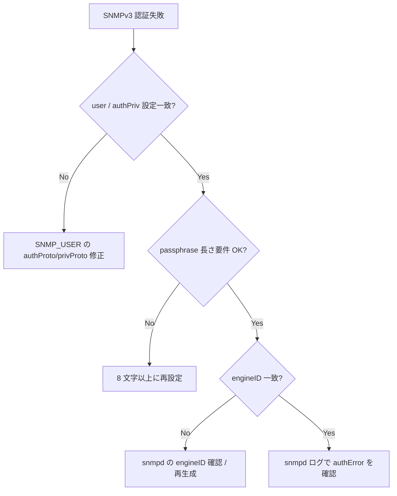

# Runbook: SNMPv3 user 認証 / 暗号化が失敗する

!!! danger "実行前提"
    SNMP user の削除 / 再作成 / password 変更は監視サーバ側の polling を一時的に失敗させる。事前に監視側で対象 user の alert を抑止し、変更前の `SNMP_USER` キー値を退避すること。**ロールバック**は退避値を `sonic-db-cli hset` で書き戻し、`docker restart snmp` で snmpd を再ロード。

## 症状

- snmpwalk が `Authentication failure (incorrect password, community or key)`
- `Timeout: No Response from <switch>`（v3 でも community-like 失敗）
- 一部 OID のみ `noSuchObject`

## 想定原因（優先度順）

1. **auth/priv password 不一致**: SHA / MD5 / AES / DES の組合せが client 側と異なる
2. **engineID の不整合**: ホスト名変更 / image 入替で engineID が変わり、key が再導出されず polling 側 cache とずれる
3. **security level (`authNoPriv` / `authPriv`) の食い違い**
4. **AgentX 経由の sub-agent (sonic-snmpagent) 未起動**: 一部 OID のみ返らない
5. **[ACL](../../reference/glossary.md#term-acl) / firewall で UDP 161 がブロック**

## 切り分け手順




## 確認コマンド

### 1. user 設定

```bash
sonic-db-cli CONFIG_DB keys "SNMP_USER|*"
sonic-db-cli CONFIG_DB hgetall "SNMP_USER|<user>"
show snmp user
```

### 2. snmpd / sub-agent

```bash
docker exec snmp ps auxf | grep -E "snmpd|sonic_ax"
docker logs snmp 2>&1 | tail -200
```

- 期待: `snmpd` と `sonic_ax_impl` 両方が running

### 3. engineID

```bash
docker exec snmp grep -i engineID /etc/snmp/snmpd.conf
snmpget -v3 -u <user> -l authPriv -a SHA -A '<auth>' -x AES -X '<priv>' <switch> 1.3.6.1.2.1.1.1.0
```

### 4. wire レベル

```bash
sudo tcpdump -i any -nn udp port 161 -vv
```

### 5. ACL / firewall

```bash
sudo iptables -L -nv | grep 161
sonic-db-cli CONFIG_DB keys "ACL_TABLE|*"
```

## 対処方法

- パスワード再投入: `sudo config snmp user del <user>` → `sudo config snmp user add <user> ...`（**ロールバック**: 退避値で再作成）
- engineID 固定: `/etc/snmp/snmpd.conf` の `engineID` を固定値に（再起動後も維持される）
- sub-agent: `docker exec snmp supervisorctl restart snmp-subagent`
- [ACL](../../reference/glossary.md#term-acl): `ACL_RULE` で UDP/161 を許可

## 関連ページ

- [SNMP / Telemetry コンセプト](../../topics/09-telemetry-snmp/concept.md)
- [SNMP / Telemetry 運用ガイド](../../topics/09-telemetry-snmp/operations.md)

## 引用元

本ページの根拠は引用元 [^1][^2] を参照。

[^1]: sonic-net/sonic-snmpagent @ master — main.py
[^2]: sonic-net/[sonic-buildimage](../../reference/glossary.md#term-sonic-buildimage) @ master — docker-snmp

<!-- glossary-links-injected: 1f2da1437d5b -->
