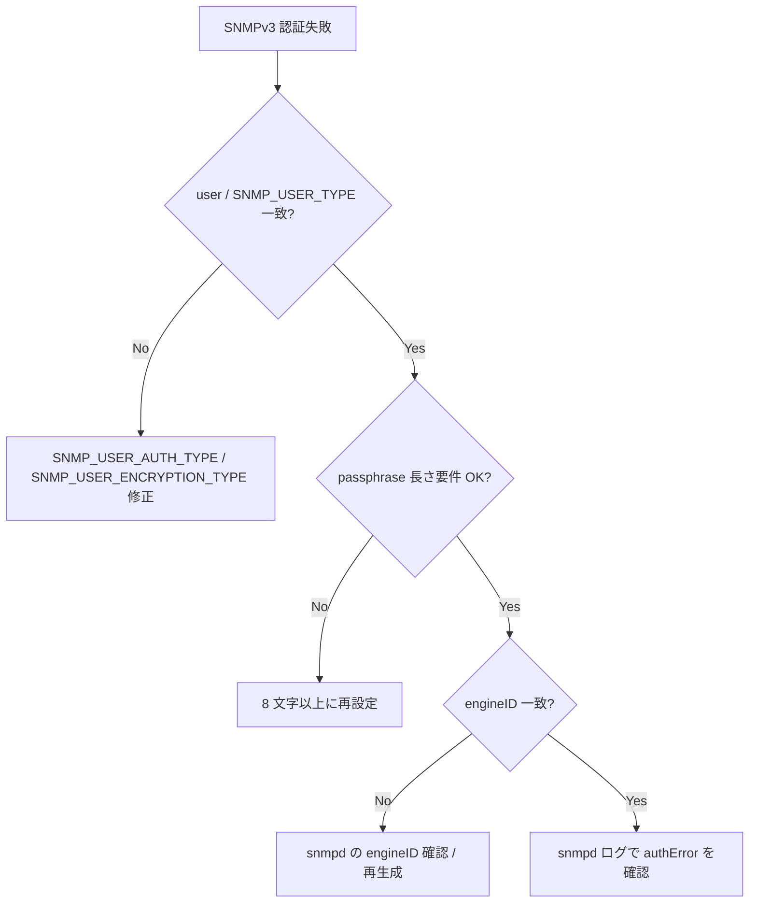

# Runbook: SNMPv3 user 認証 / 暗号化が失敗する

!!! danger "実行前提"
    SNMP user の削除 / 再作成 / password 変更は監視サーバ側の polling を一時的に失敗させる。事前に監視側で対象 user の alert を抑止し、変更前の `SNMP_USER|<user>` ハッシュ全フィールドを `sonic-db-cli CONFIG_DB hgetall` で退避すること。**ロールバック**は退避値を `sonic-db-cli CONFIG_DB hset SNMP_USER|<user> <field> <value>` で書き戻し、`sudo systemctl restart snmp.service` で snmpd を再ロードする（`config snmp user add` 経由でも snmp.service が restart される [^2]）。

## 症状

- snmpwalk が `Authentication failure (incorrect password, community or key)`
- `Timeout: No Response from <switch>`（v3 でも community-like 失敗）
- 一部 OID のみ `noSuchObject`

## 想定原因（優先度順）

1. **auth/priv password 不一致**: SHA / MD5 / AES / DES の組合せが client 側と異なる
2. **engineID の不整合**: ホスト名変更 / image 入替で net-snmp が生成する engineID が変わり、localized key が再導出されず polling 側 cache とずれる（[SONiC](../../reference/glossary.md#term-sonic) の `snmpd.conf.j2` は engineID を明示設定しないため net-snmp 既定の自動生成に従う [^1]）
3. **security level (`SNMP_USER_TYPE` の `AuthNoPriv` / `Priv`) と client 側の食い違い**
4. **AgentX 経由の sub-agent (sonic-snmpagent / `sonic_ax_impl`) 未起動**: 一部 OID のみ返らない [^3]
5. **[ACL](../../reference/glossary.md#term-acl) / firewall で UDP 161 がブロック**

## 切り分け手順



## CONFIG_DB スキーマ（SNMP_USER エントリ）

`config snmp user add` は [CONFIG_DB](../../reference/glossary.md#term-config_db) の `SNMP_USER|<name>` ハッシュに以下 6 フィールドを書く [^2]。`snmpd.conf.j2` はこの 6 フィールドを直接 `rouser` / `rwuser` / `CreateUser` 行に展開する [^1]。

| フィールド | 取り得る値 | 用途 |
|------------|------------|------|
| `SNMP_USER_TYPE` | `noAuthNoPriv` / `AuthNoPriv` / `Priv` | `rouser` / `rwuser` の security level 引数 |
| `SNMP_USER_PERMISSION` | `RO` / `RW` | `rouser` か `rwuser` かの分岐 |
| `SNMP_USER_AUTH_TYPE` | `MD5` / `SHA` / `HMAC-SHA-2` 等 | `CreateUser` の auth proto |
| `SNMP_USER_AUTH_PASSWORD` | 文字列（8 文字以上） | `CreateUser` の auth passphrase |
| `SNMP_USER_ENCRYPTION_TYPE` | `DES` / `AES` 等 | `CreateUser` の priv proto |
| `SNMP_USER_ENCRYPTION_PASSWORD` | 文字列（8 文字以上） | `CreateUser` の priv passphrase |

## 確認コマンド

### 1. user 設定

```bash
sonic-db-cli CONFIG_DB keys "SNMP_USER|*"
sonic-db-cli CONFIG_DB hgetall "SNMP_USER|<user>"
show snmp user
```

`hgetall` で上表 6 フィールドが揃っているか確認する。`SNMP_USER_TYPE` が `AuthNoPriv` の場合は `*_AUTH_TYPE` / `*_AUTH_PASSWORD` のみが、`Priv` の場合は 4 つの auth/encryption フィールド全てが必要 [^2]。

### 2. snmpd / sub-agent

```bash
docker exec snmp ps auxf | grep -E "snmpd|sonic_ax"
docker logs snmp 2>&1 | tail -200
```

- 期待: `snmpd` と `sonic_ax_impl`（AgentX sub-agent）の両方が running [^3]

### 3. engineID

```bash
docker exec snmp grep -i engineID /etc/snmp/snmpd.conf
snmpget -v3 -u <user> -l authPriv -a SHA -A '<auth>' -x AES -X '<priv>' <switch> 1.3.6.1.2.1.1.1.0
```

`snmpd.conf.j2` は engineID 行を出力しないため、`/etc/snmp/snmpd.conf` に engineID が明示されない場合は net-snmp が `/var/lib/snmp/snmpd.conf` 配下に自動生成した値を使う [^1]。

### 4. wire レベル

```bash
sudo tcpdump -i any -nn udp port 161 -vv
```

### 5. ACL / firewall

```bash
sudo iptables -L -nv | grep 161
sonic-db-cli CONFIG_DB keys "ACL_TABLE|*"
```

## 対処方法

- パスワード再投入: `sudo config snmp user del <user>` → `sudo config snmp user add <user> <noAuthNoPriv|AuthNoPriv|Priv> <RO|RW> ...` [^2]（**ロールバック**: 退避した 6 フィールドを `sonic-db-cli CONFIG_DB hset` で書き戻し、`sudo systemctl restart snmp.service`）
- engineID 固定: `/etc/snmp/snmpd.conf` 末尾に `engineID <hex>` 行を追加し、`docker restart snmp`（テンプレ側で出さないため永続化には `snmpd.conf.j2` 改変か他手段が必要）
- sub-agent: `docker exec snmp supervisorctl restart snmp-subagent`
- [ACL](../../reference/glossary.md#term-acl): `ACL_RULE` で UDP/161 を許可

## 関連ページ

- [SNMP / Telemetry コンセプト](../../topics/09-telemetry-snmp/concept.md)
- [SNMP / Telemetry 運用ガイド](../../topics/09-telemetry-snmp/operations.md)

## 引用元

[^1]: sonic-net/[sonic-buildimage](../../reference/glossary.md#term-sonic-buildimage) @ master — `dockers/docker-snmp/snmpd.conf.j2` L66-L77（`SNMP_USER` ループで `SNMP_USER_PERMISSION` / `SNMP_USER_TYPE` / `SNMP_USER_AUTH_TYPE` / `SNMP_USER_AUTH_PASSWORD` / `SNMP_USER_ENCRYPTION_TYPE` / `SNMP_USER_ENCRYPTION_PASSWORD` を `rouser` / `rwuser` / `CreateUser` 行に展開）
[^2]: sonic-net/[sonic-utilities](../../reference/glossary.md#term-sonic-utilities) @ master — `config/main.py` L4710-L4792（`config snmp user add` が [CONFIG_DB](../../reference/glossary.md#term-config_db) の `SNMP_USER|<name>` に上記 6 フィールドを `set_entry` し、`systemctl restart snmp.service` を発行）
[^3]: sonic-net/sonic-snmpagent @ master — `src/sonic_ax_impl/main.py`（`sonic_ax_impl` が net-snmp の AgentX sub-agent として OID を提供。未起動だと一部 OID が `noSuchObject`）

<!-- glossary-links-injected: ff41d85b3b10 -->
