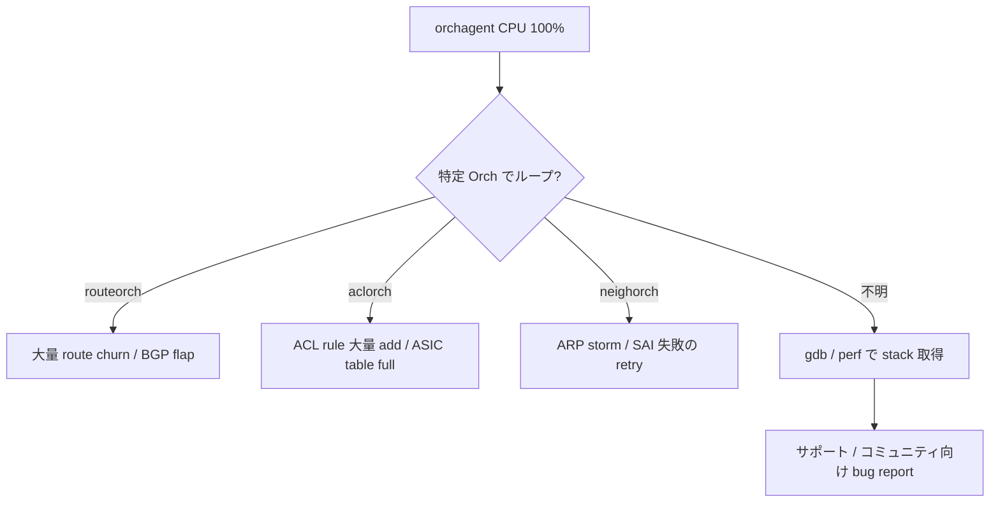

# Runbook: orchagent が CPU 100% で詰まる

!!! warning "HLD-only"
    orchagent の event loop と Orch::doTask のリトライメカニズムからの一般運用ノート。

!!! danger "実行前提"
    `docker restart swss` は ASIC 構成を再 sync するため数十秒〜数分の中断が発生し、warm-restart 未設定時は転送断となる。本番では計画 maintenance window で行う。

## 症状

- `top` で `orchagent` プロセスが 1 コアを使い切ったまま
- `config` / `show` の応答が極端に遅く、新規設定が反映されない
- `/var/log/swss/sairedis.rec` の更新が止まる、または逆に膨張
- syslog に `doTask` ループの繰り返し WARN が大量出力

## 切り分けフロー



## 確認コマンド

```bash
# CPU 使用率
docker exec swss top -b -n 1 | head -20
ps -eLo pid,tid,pcpu,comm | grep orchagent | sort -k3 -n -r | head

# 直近のループメッセージ
sudo grep -E "doTask|retry" /var/log/swss/swss.rec 2>/dev/null | tail -40
sudo grep -i orchagent /var/log/syslog | tail -100

# SAI 操作の頻度
sudo tail -n 200 /var/log/swss/sairedis.rec
sudo wc -l /var/log/swss/sairedis.rec.*

# どの Orch が busy か (perf)
sudo perf top -p $(pgrep -f orchagent) -d 5  # Ctrl-C で抜ける

# Redis 側 queue 滞留
sonic-db-cli APPL_DB info | grep -E "db|keys"
sonic-db-cli COUNTERS_DB dbsize
```

## よくある原因

1. **BGP flap による大量 route churn** — routeorch が `SAI_STATUS_ITEM_NOT_FOUND` retry でループ
2. **ACL rule 大量挿入で ASIC table full** — aclorch が同一エラーを retry し続ける（`sai-table-full.md` 参照）
3. **CRM / sai resource 枯渇** — `crm-threshold-exceeded.md` 参照
4. **依存関係解決の循環** — port / vlan / neigh の add 順序が逆で `SAI_STATUS_OBJECT_IN_USE`
5. **syncd レスポンス遅延** — orchagent は応答待ちで spin（厳密にはブロックだが top では busy に見える）
6. **flex-counter の polling 頻度過剰** — `flex-counter-stuck.md` 参照

## 対処

- 一時的に **`config bgp shutdown all`** で route churn を止め、orchagent が収束するか確認
- ACL / route の bulk delete を試す前に `config save -y` で backup
- 最終手段として `docker restart swss`（中断発生）→ warm-restart 設定がある場合のみ無瞬断に近い

## 関連 reference / topics

- [sai-table-full.md](sai-table-full.md)
- [crm-threshold-exceeded.md](crm-threshold-exceeded.md)
- [flex-counter-stuck.md](flex-counter-stuck.md)
- [appdb-asicdb-sync-lag.md](appdb-asicdb-sync-lag.md)
