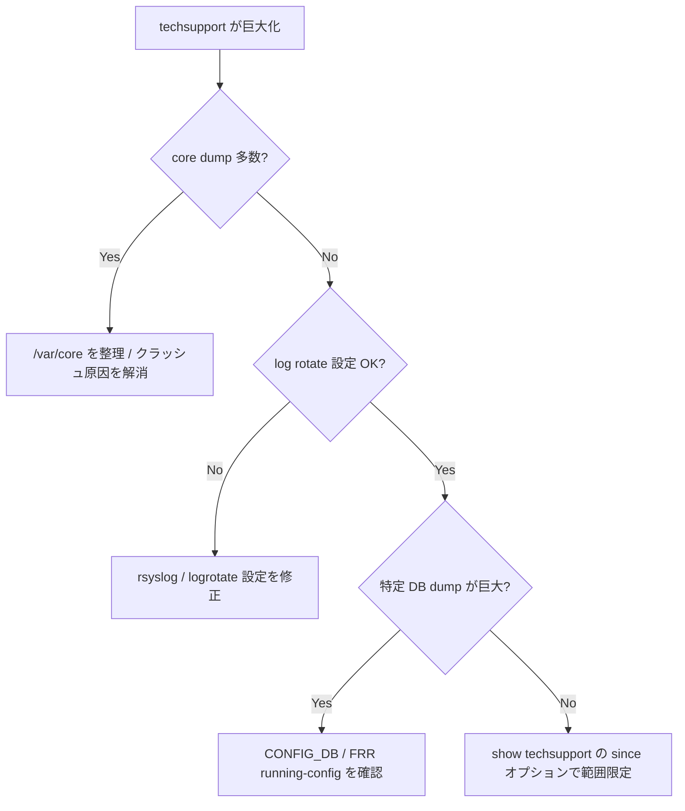

# Runbook: show techsupport (generate_dump) のアーカイブが GB 級に肥大化

!!! danger "実行前提"
    `/var/dump/` の手動削除 / `logrotate` 強制実行 / `journalctl --vacuum-size` は**過去のログを永久喪失**させる。障害解析中の dump を消すと再現できない。**実行前に必要な dump を別ホストに退避**（`scp`）し、保持期間ポリシーを NOC と合意すること。ロールバック不可（削除後は復元不能）。

## 症状

- `/var/dump/sonic_dump_*.tar.gz` が 数百 MB 〜 GB 単位
- 生成に 10 分以上かかる / 完了せずタイムアウト（[techsupport-timeout.md](techsupport-timeout.md) も参照）
- `/var/log` 配下が溢れて他 process が disk full エラー

## 想定原因（優先度順）

1. **`/var/log/syslog*` の長期保持**: rotate されず数 GB 蓄積
2. **core dump の同梱**: `/var/core/` に過去の crash dump が大量
3. **特定 daemon が DEBUG ログを吐き続けている**
4. **[BGP](../../reference/glossary.md#term-bgp) / [FRR](../../reference/glossary.md#term-frr) の log volume 過大**（debug bgp updates 等が有効のまま）
5. **counters CSV / dump の冗長収集**: cumulative ログ

## 切り分け手順




## 確認コマンド

### 1. dump 構成

```bash
ls -lhS /var/dump/ | head
sudo tar -tzf /var/dump/sonic_dump_<latest>.tar.gz | xargs -I{} echo {} | head -50
sudo tar -tzvf /var/dump/sonic_dump_<latest>.tar.gz | sort -k3 -n -r | head -30
```

### 2. /var/log 占有

```bash
sudo du -sh /var/log/* | sort -rh | head
sudo ls -lh /var/log/syslog*
sudo journalctl --disk-usage
```

### 3. core dump

```bash
sudo ls -lh /var/core/ 2>/dev/null
sudo du -sh /var/core/ 2>/dev/null
```

### 4. ログレベル

```bash
sonic-db-cli CONFIG_DB keys "LOGGER|*"
sonic-db-cli CONFIG_DB hgetall "LOGGER|<component>"
docker exec bgp vtysh -c "show debugging"
```

### 5. logrotate 状態

```bash
sudo cat /etc/logrotate.d/rsyslog
sudo cat /etc/cron.daily/logrotate
sudo logrotate -d /etc/logrotate.conf 2>&1 | head -50
```

## 対処方法

- ログレベル正常化: `sonic-db-cli CONFIG_DB hset "LOGGER|<comp>" LOGLEVEL NOTICE`（**ロールバック**: 元の LOGLEVEL を控えて hset で戻す）
- [FRR](../../reference/glossary.md#term-frr) debug 解除: `vtysh -c "no debug bgp updates"`
- 古い dump 削除: `sudo find /var/dump/ -name "sonic_dump_*.tar.gz" -mtime +14 -print` で確認後、**退避済みであることを確認してから** `-delete`
- core dump: `sudo find /var/core/ -mtime +14 -print` で確認、退避後に削除
- logrotate 強化: `/etc/logrotate.d/rsyslog` で `rotate` / `size` / `compress` を調整

## 関連ページ

- [./techsupport-timeout.md](./techsupport-timeout.md)
- [./container-not-starting.md](./container-not-starting.md)

## 引用元

本ページの根拠は引用元 [^1][^2] を参照。

[^1]: sonic-net/[sonic-utilities](../../reference/glossary.md#term-sonic-utilities) @ master — generate_dump
[^2]: sonic-net/[sonic-utilities](../../reference/glossary.md#term-sonic-utilities) @ master — show/main.py

<!-- glossary-links-injected: 3887c0ea65db -->
