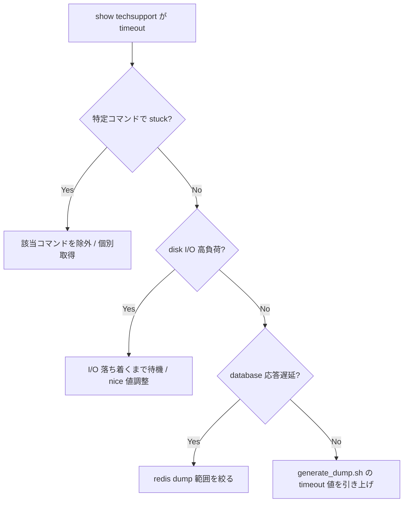

# Runbook: show techsupport が timeout する

!!! danger "実行前提"
    `show techsupport` は CPU と I/O を大量消費し、コアな control plane プロセス（orchagent / bgpd / syncd）を一時的に block する可能性がある。実行前に `df -h /var/dump` で空き容量を確認（最低 2 GB 推奨）、`/var/core` の旧 core file は別途退避。`AUTO_TECHSUPPORT` の `rate_limit_interval` を一時的に伸ばす場合は元値を `redis-cli -n 4 HGETALL "AUTO_TECHSUPPORT|GLOBAL" > /tmp/at.bak` で保存し、終了後に戻す。途中中断したい場合は `Ctrl+C` ではなく別 session から `sudo pkill -f generate_dump` で停止（partial dump は `/var/dump/` に残る）。

## 症状

- `show techsupport` 実行が長時間（> 30 分）終わらない
- `--global-timeout` で abort し、不完全な dump しか取れない
- 個別コマンドの `-c, --cmd-timeout` を超え、`timeout: sending signal TERM` が頻発

## 想定原因

1. **`debug dump` モジュール（`--debug-dump`）が [ASIC](../../reference/glossary.md#term-asic) の重い snapshot を取る**: 大規模 [ASIC](../../reference/glossary.md#term-asic) で 1 module だけで分単位
2. **`/var/log` 配下の log file が巨大**: `tar` の `gzip` フェーズで CPU 飽和
3. **`vtysh -c "show ..."` 系が hang**: bgpd / [zebra](../../reference/glossary.md#term-zebra) busy → コマンド単位で stuck
4. **`syncd` が [SAI](../../reference/glossary.md#term-sai) dump 中に busy**: [ASIC](../../reference/glossary.md#term-asic) API 呼び出しが直列化されレスポンス遅延
5. **core file / dump 過多**: 過去 dump が片付かず `/var/dump` が容量圧迫

## 切り分け手順




## 確認コマンド

### 1. 直近の dump サイズ / 残骸

```bash
ls -lh /var/dump/
df -h /var
```

- 期待: 過去 dump がローテーションされている
- 異常: 数十 GB 滞留 → `techsupport_cleanup.py` 動作不全

### 2. 個別コマンド timeout の頻度

```bash
sudo show techsupport --cmd-timeout 2 --global-timeout 30 2>&1 | grep -iE "timeout|signal" | head
```

- 期待: timeout が稀
- 異常: 数十件単位 → 特定コマンドが慢性的に hang

### 3. 重い debug dump をスキップ

```bash
sudo show techsupport --silent              # debug-dump 無し
sudo show techsupport --debug-dump          # 明示的に有効
```

- 比較で hang 主因が `debug dump` か log 圧縮か切り分ける

### 4. 並列実行の有無

```bash
ps -ef | grep -E "generate_dump|show techsupport"
```

- 期待: 同時実行は 1 本
- 異常: 複数 → 自動 techsupport（auto-techsupport）と手動が衝突。`AUTO_TECHSUPPORT` を一時停止

### 5. auto-techsupport の頻度

```bash
sonic-db-cli CONFIG_DB hgetall "AUTO_TECHSUPPORT|GLOBAL"
sonic-db-cli CONFIG_DB keys "AUTO_TECHSUPPORT_FEATURE|*"
```

- 期待: rate-limit, retention 適正
- 異常: 短い間隔 → ストレージ枯渇の連鎖を起こす

## 対処方法

- timeout を引き上げて取り直す: `show techsupport --global-timeout 60 --cmd-timeout 10`
- `/var/dump` 整理: `sudo techsupport_cleanup.py` or 手動で古い tarball を削除
- auto-techsupport の閾値調整: `config auto-techsupport global state enabled max-techsupport-limit 10`
- `--silent` で軽量 dump → 状況把握 → その後の絞り込み解析

## 関連ページ

- [../cli/show-techsupport.md](../cli/show-techsupport.md)
- [../config-db/auto-techsupport.md](../config-db/auto-techsupport.md)
- [../../internals/dump-utility-for-easy-debugging.md](../../internals/dump-utility-for-easy-debugging.md)

## 引用元

本ページの根拠は引用元 [^1][^2] を参照。

[^1]: sonic-net/[sonic-utilities](../../reference/glossary.md#term-sonic-utilities) @ 39732bceb — `scripts/generate_dump`
[^2]: sonic-net/[sonic-utilities](../../reference/glossary.md#term-sonic-utilities) @ 39732bceb — `show/main.py`

<!-- glossary-links-injected: 8df9850464d2 -->
