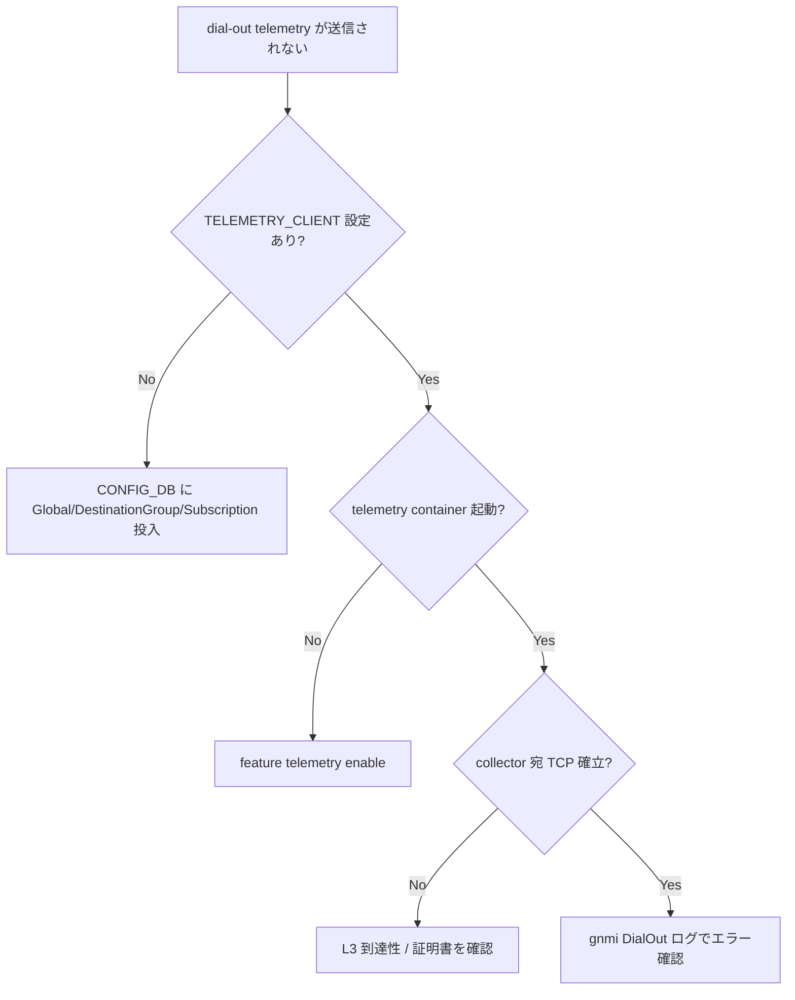

# Runbook: Telemetry dial-out が collector に届かない

!!! danger "実行前提"
    本ページで案内する `config reload` / `systemctl restart telemetry` / 証明書差し替えは telemetry セッションを切断する。実行前に collector 側で受信途絶アラートを抑制し、変更前の `config_db.json` と `/etc/sonic/telemetry/` を退避すること。ロールバックは退避ファイルへ書き戻して `systemctl restart telemetry`。

## 症状

- collector 側に streaming sample が到達しない（gRPC 接続自体が張られない）
- `docker logs telemetry` に `dial tcp ... i/o timeout` / `transport: authentication handshake failed` が連続
- `show feature status telemetry` は `enabled` だが、`netstat` で TCP 確立が見えない

## 想定原因（優先度順）

1. **`TELEMETRY_CLIENT` テーブル未設定 / 不整合**: `Global` / `DestinationGroup_<name>` / `Subscription_<name>` の 3 系統キーの欠落、`dst_addr` / `report_type` / `encoding` 不一致[^1]
2. **TLS 証明書 / CA 不整合**: collector 側 root CA とスイッチ側証明書チェーンの不一致、SAN 不足
3. **L3 到達不能 / firewall**: collector への TCP/8080 (or 設定 port) 不通
4. **`unix_socket_address` を使う構成で counters / [STATE_DB](../../reference/glossary.md#term-state_db) 取得失敗**: subscribe path が無効で publish 抑止
5. **dial-out client goroutine が panic で終了**: log に stack trace が出ているがプロセスは生存（telemetry container 自体は up）

## 切り分け手順



## 確認コマンド

### 1. CONFIG_DB の設定確認

`TELEMETRY_CLIENT` テーブルは Global / DestinationGroup / Subscription の 3 キーで構成される[^1]。

```bash
sonic-db-cli CONFIG_DB keys "TELEMETRY_CLIENT|*"
sonic-db-cli CONFIG_DB hgetall "TELEMETRY_CLIENT|Global"
sonic-db-cli CONFIG_DB hgetall "TELEMETRY_CLIENT|DestinationGroup_HS"
sonic-db-cli CONFIG_DB hgetall "TELEMETRY_CLIENT|Subscription_HS_RDMA"
sonic-db-cli CONFIG_DB hgetall "TELEMETRY|gnmi"
```

- 期待: `Global` には `src_ip` / `retry_interval` / `encoding` / `unidirectional`、`DestinationGroup_<name>` には `dst_addr = IP:PORT[,IP:PORT...]`、`Subscription_<name>` には `path_target` / `paths` / `dst_group` / `report_type` / `report_interval` がそれぞれ存在し、`dst_group` が `DestinationGroup_*` の `<name>` と一致

<!-- evidence:
source: sonic-net/sonic-gnmi/dialout/dialout_client/dialout_client.go#L412-L433 (sha: eb635b7679b260c3fd0786a6d0734fc8e82c9a22)
excerpt: |
  Key         = TELEMETRY_CLIENT|Global
  src_ip / retry_interval / encoding / unidirectional
  Key      = TELEMETRY_CLIENT|DestinationGroup_<name>
  dst_addr   = IP1:PORT2,IP2:PORT2
  Key         = TELEMETRY_CLIENT|Subscription_<name>
  path_target / paths / dst_group / report_type / report_interval
reasoning: 旧 sonic-telemetry リポは sonic-gnmi に統合され、dial-out CONFIG_DB スキーマはコメントとして dialout_client.go に明文化されている。`DialOut|<dst>:port` という単一キー形式は実装に存在しない。
-->

<!-- evidence-rendered:start -->
??? note "📋 検証エビデンス: sonic-net/sonic-gnmi/dialout/dialout_client/dialout_client.go#L412-L433 (sha: eb635b7679b260c3fd0786a6d0734fc8e82c9a22)"

    **出典**:

    `sonic-net/sonic-gnmi/dialout/dialout_client/dialout_client.go#L412-L433 (sha: eb635b7679b260c3fd0786a6d0734fc8e82c9a22)`

    **抜粋**:

    ```text
    Key         = TELEMETRY_CLIENT|Global
    src_ip / retry_interval / encoding / unidirectional
    Key      = TELEMETRY_CLIENT|DestinationGroup_<name>
    dst_addr   = IP1:PORT2,IP2:PORT2
    Key         = TELEMETRY_CLIENT|Subscription_<name>
    path_target / paths / dst_group / report_type / report_interval
    ```

    **判断根拠**: 旧 sonic-telemetry リポは sonic-gnmi に統合され、dial-out CONFIG_DB スキーマはコメントとして dialout_client.go に明文化されている。`DialOut|<dst>:port` という単一キー形式は実装に存在しない。

<!-- evidence-rendered:end -->

### 2. プロセス・gRPC 状態

```bash
docker exec telemetry ps auxf | grep -E "telemetry|dialout"
docker exec telemetry netstat -ntp 2>/dev/null | grep -E "8080|<collector_port>"
sudo ss -tnp | grep <collector_ip>
```

- 期待: `telemetry` プロセス内部から collector への TCP `ESTABLISHED`
- 異常: `SYN_SENT` で停止 → L3 / firewall 問題

### 3. TLS / 証明書

```bash
ls -l /etc/sonic/telemetry/
openssl x509 -in /etc/sonic/telemetry/streamingtelemetryserver.cer -noout -dates -subject -issuer
openssl s_client -connect <collector_ip>:<port> -CAfile /etc/sonic/telemetry/dsmsroot.cer </dev/null
```

- 期待: 有効期限内、SAN が collector hostname を含む
- 異常: `verify error:num=20:unable to get local issuer` → CA バンドル不足

### 4. ログから理由特定

```bash
docker logs telemetry 2>&1 | tail -200
docker exec telemetry grep -iE "dialout|panic|error" /var/log/telemetry.log 2>/dev/null | tail -100
```

### 5. 手動 gNMI subscribe で内部状態確認

```bash
docker exec telemetry gnmi_cli -a 127.0.0.1:8080 -insecure \
  -query_type=stream -query "COUNTERS/Ethernet0" -v 6
```

## 対処方法

- `TELEMETRY_CLIENT` の値が誤っている: `sonic-db-cli` で hset し、`docker restart telemetry`。**ロールバック**: 変更前にダンプした key/value を hset で書き戻す
- 証明書差し替え: 旧証明書を `/etc/sonic/telemetry/backup.<date>/` に退避してから配置 → `systemctl restart telemetry`。**ロールバック**: 退避ディレクトリから戻す
- L3 不達: ルーティング / [ACL](../../reference/glossary.md#term-acl) 修正、`mgmt_vrf` 経由なら `ip vrf exec mgmt curl` で疎通確認
- panic ループ: `docker logs telemetry` の stack trace から module を特定し、対応 PR を upstream で確認

## 関連ページ

- [../config-db/telemetry.md](../config-db/telemetry.md)
- [../config-db/telemetry-client.md](../config-db/telemetry-client.md)

## 引用元

本ページの根拠は引用元 [^1] を参照。

[^1]: sonic-net/sonic-gnmi @ eb635b7 — `dialout/dialout_client/dialout_client.go` L412-L433 (TELEMETRY_CLIENT スキーマ定義コメント)

<!-- glossary-links-injected: b338a822a999 -->
